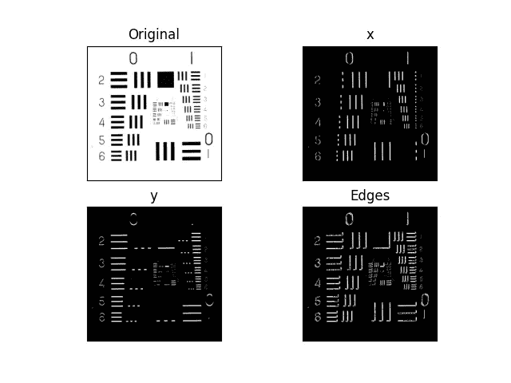
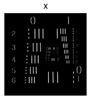
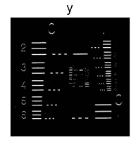

# 如何在 cv2 中使用 Sobel X 和 Sobel Y 执行边缘检测——简单说明

> 原文：<https://medium.com/mlearning-ai/how-to-perform-edge-detection-using-sobel-x-and-sobel-y-in-cv2-easiest-explanation-83c4a6a56875?source=collection_archive---------3----------------------->

所以在今天的博客中，我们将看到 cv2 中使用 Sobel X 和 Sobel Y 进行边缘检测的神奇之处。Sobel X 和 Sobel Y 是一阶导数。我可以向你保证，看完结果你会大吃一惊的。因此，没有任何进一步的原因，让我们深入研究。

**在这里阅读带源代码的整篇文章—**[https://machine learning projects . net/Sobel-x-and-Sobel-y-in-cv2/](https://machinelearningprojects.net/sobel-x-and-sobel-y-in-cv2/)



# 让我们开始吧…

## 步骤 1 —让我们导入所需的包。

```
import cv2
import matplotlib.pyplot as plt
```

## 第二步——让我们阅读图片。

```
imgpath = "test.tiff"
img = cv2.imread(imgpath, 1)
img = cv2.cvtColor(img, cv2.COLOR_BGR2RGB)
```

## 步骤 3——让我们在 cv2 中使用 Sobel X 和 Sobel Y 找到边缘。

**语法** — *cv2。Sobel(src，ddepth，dx，dy[，ksize[，scale[，delta[，border type]]])*

```
edgesx = cv2.Sobel(img, -1, dx=1, dy=0, ksize=1)
edgesy = cv2.Sobel(img, -1, dx=0, dy=1, ksize=1)
```



*   Sobel X 简单地求出 X 方向的一阶导数。这意味着它将只检测那些在 X 方向变化的边缘(见第一幅图)。
*   同样，Sobel Y 求出 Y 方向的一阶导数。这意味着它将只检测那些在 Y 方向上变化的边缘(见第二幅图)。

***看我关于二阶导数的博客:*** [***如何在 PYTHON 中使用拉普拉斯二阶导数检测边缘使用 OPENCV***](https://machinelearningprojects.net/how-to-detect-edges-using-laplacian-2nd-order-derivative-using-opencv/)

## 第 4 步—让我们合并 cv2 中 Sobel X 和 Sobel Y 的这些结果。

```
edges = edgesx + edgesy
```

*   我们可以简单地添加 X 方向的边缘和 Y 方向的边缘，以获得图像的整体边缘(见最终图像)。

## 第五步——绘制结果图。

```
output = [img, edgesx, edgesy, edges]
titles = ['Original', 'x', 'y', 'Edges']

for i in range(4):
    plt.subplot(2, 2, i + 1)
    plt.imshow(output[i], cmap='gray')
    plt.title(titles[i])
    plt.xticks([])
    plt.yticks([])
plt.show()
```


***注*** — ***在 OpenCV 的文档页面上阅读更多关于***[***Sobel***](https://docs.opencv.org/3.4/d2/d2c/tutorial_sobel_derivatives.html)[](https://docs.opencv.org/3.4/d2/d2c/tutorial_sobel_derivatives.html)****的内容。****

*如果对 cv2 中的 Sobel X 和 Sobel Y 有任何疑问，请通过电子邮件或 LinkedIn 联系我。*

***如需进一步的代码解释和源代码，请访问此处**—[https://machine learning projects . net/Sobel-x-and-Sobel-y-in-cv2/](https://machinelearningprojects.net/sobel-x-and-sobel-y-in-cv2/)*

**这就是这篇博客的全部内容，感谢阅读，我希望你在阅读完这篇文章后会有所收获，直到下一次……**

****阅读我之前的帖子:***[](https://machinelearningprojects.net/rotating-and-scaling-images-a-fun-application-in-opencv/)*[***旋转和缩放图片——一个用 OPENCV***](https://machinelearningprojects.net/rotating-and-scaling-images-in-cv2/) 在 PYTHON 中有趣的应用**

****查看我的其他** [**机器学习项目**](https://machinelearningprojects.net/machine-learning-projects/)**[**深度学习项目**](https://machinelearningprojects.net/deep-learning-projects/)**[**计算机视觉项目**](https://machinelearningprojects.net/opencv-projects/)**[**NLP 项目**](https://machinelearningprojects.net/nlp-projects/)**[**烧瓶项目**](https://machinelearningprojects.net/flask-projects/)**at************

******[](/mlearning-ai/mlearning-ai-submission-suggestions-b51e2b130bfb) [## Mlearning.ai 提交建议

### 如何成为 Mlearning.ai 上的作家

medium.com](/mlearning-ai/mlearning-ai-submission-suggestions-b51e2b130bfb)******