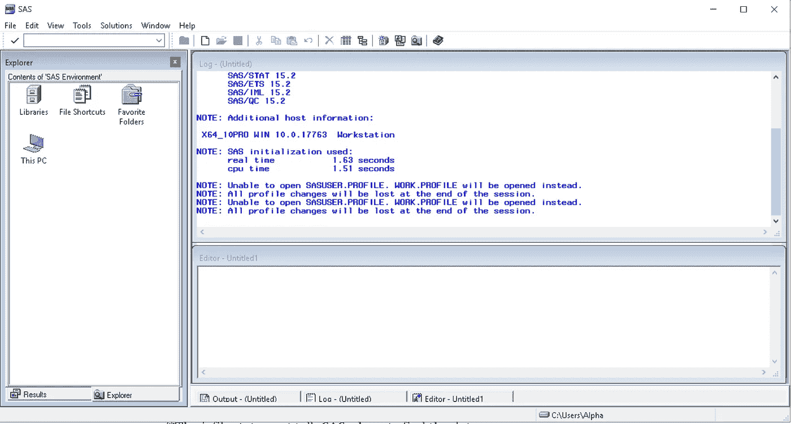
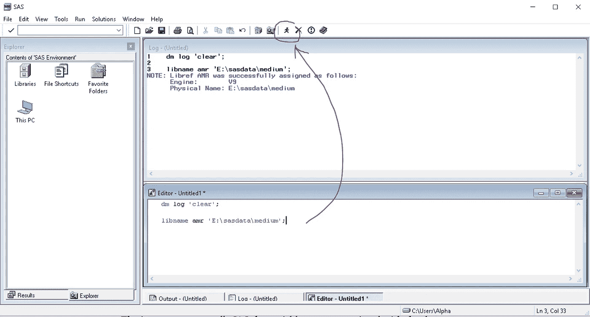
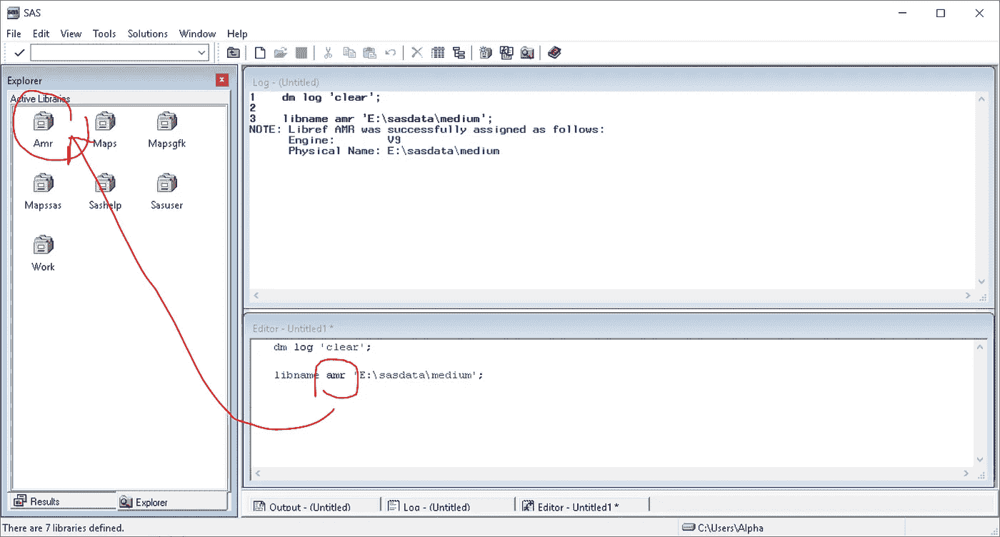
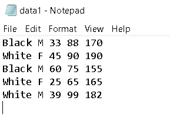
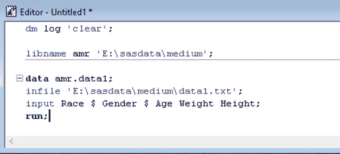
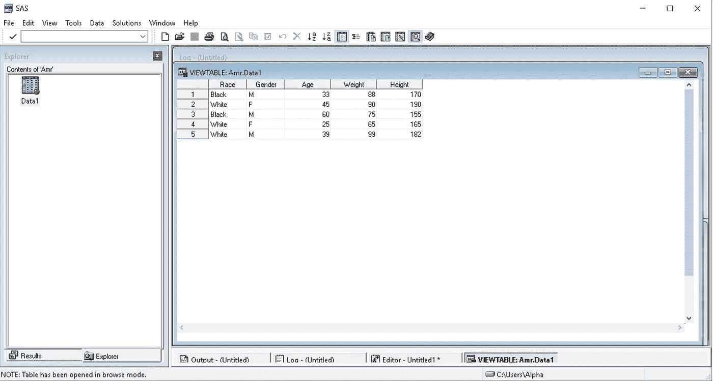
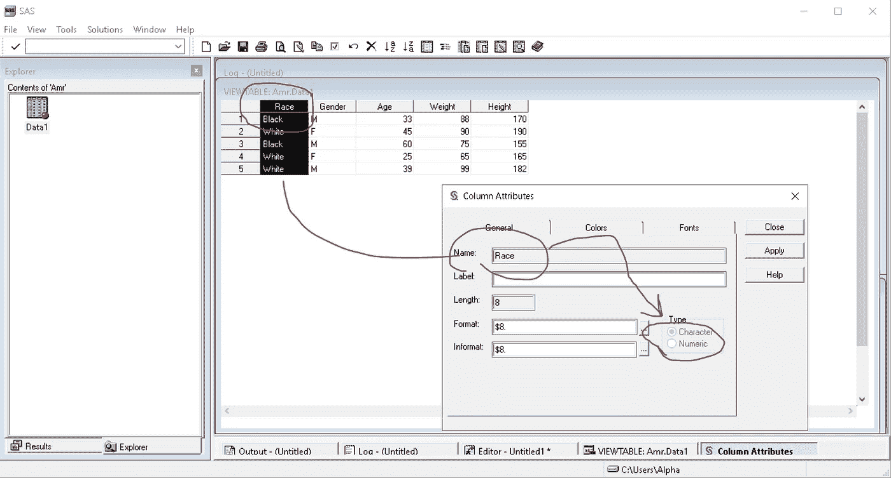
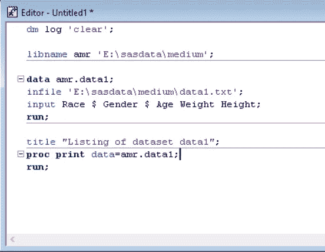
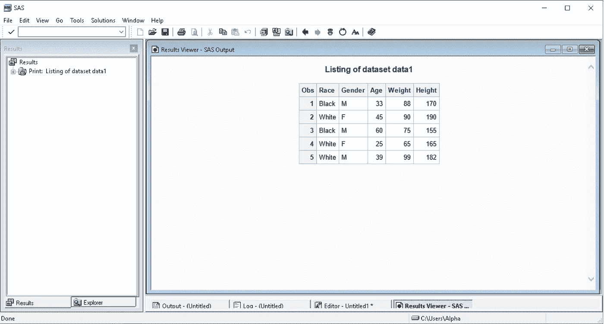

# 如何使用 SAS infile 语句读取由空格分隔的数据值

> 原文：<https://medium.com/mlearning-ai/how-to-read-data-values-separated-by-blanks-using-the-sas-infile-statement-47c4e5cefd06?source=collection_archive---------6----------------------->

在事情变得更复杂之前，这是一段基本的代码…

作为一名公共卫生研究人员，我上过一门公共卫生课程，这门课程向我介绍了 SAS(统计分析软件)。这是我第一次为了得到一个结果而不得不编码或编程。作为一个点击式统计程序，我对 JMP 做得还不错，但是我仍然想知道写代码来分析数据是什么样子的。

尽管最后我得了个“A ”,你可以说实际上我几乎没有错过那门课的“B”区。尽管编码很有趣，但为了像使用 JMP 一样使用 SAS，我仍然需要知道很多东西。所以，我决定写下我希望这门课是什么样的。当然，我很乐意通过例子来学习 sa。

那门课，我用的是 SAS 9.4。我就不说怎么下载或者下载 SAS studio 了。我会直接跳到手边的例子。

首先，您必须知道 SAS 可以通过多种方式读取非 SAS 数据集(txt、csv、xlsx 等)。今天，我们将介绍“infile”方法，并使用 SAS 来读取由空格分隔并存在于 txt 文件中的数据。

打开 SAS 9.4 程序后，会弹出以下窗口。

The opening window in SAS 9.4

代码写在下方名为“编辑器”的窗口中，由 SAS 检查上方名为“日志”的窗口中的错误。最左边的“资源管理器”窗口有链接到工作目录或您自己创建的“库”的文件，或者链接到 SAS 自己创建的其他有用的库的文件。

因此，让我们通过键入下面的代码开始清除日志窗口。

> dm 日志“清除”；

此外，让我们使用代码来创建一个个人图书馆，我将保持和保存我所有的文件。为此，我将使用“libname”语句。永远记住一个语句总是以关键字=libname 开头，并且总是以分号=结尾；

根据下面的代码，我用我的名字“amr”来命名我的库，并且我指定了一个到我为这个库创建的文件的路径。它将被命名为“medium ”,它将被放在另一个名为“sasdata”的文件中，而这个文件又将被放在我的硬盘驱动器的 E 分区中。该语句应该类似于下面的代码。

> libname AMR ' E:\ SAS data \ medium '；

看到红圈里的“跑男”图标了吗？这是“运行”或“提交”按钮。我们用它来运行我们写的每一条语句。在运行了上面两条语句之后，转到“Explorer”窗口中的“libraries”图标，双击它，您将会在库中看到一个名为“Amr”的图标。这是我们使用“libname”语句创建的库(见下文)。

如果您现在打开“amr”库，您将什么也看不到，因为 SAS 只看到 SAS 数据集，而不是其他数据集，并且我们指定的 medium 文件夹将只包含名为 data1 的 txt 文件。由于该文件是一个 txt(非 SAS)文件，所以 SAS 将看不到它，直到它被转换或以 SAS 可见的方式“读取”,这就是“infile”语句的作用。

我已经创建了 txt 文件(data1)，它在下面。我已经把它放在“medium”文件中，但是 SAS 将看不到它，除非我以如下所示的方式使用 infile 语句。如您所见，数据由五个变量(列)和五个观察值(行)组成。根据列的顺序，变量名为:种族、性别、年龄、体重和身高。“种族”和“性别”变量是分类变量，而“年龄”、“体重”和“身高”变量是数字变量。

我们将以我们想要创建并保存在名为“Amr”的库中的 SAS 数据集的名称开始我们的代码。我想创建它并将其保存在“amr”库中，这就是为什么我从数据语句开始，我选择编写“amr.data1 ”,以便告诉 SAS 将其保存在“Amr”库中。

> data amr.data1

如果我想创建它而不保存它，我应该写“data data1”。这样它仍然会被创建，但是它会在另一个叫做“工作”库的库中被发现。“工作”库是一个临时库，包含您创建的文件，但这些文件将在您关闭 SAS 后被删除。

现在让我们遵循我们的代码。

infile 语句将告诉 SAS 在哪里可以找到数据。

> infile ' E:\ SAS data \ medium \ data 1 . txt '；

input 语句将告诉 SAS 与数据值相关联的变量名。正如你在上面的 txt 图片中看到的，数据没有变量名。因此列的变量名将由输入语句决定。

我们必须确保输入语句中变量名的顺序与数据值的顺序相匹配。

(Gender)后面出现的美元符号($)告诉 SAS ,( Gender)
变量是一个字符变量。变量名称的其余部分
后没有美元符号表示(身高)和(体重)变量是数字。

> 输入种族$性别$年龄体重身高；

然后以 run 语句结束。

> 跑步；

总而言之，我们的最后一段代码将是这样的:

> data amr.data1
> infile ' E:\ SAS data \ medium \ data 1 . txt '；
> 输入种族$性别$年龄体重身高；
> 跑；

或者这个:

运行此代码后，您将看到文本文件中的无名数据被转换为 SAS 数据集，并根据变量名的分配顺序添加了变量名。如果您注意到左边，我已经单击了“Amr”库，名为“data1”的 SAS 数据集就在那里。这就是为什么我们都在“Amr”图书馆里看到它。

如果您想检查变量的类型，双击变量名称，您将在产生的 SAS 窗口中看到变量的类型。

现在让我们看看使用 proc print 函数的输出表。

> 标题“数据集 data1 列表”；
> proc 打印数据= amr.data1
> 运行；

或者…

输出将是这样的:

如果您觉得这些内容有帮助，请告诉我。

 [## Mlearning.ai 提交建议

### 如何成为 Mlearning.ai 上的作家

medium.com](/mlearning-ai/mlearning-ai-submission-suggestions-b51e2b130bfb)