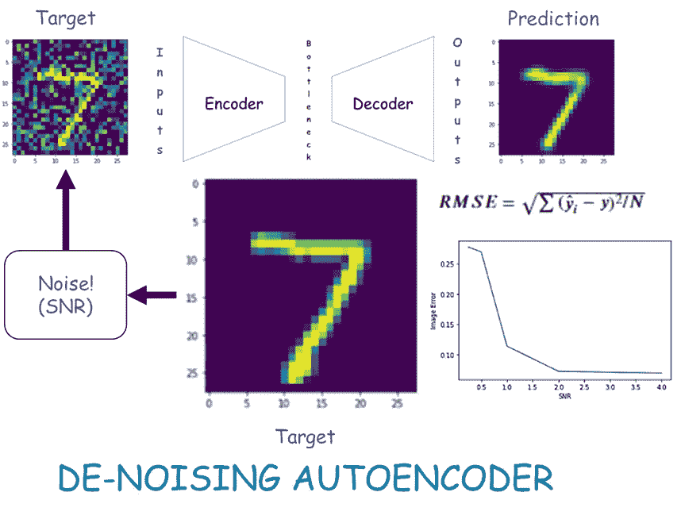

# 如何使用自动编码器降低图像噪声

> 原文：<https://medium.com/mlearning-ai/how-to-reduce-image-noise-using-an-autoencoder-e01146e3ce00?source=collection_archive---------2----------------------->

数据科学先生

在整篇文章中，我将使用 mnist 数据集向您展示如何使用一个简单的自动编码器来减少图像噪声。首先，我将演示如何人为地给你的图像添加噪声。接下来，我将描述创建自动编码器的过程，最后，我将在一些不同的信噪比(SNR)图像上测试自动编码器，以…