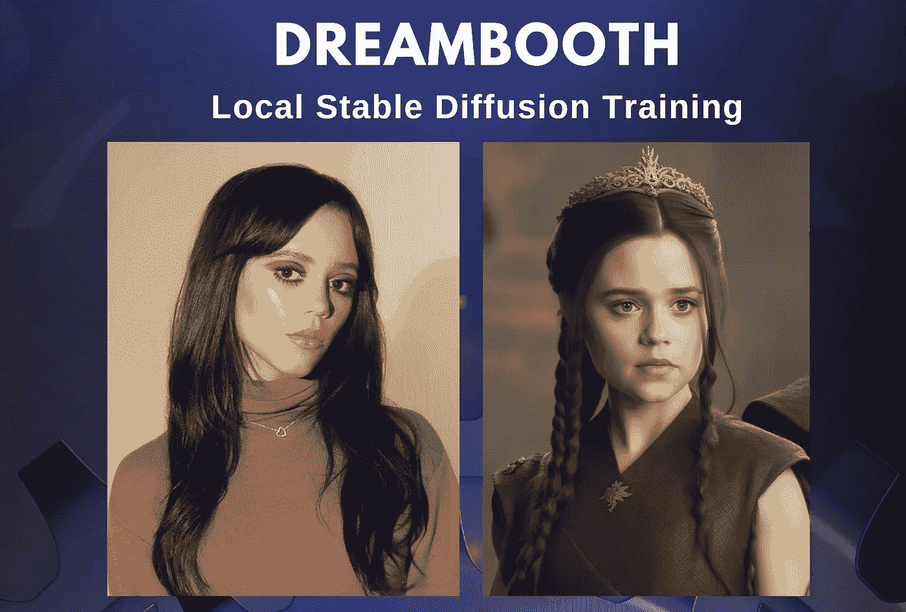

# 如何在本地运行具有稳定扩散的 DreamBooth 分步指南

> 原文：<https://medium.com/mlearning-ai/how-to-run-dreambooth-locally-a-step-by-step-gyu-88c028ab01a4?source=collection_archive---------0----------------------->

(Left) Jenna Ortega portrait by Jonny Marlow. (Right) AI-generated by [Jim Clyde Monge](https://medium.com/u/819323b399ac?source=post_page-----88c028ab01a4--------------------------------)

最近几个月，人工智能艺术生成器的崛起可谓是一飞冲天。这些创造性工具以难以跟上的速度变得越来越好。现在，有了 [Dreambooth](https://dreambooth.github.io/) ，你可以用自己的照片让这些人工智能模型更加个性化。

## 什么是梦想小屋？