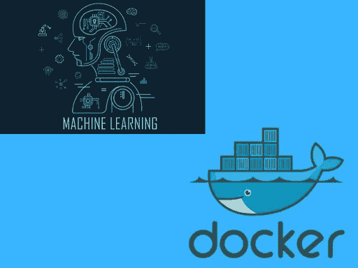
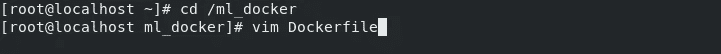
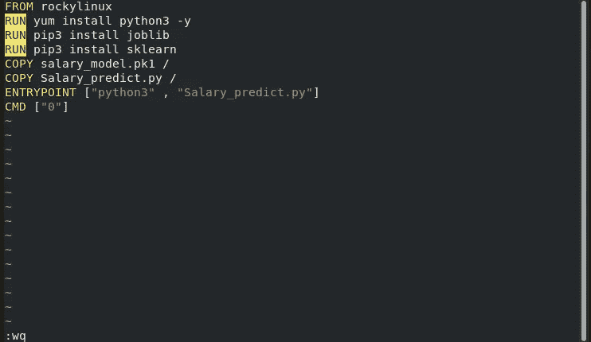
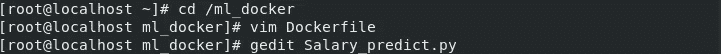
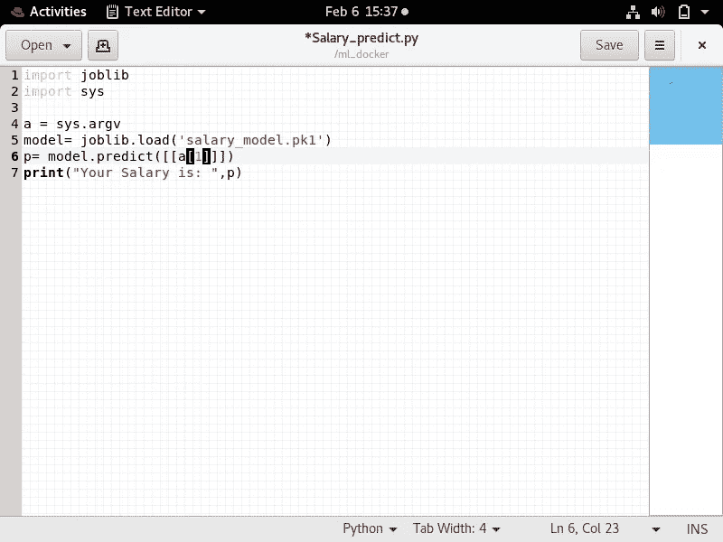
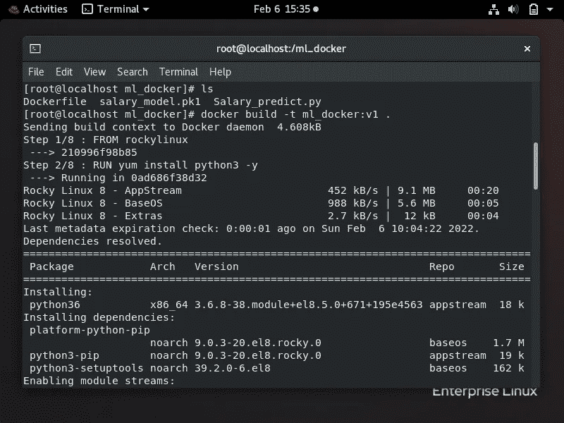
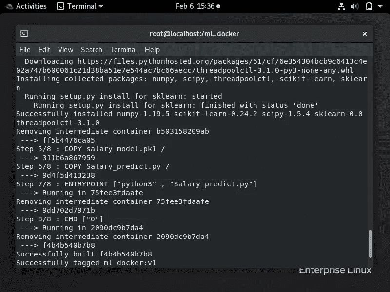
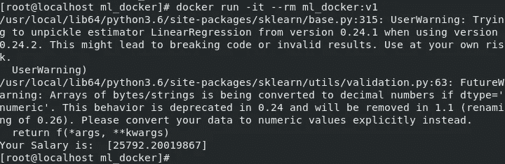
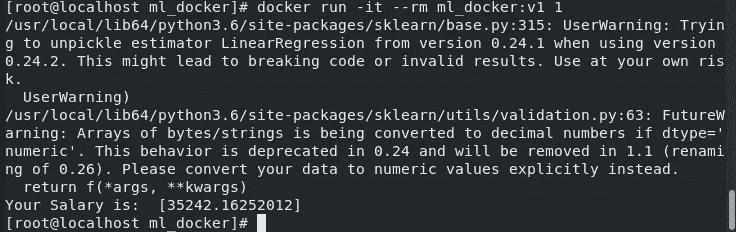

# 如何在 Docker 容器中运行机器学习模型

> 原文：<https://medium.com/mlearning-ai/how-to-run-machine-learning-model-inside-a-docker-container-d0f26c0ddc13?source=collection_archive---------3----------------------->

Docker 是一款打包应用程序代码及其所有依赖项的软件，提供了一个被称为**容器**的隔离环境。

# 为什么我们应该使用 Docker 容器来部署机器学习模型？

1.  **我们可以很容易地在我们的系统中创建一个机器学习模型。但是，当我们想在其他系统的生产阶段使用该模型时，这是一项复杂的任务。** Docker 让这项任务变得更简单、更快速、更可靠。
2.  使用 Docker 我们可以很容易地**重现工作环境**来训练和运行不同操作系统上的模型
3.  我们可以**使用诸如 OpenShift(一个 Kubernetes 发行版)之类的技术，轻松地部署您的模型，并让您的模型对客户可用。**
4.  开发人员可以跟踪容器映像的不同版本，检查谁用什么构建了一个版本，还可以回滚到以前的版本。
5.  即使我们的机器学习应用程序**宕机、修复或更新，它也不会停止运行。**
6.  **我们的机器学习模型通常用 python 等单一编程语言**编写，但**应用程序肯定需要与用不同编程语言编写的其他应用程序进行交互。Docker 管理所有这些交互，因为每个微服务可以用不同的语言编写，允许可伸缩性和独立服务的轻松添加或删除。**

让我们理解如何在 Docker 容器中部署我们的机器学习模型。这里我就拿一个简单的**薪资预测机器学习模型**来说明工作流程。

1.  为此任务创建一个单独的目录，并将您的机器学习代码复制到该目录。

2.创建 Dockerfile 文件。

1.  这里，我使用了 **rockylinux 作为容器的基础图像**。
2.  安装运行代码所需的所有包。
3.  **复制**命令将**将指定文件从本地机器复制到容器**中，该容器将使用该映像启动。
4.  **入口点** **指定容器启动时要执行的命令。**
5.  **CMD** 指定将给予 entry point(python 3 Salary _ predict . py)执行的程序的**命令行输入**。这被启动容器期间传递的命令行输入覆盖**(如果有)。**

注意: ***Entrypoint 和 CMD*** ，*都可以用来指定容器启动时要执行的命令。唯一不同的是* `*ENTRYPOINT*` *不允许你覆盖命令。相反，添加到* `*docker run*` *命令末尾的任何内容都会追加到该命令中。*

3.Python 代码。

**sys** 模块提供了用于操纵 Python 运行时环境不同部分的函数和变量。

**sys.argv** 是命令行参数的**列表。**

但是 **sys.argv[0]** 是当前 Python 脚本的**名称。**

**sys.argv[1]** 是**的第一个命令行参数。**

**sys.argv[2]** 是第**个命令行参数**等等。

因此，我们为 ML 模型提供 sys.argv[1]。

5.现在，**从上面创建的 Dockerfile 文件中构建** **一个映像**。

6.最后，我们准备启动我们的**容器**并运行我们的机器学习模型。

Years of experience = 0

这里，因为我们没有提供任何命令行参数，所以将使用 0 作为参数传递给程序入口点。

7.我们还可以向 python 代码提供命令行输入。

Years of experience = 1

这里，由于我们已经提供了命令行参数，0 将被 1 覆盖。

我们现在知道如何在 Docker 容器中运行机器学习模型。快乐编码。😀

 [## Mlearning.ai 提交建议

### 如何成为 Mlearning.ai 上的作家

medium.com](/mlearning-ai/mlearning-ai-submission-suggestions-b51e2b130bfb) 

成为作家