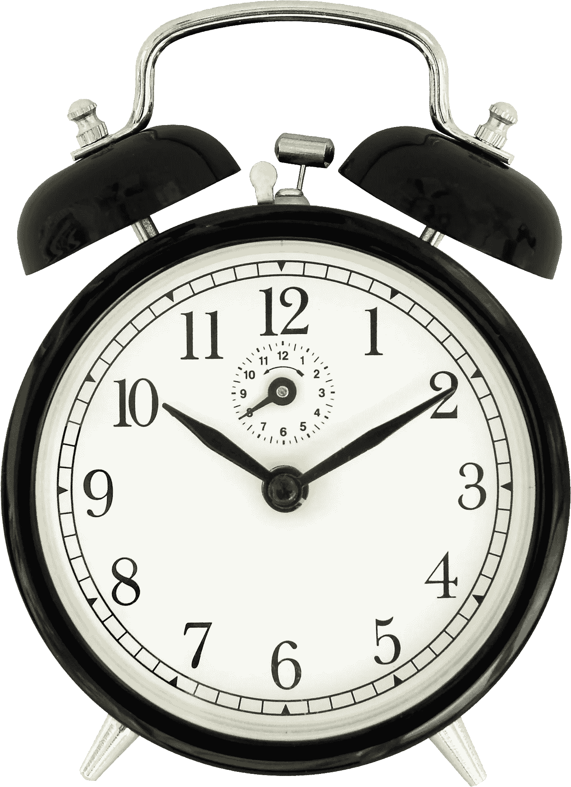
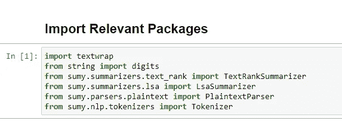
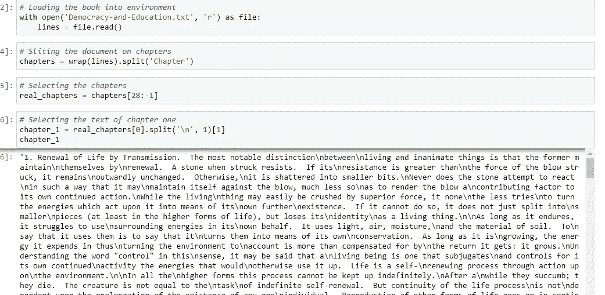
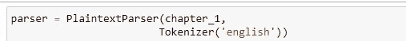
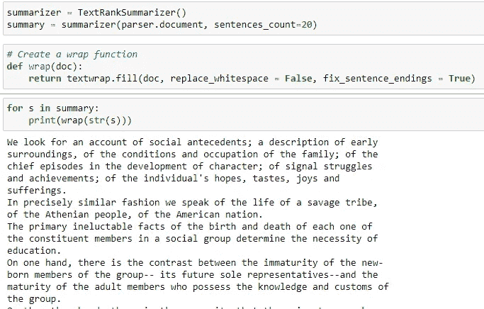
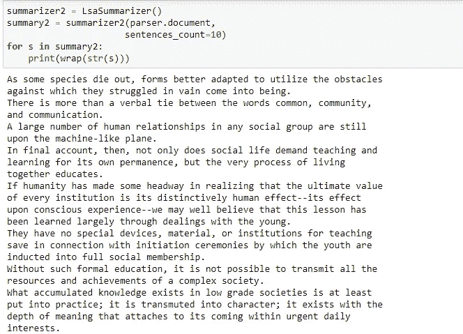

# 如何利用人工智能节省阅读时间

> 原文：<https://medium.com/mlearning-ai/how-to-save-reading-time-using-ai-b6082c29082d?source=collection_archive---------3----------------------->

毫无疑问，阅读是扩大知识面和提高词汇量的一种方式。许多富有的企业家每年阅读数百本书。但是，有一个问题，随着时间的推移，书籍变得越来越大。《卫报》在 2016 年撰写的一篇题为“ [**的文章中提出了一个大问题:书籍越来越长了吗？**](https://www.theguardian.com/books/2015/dec/10/are-books-getting-longer-survey-marlon-james-hanya-yanagihara) ”，据说现在的书平均比 15 年前大 25%。一本书的平均长度从 1999 年的 320 页增加到了 2014 年的 400 页，这个数字肯定会继续增加，因为电子书的使用现在已经变得非常流行。

如果有一种方法可以在更短的时间内消化这些信息呢？。请和我呆在一起，我将带您了解如何实现这一点。

如果您尚未订阅，请点击此处的**。我每周发表关于自然语言处理的文章。**

**唯一的先决条件是初级 python 编程。我们将使用一个叫做 sumy 的 python 库来总结“民主与教育”的第一章。**

**现在让我们把手弄脏。我们进口必要的包装。**

****

**我们将文档加载到环境中，并选择我们想要总结的章节。**

****

**此时，我们要做的就是使用 PlaintextParser 类和 Tokenizer 类来解析文本。本课程为摘要准备文档。这个过程可以在下图中看到。**

****

**现在是施展魔法的时候了。在这一点上，我们所要做的就是实例化 summarizer 类，并插入解析后的文档和想要输出的句子数量。**

****使用 TextRankSummarizer:****

***注意:我们创建了一个 wrap 函数来很好地格式化返回的文本。***

****

**并返回一个格式良好的文本。**

****使用 LSA summary zer:****

****

**在这一点上，我相信你将能够总结你手上的任何一篇文章。**

**如果你喜欢这篇文章，请[订阅](https://amusatomisin65.medium.com/subscribe)这个页面，并为这篇文章鼓掌。**

**下一期见:)。**

****资源:****

**GitHub:在这里查看[上的代码和 txt 文件。](https://github.com/oluwatomsin/Text_summarization)**

** [## Mlearning.ai 提交建议

### 如何成为 Mlearning.ai 上的作家

medium.com](/mlearning-ai/mlearning-ai-submission-suggestions-b51e2b130bfb)**