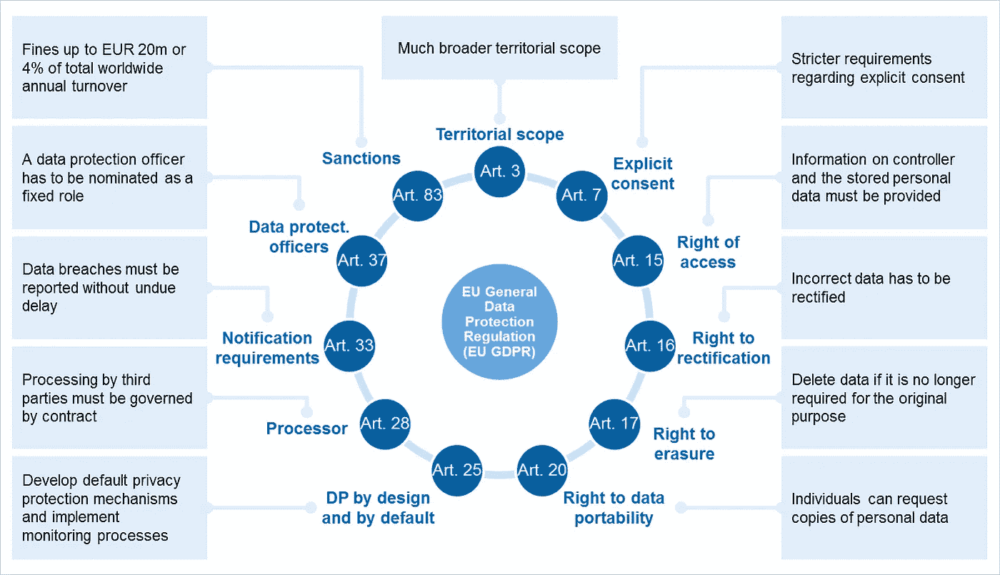
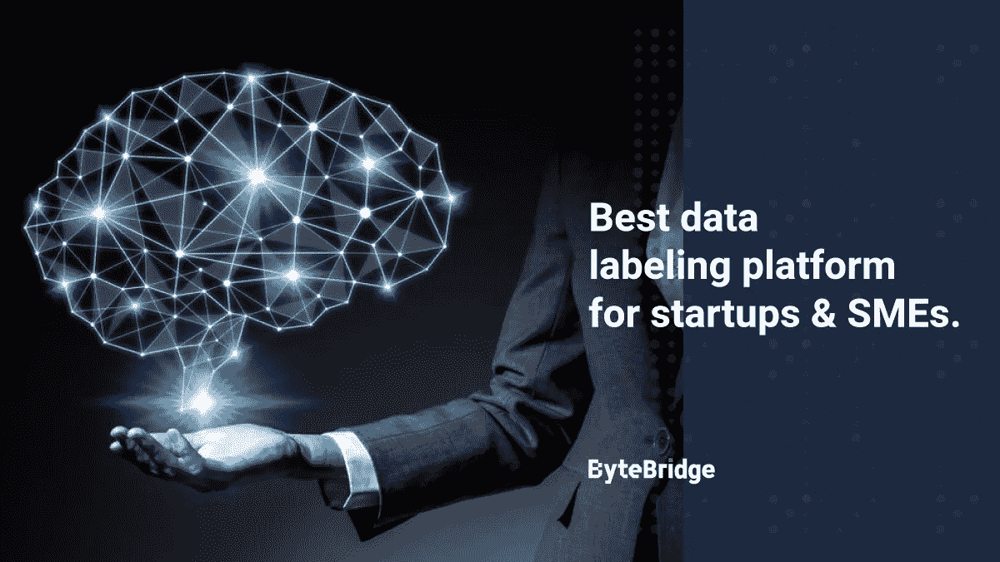
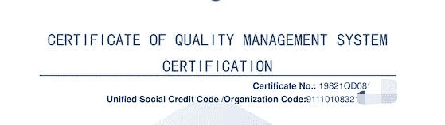

# 如何保护数据注释？

> 原文：<https://medium.com/mlearning-ai/how-to-secure-data-annotation-67ca22377cec?source=collection_archive---------3----------------------->

[https://www.bankinghub.eu/banking/finance-risk/gdpr-deep-dive-implement-right-forgotten](https://www.bankinghub.eu/banking/finance-risk/gdpr-deep-dive-implement-right-forgotten)

# 安全问题

不同的国家都颁布了相应的数据安全法律法规。

以自驾行业为例:

智能汽车产生大量数据。与传统汽车相比，它将面临的数据安全风险涉及个人隐私。汽车会获得车内驾驶员或乘客的一些信息，而车外的传感器可能会涉及到车外行人的一些信息。如何处理、保护、使用和存储这些信息会涉及个人隐私问题。

另一个安全问题是数据泄露。数据一旦传输，就有可能被复制。客户担心数据会被直接复制并出售给竞争对手。

**总之，除了法律规范，数据安全本质上是一个信任问题。**

# 选择外包合作伙伴时，您应该了解的数据安全知识

首先，你应该知道根据原则和规则，什么应该被保护。比如个人信息，知识产权等。

**那你应该了解一下外包公司是如何保护的。**

你应该问这样的问题:

*   如何防止数据泄露？
*   如何限制标注观看权限？
*   是否有通过云或内部部署的措施

# ByteBridge，一个人工驱动的 ML 辅助的数据标签工具平台，具有完全可管理的数据安全解决方案

## 我们遵守每个地区的原则和规则:

1.公司首席执行官作为 DPO(数据保护官)监督数据管理

2.根据指南，如果有数据泄露，我们将在 72 小时内通知客户

## 在我们的标签循环中:

保密智能合同

符合 GDPR 个人隐私和数据保护法规

工人位置、流程和权限限制

由于数据经过压缩和预处理，没有原始数据泄漏

由于分割机制确保了数据的分散性，整个过程中不会出现数据泄漏

支持私有云及私有化部署

此外，[字节桥](https://tinyurl.com/mthbx7c7)还获得了国际标准化组织(ISO)的质量管理体系(ISO 9001)和信息安全管理体系(ISO 27001)认证。

## ISO 27001

ISO 27001 为公司内部信息安全的实施、管理和维护提供了一种国际化的方法。获得 ISO 27001 认证表明组织的信息安全管理系统(ISMS)符合文件标准，并为客户提供关于组织系统安全性的保证。ISO 27001 认证要求对组织进行彻底的评估，以确定其在分为 14 个信息安全类别的 114 项要求方面的资格。

## ISO 9001

ISO 9001 列出了采用质量管理体系的必要步骤。它旨在帮助组织确保满足顾客和其他相关方的需求和期望，以国际公认的质量管理原则(ISO)为基础。认证每 3 年更新一次，在此期间，认证机构每年都要对其安全和管理系统进行评估。

通过获得国际标准认证，基金会再次证明了它在开发、运营和管理各种服务方面保持着高标准。ByteBridge 还扩大了与众多客户、公司和合作伙伴合作的机会。

# 结束

将你的数据标注任务外包给 [ByteBridge](https://tinyurl.com/mthbx7c7) ，你可以更便宜更快的获得高质量的 ML 训练数据集！

*   无需信用卡的免费试用:您可以快速获得样品结果，检查输出，并直接向我们的项目经理反馈。
*   100%人工验证
*   透明标准定价:[有明确的定价](https://www.bytebridge.io/#/?module=price)(含人工成本)

**为什么不试一试？**

来源:Maro 官方博客