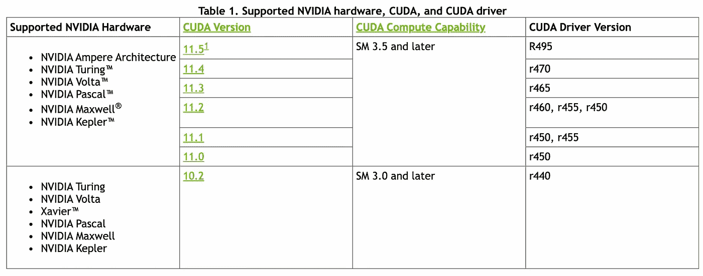

# 如何在 Ubuntu 20.04 — 2022 上设置和优化 CUDA 和 TensorFlow

> 原文：<https://medium.com/mlearning-ai/how-to-setup-cuda-and-tensorflow-on-ubuntu-20-04-2022-7d240cffdf1e?source=collection_archive---------0----------------------->

# 介绍

通常，公司将基于云的服务器用于机器学习应用，如**微软 Azure 和谷歌云平台**，主要是因为它们的**随时可用且易于使用的服务**，这些服务是为广泛的问题而构建的，并为日常 ML 操作提供**低代码解决方案**。

尽管大多数公司可以通过这些工具快速而廉价地交付价值，但也有一些企业主要依赖于它们的 ML 能力作为核心产品或战略，并且最常见的是**在它们的** **AI 基础设施和代码**上投资大量金钱和时间。

如果你是其中一个项目的数据科学家，你可能会面临**用 CUDA/cuDNN 和 TensorFlow 栈**设置 Ubuntu 服务器的需求，以便为**训练/预测任务和管道**提供服务。

此外，处理人工智能时最大的负担之一是**在训练大型模型(例如用于图像和视频检测/分割的神经网络)时耗尽内存**，这使得**GPU 使用的优化**对于维持整个训练过程而不崩溃是必要的。

在本文中，我将介绍正确安装和优化 CUDA/cuDNN 的**设置步骤，**主题组织如下:

1.  发现和安装 nvidia 驱动程序。
2.  匹配 nvidia 驱动与 CUDA 和 TensorFlow 版本。
3.  安装 CUDA 工具包和 cuDNN。
4.  CUDA 环境变量。
5.  安装 TensorFlow。
6.  优化您的 GPU 处理。

# 1️⃣发现并安装 NVIDIA 驱动程序


Photo by [Christian Wiediger](https://unsplash.com/@christianw?utm_source=medium&utm_medium=referral) on [Unsplash](https://unsplash.com?utm_source=medium&utm_medium=referral)

**就机器学习库和**与常见框架(如 PyTorch 或 TensorFlow)的集成而言，NVIDIA GPUs 是最好的**。****NVIDIA CUDA toolkit 包括 GPU 加速库**，一个 C 和 C++编译器和运行时，以及优化和调试工具。它使您能够立即开始，而不用担心构建定制集成。(*如果你的机器上没有 nvidia GPU，这个教程不适合你。*)

首先，检测您的 nvidia 显卡的型号和推荐的驱动程序。为此，请执行以下命令。请注意，您的输出和推荐的驱动程序很可能不同:

```
$ ubuntu-drivers devices
```

这将给你一个类似这样的输出:

```
== /sys/devices/pci0000:00/0000:00:01.0/0000:01:00.0 ==
modalias : pci:v000010DEd00001C03sv00001043sd000085ABbc03sc00i00
vendor   : NVIDIA Corporation
model    : GP106 [GeForce GTX 1060 6GB]
driver   : nvidia-driver-390 - distro non-free
driver   : nvidia-driver-435 - distro non-free
driver   : nvidia-driver-440 - distro non-free recommended
driver   : xserver-xorg-video-nouveau - distro free builtin
```

从上面的输出我们可以得出结论，当前系统已经安装了**NVIDIA GeForce GTX 1060 6GB**显卡，推荐安装的驱动程序是 **nvidia-driver-440** 。

如果您同意建议，请随意再次使用`**ubuntu-drivers**`命令来安装所有推荐的驱动程序:

```
$ sudo ubuntu-drivers autoinstall
```

或者，使用`**apt**`命令选择性地安装所需的驱动程序。例如:

```
$ sudo apt install nvidia-driver-440
```

安装完成后，重启系统，就大功告成了。

```
$ sudo reboot
```

重启后，检查你是否能通过你的 nividia 驱动找到你的 GPU:

```
$ nvidia-smi
```

# 2️⃣将 nvidia 驱动程序与 CUDA 和 TensorFlow 版本匹配

当我第一次用 CUDA 堆栈设置 Ubuntu 服务器时，我的一个噩梦是我**不小心为我的 nvidia GPU 安装了错误的 CUDA 工具包版本**。我花了很长时间才发现哪里出了问题，因为我在任何地方都找不到它。为了避免这种错误，你应该首先**检查 CUDA、cuDNN、Tensorflow 和你的 nvidia 驱动之间的所有版本兼容性。**

**参考** [**此链接**](https://docs.nvidia.com/deeplearning/cudnn/archives/cudnn-831/support-matrix/index.html) **来自 nvidia 官方文档**显示了一个支持矩阵，该矩阵提供了对操作系统、NVIDIA CUDA、CUDA 驱动程序和 NVIDIA cuDNN 8.3.1 硬件的支持版本的了解— **如果您想要更旧或更早的版本，请参考** [**此链接**](https://docs.nvidia.com/deeplearning/cudnn/archives/index.html) **。**



*Image by the author — screenshot from public Nvidia docs (link above)*

在我的情况下，因为我安装了 r440 nvidia 驱动程序，我的 CUDA 工具包版本将是 10.2。

# 3️⃣安装 CUDA 工具包和 cuDNN

## CUDA 工具包

CUDA 是 NVIDIA 发明的并行计算平台和编程模型。它通过利用图形处理单元(GPU)的能力来大幅提高计算性能，是运行 TensorFlow 应用程序的先决条件。

检查完您需要的版本后，您可以按照 [**这个链接**](https://developer.nvidia.com/cuda-toolkit-archive) **上的说明安装**CUDA 工具包。****

在我的例子中，我只是一次执行一个命令:

```
$ wget [https://developer.download.nvidia.com/compute/cuda/repos/ubuntu2004/x86_64/cuda-ubuntu2004.pin](https://developer.download.nvidia.com/compute/cuda/repos/ubuntu2004/x86_64/cuda-ubuntu2004.pin)
$ sudo mv cuda-ubuntu2004.pin /etc/apt/preferences.d/cuda-repository-pin-600
$ sudo apt-key adv --fetch-keys [https://developer.download.nvidia.com/compute/cuda/repos/ubuntu2004/x86_64/7fa2af80.pub](https://developer.download.nvidia.com/compute/cuda/repos/ubuntu2004/x86_64/7fa2af80.pub)
$ sudo add-apt-repository "deb https://developer.download.nvidia.com/compute/cuda/repos/ubuntu2004/x86_64/ /"
$ sudo apt-get update
$ sudo apt-get -y install cuda
```

## cuDNN

NVIDIA CUDA 深度神经网络库(cuDNN)是一个针对[深度神经网络](https://developer.nvidia.com/deep-learning)的 GPU 加速原语库。cuDNN 为标准例程提供了**高度优化的实现，例如前向和后向卷积、池化、规范化和激活层**。这也是运行 TensorFlow 应用程序的先决条件。

**其安装指南可在** [**此链接**](https://docs.nvidia.com/deeplearning/cudnn/archives/cudnn-831/install-guide/index.html) 找到。几乎所有的先决条件都在前面的步骤中安装好了(nvidia 驱动程序和 CUDA 工具包)——唯一剩下的是 zlib:

```
$ sudo apt-get install zlib1g
```

现在，为了**下载 cuDNN** ，请确保您注册了 [NVIDIA 开发者计划](https://developer.nvidia.com/accelerated-computing-developer)。它会给你一个. tar 文件进行解压和安装。

去吧。tar 文件位置，并执行以下操作来**解压缩它**:

```
$ tar -xvf cudnn-linux-x86_64-8.x.x.x_cudaX.Y-archive.tar.xz
```

您需要将 X.Y 和 v8.x.x.x 替换为您特定的 CUDA 和 cuDNN 版本以及打包日期。

例如，在为 CUDA 11.5 安装 cuDNN v8.3.1 时，它将如下所示:

```
$ tar -xvf cudnn-linux-x86_64–8.3.1.22_cuda11.5-archive.tar.xz
```

然后，在解压文件的同一个文件夹中，**将这些文件移动到 CUDA toolkit 存储库中，并授予访问权限**:

```
$ sudo cp cudnn-*-archive/include/cudnn*.h /usr/local/cuda/include 
$ sudo cp -P cudnn-*-archive/lib/libcudnn* /usr/local/cuda/lib64 
$ sudo chmod a+r /usr/local/cuda/include/cudnn*.h /usr/local/cuda/lib64/libcudnn*
```

# 4️⃣ CUDA 环境变量

正确安装 CUDA/cuDNN 堆栈后，现在您需要**导出运行 ML 应用程序**时定位安装路径所需的环境变量。

我建议你将这些导出集成到你的 Python 代码中。sh 脚本所以每次你运行它时，环境变量都会自动设置。

在我的应用程序中，我总是定义一个函数来导出所有需要的变量，叫做`**exports()**`:

```
def exports():       # Set CUDA and CUPTI paths  
    os.environ['CUDA_HOME'] = '/usr/local/cuda'
    os.environ['PATH']= '/usr/local/cuda/bin:$PATH'  
    os.environ['CPATH'] = '/usr/local/cuda/include:$CPATH'  
    os.environ['LIBRARY_PATH'] = '/usr/local/cuda/lib64:$LIBRARY_PATH'  
    os.environ['LD_LIBRARY_PATH'] = '/usr/local/cuda/extras/CUPTI/lib64:$LD_LIBRARY_PATH'  
    os.environ['LD_LIBRARY_PATH'] = '/usr/local/cuda/lib64:$LD_LIBRARY_PATH'
```

上面，我们导出了定位 CUDA 堆栈所需的每个环境变量。 **CUPTI ( *CUDA 剖析工具接口)*支持创建针对 CUDA 应用的剖析和跟踪工具**，并已随工具包一起提供。

# 5️⃣安装张量流

## 系统安装

你可以直接在你的机器上安装 TF，尽管推荐的**是在你正在使用的库内的虚拟环境**中安装，以避免[依赖地狱](https://en.wikipedia.org/wiki/Dependency_hell)。可以通过 pip 软件包管理器完成:

```
$ pip3 install --user --upgrade tensorflow  # install in $HOME
```

然后，验证执行 Python 脚本的安装，该脚本将运行简单的 TensorFlow 操作:

```
$ python3 -c "import tensorflow as tf; print(tf.reduce_sum(tf.random.normal([1000, 1000])))"
```

## 虚拟环境(推荐)

只需在您的虚拟环境中执行以下操作:

```
$ pip install --upgrade tensorflow
```

然后，通过执行系统安装中提到的相同 TF 操作来验证它:

```
$ python -c "import tensorflow as tf;print(tf.reduce_sum(tf.random.normal([1000, 1000])))"
```

*如果你不知道如何创建一个 Python 虚拟环境，* [*跟随这个教程。*](https://realpython.com/python-virtual-environments-a-primer/)

# 6️⃣优化您的 GPU 处理

现在你已经准备好了，你可能想要**优化你的筹码**。

为此，我们将与一些 **CUDA C 和****cud nn API 交互，以执行更快的操作**。这在**处理繁重的神经网络**时特别有用，并且对于不使你的训练应用崩溃是决定性的。

这将通过**导出一些环境变量**来完成，这些变量将告诉 CUDA 如何操作。

1.  **CUDA_CACHE_DISABLE**

为实时编译禁用缓存(设置为 1 时)或启用缓存(设置为 0 时)。禁用时，不会向缓存添加二进制代码，也不会从缓存中检索二进制代码。使用:

```
os.environ[‘CUDA_CACHE_DISABLE’] = ‘0’
```

2.**TF _ FORCE _ GPU _ ALLOW _ GROWTH**

在某些情况下，希望进程只分配可用内存的子集，或者只根据进程的需要增加内存使用量。TensorFlow 提供了两种方法来控制这一点。

这个环境变量试图只分配运行时分配所需的 GPU 内存:**它开始分配很少的内存，随着程序的运行，需要更多的 GPU 内存，GPU 内存区域将为 TensorFlow 进程扩展**。不释放内存，因为这会导致内存碎片。

```
os.environ['TF_FORCE_GPU_ALLOW_GROWTH'] = 'true'
```

3. **TF_CPP_MIN_LOG_LEVEL**

这个变量只是为了禁用 TF 的警告和日志记录。

```
os.environ['TF_CPP_MIN_LOG_LEVEL'] = '3''''
   Legend: 0 = all messages are logged (default behavior)
   1 = INFO messages are not printed
   2 = INFO and WARNING messages are not printed
   3 = INFO, WARNING, and ERROR messages are not printed
'''
```

4. **TF_GPU_THREAD_MODE**

这确保了 **GPU 内核从它们自己的专用线程**中启动，并且不会在`tf.data`工作之后排队，并且**防止 CPU 端线程干扰 GPU 活动**。

```
os.environ['TF_GPU_THREAD_MODE'] = 'gpu_private'
```

5.**TF _ USE _ cud nn _ batch norm _ SPATIAL _ PERSISTENT**

当输入张量很小时，持续时间不随输入大小而变化。这是因为张量足够小，以至于内存带宽没有被充分利用。然而，对于较大的输入，持续时间随着大小接近线性地增加；移动两倍的输入和输出值需要两倍的时间。

当输入足够小时，cuDNN 可以使用更好的单遍算法(持续批量归一化),在这里，**输入被读入片内 GPU 存储器一次，然后从那里执行统计计算和归一化，而不需要任何额外的数据读取**。更少的数据读取导致片外存储器的流量减少，对于恒定带宽，这意味着持续时间减少。换句话说，**空间持久批量规范化比其非持久变体更快。**

```
os.environ['TF_USE_CUDNN_BATCHNORM_SPATIAL_PERSISTENT'] = '1'
```

6.**TF _ ENABLE _ wino grad _ NONFUSED**

该变量支持使用非融合 Winograd 卷积算法**，其中算法的所有步骤都由单独的内核调用**执行。最初的两个内核用于转换输入和滤波器，在此之后，卷积首先计算乘法，其次计算转换，最终获得输出。

```
os.environ['TF_ENABLE_WINOGRAD_NONFUSED'] = '1'
```

7. **TF_AUTOTUNE_THRESHOLD**

该变量提高了用于选择最快卷积算法的自动调谐过程的**稳定性。将其设置为较高的值可以提高稳定性，但是在找到最佳算法之前，需要在训练开始时进行大量的尝试。**

```
os.environ[‘TF_AUTOTUNE_THRESHOLD’] = ‘1’
```

8.**TF _ ENABLE _ Cu blas _ TENSOR _ OP _ MATH _ FP32**

此变量启用和禁用 TensorFlow 中 float32 矩阵乘法运算的张量核心数学。

```
os.environ['TF_ENABLE_CUBLAS_TENSOR_OP_MATH_FP32'] = '1'
```

9.**TF _ ENABLE _ cud nn _ TENSOR _ OP _ MATH _ FP32**

此变量启用和禁用 TensorFlow 中 float32 卷积运算的张量核数学。

```
os.environ['TF_ENABLE_CUDNN_TENSOR_OP_MATH_FP32'] = '1'
```

10.**TF _ ENABLE _ cud nn _ RNN _ 张量 _OP_MATH_FP32**

此变量在 TensorFlow 中启用和禁用 float32 cuDNN RNN 运算的张量核数学。默认情况下，float32 运算的张量核心数学是禁用的，但可以通过将此变量设置为 1 来启用。

```
os.environ['TF_ENABLE_CUDNN_RNN_TENSOR_OP_MATH_FP32'] = '1'
```

可以为特定的神经网络操作导出附加的环境变量。这是一个正在进行的研究课题，本机**tensor flow profiler——一种跟踪硬件资源利用率的工具——有助于确定进一步优化应用所需的资源。**

# 摘要

在本文中，您了解了:

1.  检查兼容的图形处理器及其驱动程序。
2.  为了**将您的 nvidia 驱动程序版本**与您的 CUDA/cuDNN 和 TensorFlow 堆栈相匹配。
3.  为了**安装使用 TensorFlow 及其深度学习库的所有先决条件**。
4.  为了**通过 pip 包管理器安装 TensorFlow** 。
5.  为了**导出工作 CUDA 堆栈所需的环境变量**。
6.  导出环境变量，使卷积和矩阵算法运行更快，从而优化您的机器学习操作**。**

[](/mlearning-ai/mlearning-ai-submission-suggestions-b51e2b130bfb) [## Mlearning.ai 提交建议

### 如何成为 Mlearning.ai 上的作家

medium.com](/mlearning-ai/mlearning-ai-submission-suggestions-b51e2b130bfb)