# 如何在 Tensorflow 中设置 LSTM

> 原文：<https://medium.com/mlearning-ai/how-to-setup-up-lstm-in-tensorflow-10a569771965?source=collection_archive---------2----------------------->

理解 LSTM 模型如何工作的理论步骤可能具有挑战性，但 Tensorflow 中可用的工具有助于设置 LSTM。我发现 X_train 和 Y_train 矩阵的符号和预处理有点棘手，因此我想在一篇简短的博文中概述一下这些步骤。

LSTM 是一种有趣的算法，用于预测时间序列中的下一个点，或者时间序列中的下一个点或一组点是否与某个类别相关联。例如，在预测下一个点或几个点很重要的金融预测中，可能希望使用 LSTM，将 return_sequence 设置为 True 以用于特定的观察窗口。或者，对于像心理学、神经科学和人类活动识别(HAR)这样的领域，在一段时间内收集数据，通常称为试验，以便可以预测每次试验的行为，可能需要使用 LSTM，将 return_sequence 设置为 False，用于特定的观察窗口。

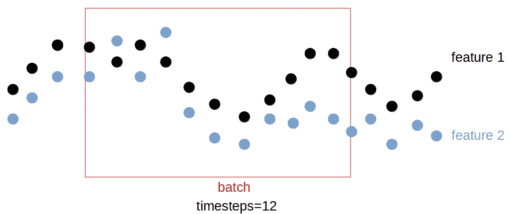

# 加载数据

我使用了 Tensorflow 教程中使用的相同数据集，该教程位于:[https://www . tensor flow . org/tutorials/structured _ data/time _ series # setup](https://www.tensorflow.org/tutorials/structured_data/time_series#setup)。

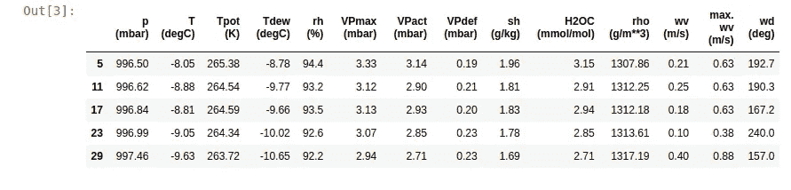

# 加载子功能

参见 github 页面(【https://github.com/j622amilah/LSTM】T2)访问四个主要的子功能:unsupervised _ lab _ k means _ clustering、create _ X _ batch _ time steps _ feature、binarize _ Y1Dvec _ 2 _ Ybin 和 LSTM_arch。

# 预测示例

在这里，我们使用函数 input return_sequences = True 来获得每个批处理的每个时间步长的输出。下面我们首先分配 X 和 y 矩阵，从 DataFrame (T (degC))中的温度列创建一个 y 标签。使用 kmeans，我们可以创建一个包含两个或更多类的 y 标签。

在图中，我们可以看到，也许 3 个类捕获了温度数据的波动，因此让我们选择 3 个类作为示例。

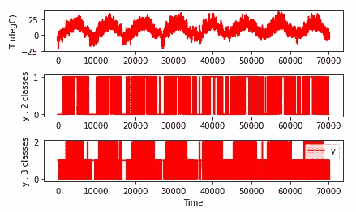

接下来，将 X 和 y_class3 矩阵分成训练和测试集数据。然后把 y 向量做成二值化矩阵，使每一列对应一个类；我发现当 y 被二进制化时，更容易跟踪 y 的大小。

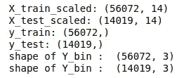

接下来，让我们指定批次大小窗口，并折叠每个批次的数据。我将 input_width = 24 指定为批处理大小窗口，时间周期可能为 24 小时。此外，我指定 return_sequence = True 来告诉 LSTM 模型，我们需要在每个时间步长进行预测。n_a =32 个单位表示每个 LSTM 单元具有隐藏状态和 32 个值的输出大小。

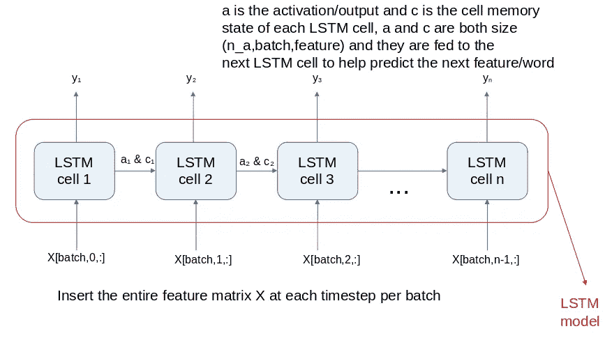

如图所示，隐藏/单元存储器状态用 c 表示，激活/输出用 a 表示，n_a 对于调整很重要，因为输入到输出的映射会影响预测。请注意，a 和 c 是 size (n_a，batch，feature ), X 的每个输入列是 size (batch，1，feature ),因此每个时间步长的特征值都映射到 n_a 值。最后，时间步长的数量表示所需的 LSTM 单元的数量，我们可以在每个时间步长输出一个预测，或者继续将 a 和 c 传递给下一个 LSTM 单元，并在最后输出一个预测(基于所有批处理数据)。

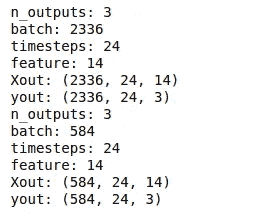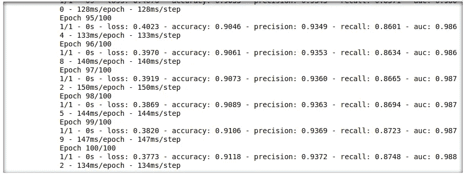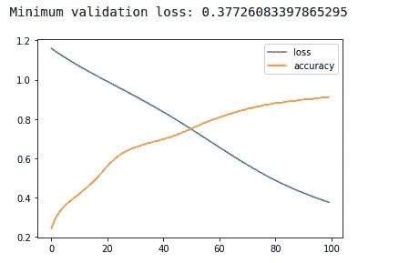

# 测试模型

# 画出一些预测

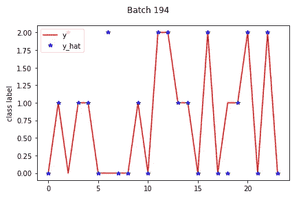

LSTM 模型可以以 91%的准确率预测测试数据集中的每个时间步长，这太棒了！查看上图，我们可以看到，对于批次 194，由 y_hat 表示的 LSTM 在 24 个时间步中出现了两个错误。

既然我们知道了如何预测一个批次中的每个时间步长，那么让我们只预测每个批次中的一个点。

# HAR/审判实例

正如我前面提到的，大多数想要预测一段时间内行为的人通常对获得整批行为的一个预测感兴趣，因为行为是一个取决于许多连续时间点的因果事件。

让我们继续这 3 个类，并设置 return_sequences = False。

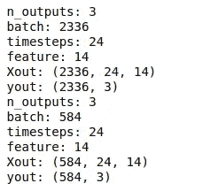

注意，唯一改变的变量是 yout，return_sequence=False 的大小是(batch，n_outputs)。但是，对于 return_sequence=True 以上，yout 的大小为(batch，timesteps，n_outputs)。让我们使用更多的历元再次运行模型，以便获得更好的准确性。

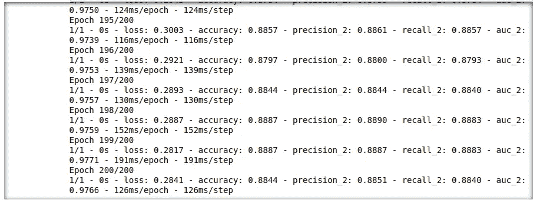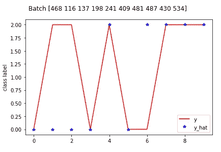

在上图中，我们可以看到每批 LSTM 的预测。如果我们为超过 200 个时期训练模型，LSTM 可以预测得更好。我希望 LSTM 的这个解释是有帮助的和清楚的。

练习愉快！

 [## Mlearning.ai 提交建议

### 如何成为 Mlearning.ai 上的作家

medium.com](/mlearning-ai/mlearning-ai-submission-suggestions-b51e2b130bfb)