# 如何在 matplotlib 中为条形图指定条形和刻度的位置

> 原文：<https://medium.com/mlearning-ai/how-to-specify-location-for-bars-and-ticks-for-barplots-in-matplotlib-490f097eada7?source=collection_archive---------2----------------------->

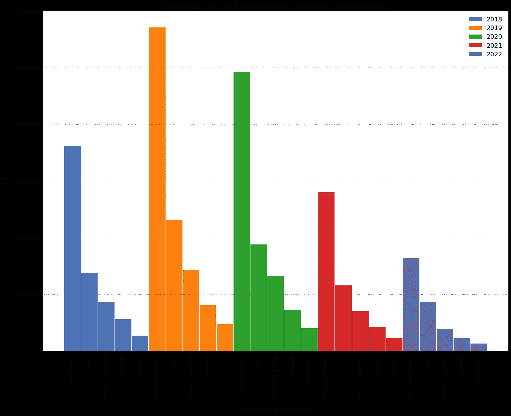

# 摘要

本教程一步一步地详细介绍了如何绘制条形图，其中您希望根据您的意愿在自定义位置绘制条形图，并且标签应与相应的条形图一起打印。

# 介绍

最近，我在做一个数据分析项目，包括一个网站在过去 5 年里从世界不同国家收到的流量数据集。我希望绘制一个条形图，显示一年中流量最大的前 5 或前 10 个国家。

实现这一点的直接解决方案是为每年绘制五个单独的条形图，然后并排比较它们。然而，我想写一个 python 代码，在单个条形图中标出流量/点击率最高的前 5 或前 10 个国家。

# 关于数据集

我已经将值更改为 csv 文件的虚拟数字，该文件将用于本例，保持我手头的结构。csv 包含一个国家栏和一个 5 年栏。表中的每个数值都是该国历年来的点击数。

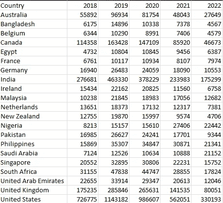

# 让我们开始工作吧

***导入必要的库***

```
import pandas as pd
import numpy as npimport matplotlib.pyplot as plt
import seaborn as snsfrom matplotlib.pyplot import figure
```

***读取数据帧*** 中的 csv

```
df = pd.read_csv(‘countries_hits.csv’)
df.head(5)
```

输出:

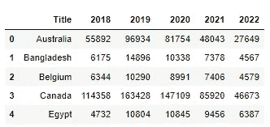

```
df.shape
```

输出:

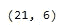

## **方法:**

1.  我们将提取列表“year”中所有带有年份的列名。这将是一年的循环，并在最后的柱状图中绘制图例。
2.  我们将对任何给定年份的数据帧进行降序排序，并将该特定年份的切片以及前 5 个国家的名称和值存储在虚拟数据帧“sorted_df”中
3.  接下来，我们将编写一个循环，在同一个图表中为每年绘制一个条形图，该图表将是我们的网站在该年收到的点击量。我们还必须确保没有酒吧重叠。
4.  最后，我们将编写一个用于显示 xticks 的循环，这些 x ticks 将是我们对应条形的国家/地区，然后对我们的图表进行一些修饰性的更新，为图表添加图例和适当的标题。

## 执行:

*在我们创建一个函数并将所有内容合并到一个代码单元之前，让我们经历一次循环迭代并理解其中的机制。*

**第一步:**

让我们提取变量“year”中的列名，并将其转换为列表。此外，我们将忽略第一列的标题“国家”。

```
year = df.columns
year = year.tolist()
year.remove(year[0])
year
```

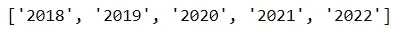

**第二步:**

声明并初始化将在后续步骤中使用的变量:

```
country = []    #to store the top 5 country names
initiate = 0    #to compute the location for bar
start = 0       #to compute the location for bar
stop = 0        #to compute the location for bar
xtick_loc = [] #to store location on which xlabel to be displayed
barWidth = 0.2  #width of bar to be plotted

clicks = None   #to store the top 5 country's click countvalue = ‘2018’  #initiate to simulate first iteration of loop
index = 0       #initiate to simulate first iteration of loop
```

让我们对数据帧进行排序，并根据需要对其进行切片:

```
 df = df.sort_values(by = [value], ascending = False)sorted_df = df.iloc[ :5, :index+2]sorted_df
```

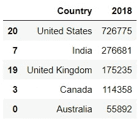

```
clicks = sorted_df.iloc[:, index+1:][value].values.tolist()clicks
```

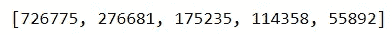

```
if len(country) == 0:
 country = sorted_df[‘Country’].values.tolist()
else:
 country = country + sorted_df[‘Country’].values.tolist()country
```

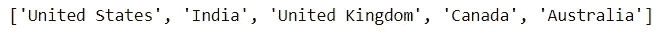

总结到目前为止所执行的步骤，我们已经获得了“点击”数组，该数组将被传递给 plt.bar 函数，以根据高度绘制条形图。

我们还有一个“country”数组，它将被传递给 plt.xticks，以便为每个条形绘制适当的分笔成交点，并使读者更容易理解该图。

**第三步:**

我们已经收集了“什么”的信息到目前为止，我们对这篇文章的主要问题是“哪里？”去策划。

我们需要指定每个条从 x 轴起点的距离。0.对于要在图上绘制的每一年的数据，我们在 x 轴上有 1 个单位的杠杆。换句话说，对于 2018 年，我们可以使用 0 到 1 的距离。我们将为 2019 年及以后的年份指定 1 到 2 的范围。

因为我们将绘制前 5 个国家，所以将在提到的范围 0 到 1 之间绘制 5 个条形。因此，我们需要创建一个数组来存储每个条形到 x 轴的距离，该数组将被传递给 plt.bar 和 plt.xticks，以使用“点击”来绘制条形，并使用“国家”来显示国家名称

我们需要一个数组“r ”,以 0 开始，以 1 结束，以 barwidth(0.2)为增量。

```
for i in range(0, len(clicks)):
 stop += barWidthstop = round(stop, 2)
r = np.arange(start, stop, barWidth, dtype = float)
stop = round(stop, 2)
start = math.ceil(stop)
stop = math.ceil(stop)r
```

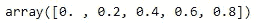

我知道看起来我们已经写了太多行代码来得到一个增量为 0.2 的数组。我们这样做是为了处理当我们将所有这些代码转换成一个动态且健壮的函数时将会传递的所有参数。

```
bar = plt.bar(r, clicks, width = barWidth, edgecolor=’white’, label = value)
```

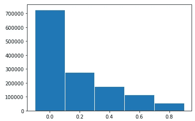

我们将清空数组，以便能够在下一次迭代中再次使用它，从 1.0 开始，到 2019 年的 1.8，依此类推。

```
for i in range(0, len(r)):
 r = np.delete(r, obj = 0, axis = 0)
```

**第四步:**

```
for x in range(0,len(clicks)):
 xtick_loc.append(initiate)
 initiate = round(initiate, 2)
 initiate += barWidth
 initiate = math.ceil(initiate)
xtick_loc
```

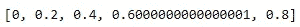

我们不会在每次迭代后清空 xticks 数组。我们将简单地追加所有的位置，重复计算“r”的步骤。

我们有了绘制简介中显示的图表所需的所有必要组件。让我们将所有代码合并到一个函数中，并给图表添加一些标题和标签，看看效果如何。

```
def plot(df, barWidth, top_n):
    year = df.columns
    year = year.tolist()
    year.remove(year[0]) country = []
    start = 0
    stop = 0 
    xtick_loc = []
    initiate = 0

    figure(figsize=(20, 15), dpi=80)

    for index, value in enumerate(year):
        clicks = None
        df = df.sort_values(by = [value], ascending = False)
        sorted_df = df.iloc[ :top_n, :index+2]
        clicks = sorted_df.iloc[:, index+1:][value].values.tolist() if len(country) == 0:
            country = sorted_df['Country'].values.tolist()
        else:
            country = country + sorted_df['Country'].values.tolist() for i in range(0, len(clicks)):
            stop += barWidth stop = round(stop, 2)
        r = np.arange(start, stop, barWidth, dtype = float)
        stop = round(stop, 2)
        start = math.ceil(stop)
        stop = math.ceil(stop) bar = plt.bar(r, clicks,  width = barWidth, edgecolor='white', label = value) for i in range(0, len(r)):
            r = np.delete(r, obj = 0,  axis = 0) for value in range(0, len(year)):
        for x in range(0,len(clicks)):
            xtick_loc.append(initiate)
            initiate = round(initiate, 2)
            initiate += barWidth
        initiate = math.ceil(initiate) plt.title("Distribution of Top 5 Countries with Maximum Hits Yearwise.", fontsize = '18') plt.ylabel('Clicks',fontsize= 18)
    plt.xlabel('Top Ranked Countries', fontsize= 18)
    plt.xticks([xtick_loc for xtick_loc in xtick_loc ], country,rotation ='vertical', fontsize= 15) plt.yticks(fontsize= 15) plt.ticklabel_format(style='plain',useOffset=False, axis ='y') plt.grid(b = True, axis = 'y', color = 'green', linestyle = '--', linewidth = 0.5, alpha = 0.7)
    plt.minorticks_on()
    plt.grid(b = True, axis = 'y', which='minor', color='#999999', linestyle='-', alpha=0.2) plt.legend(fontsize = 15)
    plt.show()plot(df, 0.2, 5)
```


*注意:您还可以将 barWidth 的值更改为 0.1，将 top_n 的值更改为 10，并分别观察前 10 个国家。*

感谢您阅读文章。请联系任何关于 kakadiya95@gmail.com 的问题、澄清或版权问题。或者，你可以在我的 Linkedin 页面上给我发消息。另外，检查我的 [github](https://github.com/sh4dowbyt3) 账户。

[](/mlearning-ai/mlearning-ai-submission-suggestions-b51e2b130bfb) [## Mlearning.ai 提交建议

### 如何成为 Mlearning.ai 上的作家

medium.com](/mlearning-ai/mlearning-ai-submission-suggestions-b51e2b130bfb)