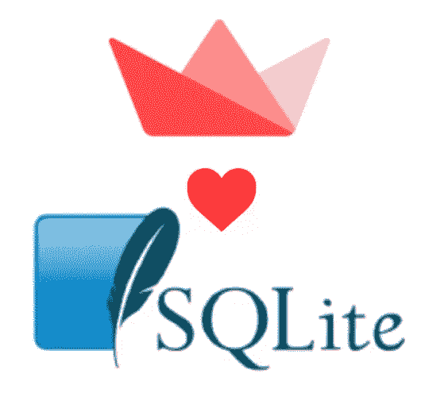
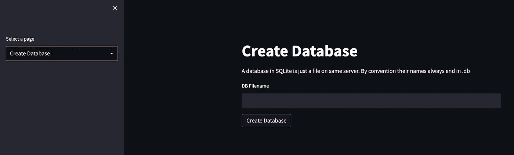
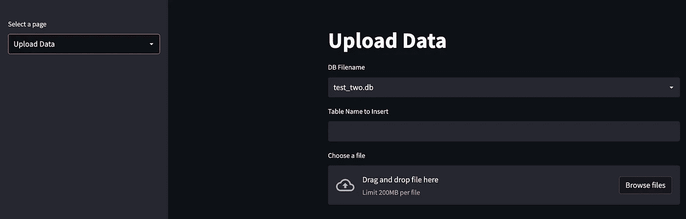

# 如何用 Streamlit 和 SQLite 开始学习 SQL

> 原文：<https://medium.com/mlearning-ai/how-to-start-learning-sql-with-streamlit-d3edad7494cd?source=collection_archive---------2----------------------->

学 SQL 比开始学 SQL 容易。使用 Streamlit 和 SQLite 的数据工程。



Streamlit and SQLite, a match made in heaven. Image by Author

对于试图进入数据行业的初学者来说，学习 SQL 显然是第一步。这说起来容易做起来难。虽然你需要知道和理解的语句非常简单。数据库术语令人困惑，建立数据库是一项大三学生不太可能做的工作。

这里有一个更高级的解决方案:

[使用 Streamlit 和 SQL(medium.com)进行快速商业智能统计](/me/stats/post/cd6a9ba8a48f)

# SQLite

SQLite 是您可以开始使用的最简单的数据库。它会在您的笔记本电脑上创建一个本地文件，您可以针对该文件运行几乎所有与 PostgresDB 相同的查询。创建连接的同时也创建了数据库，当运行这个演示时，您会看到这个文件出现在同一个目录中。

# 细流

如果你试图分解数据，你可能也在学习 python。Pandas 和它的表对象 DataFrame 是数据工程和数据科学的同义词。在这个演示中，pandas 仅用于读入 CSV 文件，并在该状态和 SQLite 之间存储数据。

Streamlit 是用 python 创建 ui 的最快方法。它最适合单向工作流。最近，改进的多页面设置使得将几个简单的交互流放在一起变得非常快。

Streamlit 在我推荐采用的框架中排名最高。

[挑选框架的框架|乔治·皮尔斯| 2022 年 8 月| Medium](/p/a4cd273e0e18)

# 细流代码

# **Python 包**

*   sqlite3 和 os 是 python 内置包，不需要安装。
*   pandas 和 streamlit 都必须“安装 pip”。其他博客已经详细解释了如何开始。

# 要运行的步骤

**从与上面代码相同的文件夹中运行:**

```
streamlit run streamlit_sqlite_demo.py
```

**点击本地主机链接:**

这将带您进入一个网页，现在您将有 3 个页面，可通过侧面板导航，这将使您能够创建一个 SQLite 数据库，上传一个 CSV，然后对其运行 SQL 查询。您的页面可能有不同的配色方案，这可以通过网站右上角的设置按钮进行更改。

**1。为您的数据库选择一个名称(以。db)并点击【创建数据库】**



create database. Image by Author.

**2。找到一个要上传的 CSV 文件，并为该表命名。**



upload data. Image by Author

[https://www.data.gov.uk/](https://www.data.gov.uk/)有一个很好的 CSV 库，可以上传和运行查询。如果您正在努力寻找一个例子(文件必须只有一行标题),下面的作品，下载名为:

【2020 年 4 月至 6 月国防部高级官员费用(2 星及以上)

从

【data.gov.uk】MOD:2020 年 1 月至 12 月高级官员业务支出、招待和会议

**3。选择您已经创建的数据库并运行 SQL 查询。**


run query. Image by Author

```
select * from <table-name>
```

是一个很好的起点。

这篇文章很好地解释了如何将您的 Streamlit 应用程序发布到 Heroku。

[如何将您的 Streamlit 应用部署到 Heroku 的快速教程。|作者纳维德·马辛奇|走向数据科学](https://towardsdatascience.com/a-quick-tutorial-on-how-to-deploy-your-streamlit-app-to-heroku-874e1250dadd)

截图中显示的应用程序目前可用

[细流(streamlitapp.com)](https://georgepearse-sqlite-streamlit-app-app-l4kyr3.streamlitapp.com/)

通过 Streamlit 云托管。

如果你觉得这很有趣或有帮助，请鼓掌并跟随。让我知道你的想法，任何问题，和所有的问题。谢谢！

也在寻找好的出版物使用。如果你是一名编辑，并且这些内容符合你的读者的兴趣，请联系我们。

[](/mlearning-ai/mlearning-ai-submission-suggestions-b51e2b130bfb) [## Mlearning.ai 提交建议

### 如何成为 Mlearning.ai 上的作家

medium.com](/mlearning-ai/mlearning-ai-submission-suggestions-b51e2b130bfb)