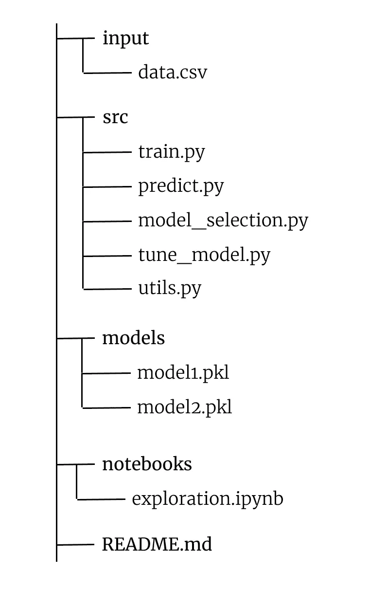

# 如何构建你的机器学习项目

> 原文：<https://medium.com/mlearning-ai/how-to-structure-your-machine-learning-project-62f8a1eef582?source=collection_archive---------1----------------------->

Photo by [Kaleidico](https://unsplash.com/@kaleidico?utm_source=unsplash&utm_medium=referral&utm_content=creditCopyText) on [Unsplash](https://unsplash.com/s/visual/adaf2806-a44c-4f78-a459-0e0addc59fb3?utm_source=unsplash&utm_medium=referral&utm_content=creditCopyText)

数据科学大三学生通常专注于理解 Scikit-Learn、Numpy 和 Pandas 等库是如何工作的。许多 MOOCs 在围绕后者的概念上推了很多，**忽略了数据科学项目的管理部分**。

就像大三学生可能知道的算法、库和编程一样，一个项目的**成功也与其结构**有关。混乱的结构会严重影响分析员的工作表现，分析员必须不断地在大量的文件和待办事项中定位自己。如果更多的人参与到这个项目中，这一点就更加重要了。

在本文中，我将分享我构建数据科学项目的样板文件。这个组织的灵感来自于 Kaggle 的知名大师 Abhishek Thakur (@abhi1thakur 在 Twitter 上)的工作，来自于他的书*接近几乎任何机器学习问题*(强烈推荐——此处阅读)。

虽然许多数据科学家使用 Jupyter 来完成他们的项目，但我们将使用 VSCode 或 PyCharm 等 IDE。Jupyter 及其笔记本只会用于探索性分析和图形生成。通过这种方式，我们可以专注于创建一个即插即用的模板，通过一些小的更改就可以适应几乎任何数据科学问题。

# 项目结构

让我们看看文件和文件夹的结构。让我们用我们的项目名创建一个文件夹——在我们的例子中，我们称它为*项目*。在*项目*中，我们将有这样的结构:

Structure of a data science project

**输入**文件夹将包含与项目数据集相关的数据和材料源文件。

**src** 文件夹将包含所有实际的工作文件。

*   **train.py** :这个脚本将训练 tune_model.py 选择的模型，它将返回一个以 **pickle** 格式保存到磁盘的模型
*   **predict.py** :使用 train.py 生成的模型进行预测的脚本
*   **model_selection.py** :在这个脚本中，我们将编写代码，为我们的数据集返回最佳性能模型的引用
*   **tune_model.py** :用于将 model_selection.py 的结果传递给超参数优化管道
*   utils.py:它将包含我们在项目中需要的所有帮助函数

**models** 文件夹将包含 train.py 返回的模型，并以 pickle 格式保存。

**笔记本**将是我们的探索环境，在这里我们将放置我们所有的。ipynb 笔记本。

README.md 将成为我们的“指导手册”——在这里，我们将插入必要的文档来传达我们软件的行为。

# 如何使用这个样板文件

**我通常通过创建 README.md 文件**开始一个数据科学/ ML 项目。使用它来记录我们流程的每一步是至关重要的。在最初阶段，我用它来收集想法，从头脑风暴活动开始，然后慢慢浏览，最终得到一个简单但直截了当的文档。

**在我开始用笔记本工作的同时或之后立即**。在这里，我研究数据并试图理解是否有需要注意的特殊情况(缺失值、特殊模式、异常值的存在，等等)。在笔记本内部，我总是使用各种代码片段之间的单元格来注释或创建我正在做的事情的解释性标记。**我** **开始用各种函数填充 utils.py 文件**，我知道这些函数会在脚本级别上帮助我。

当我觉得自己已经熟悉数据集时，我会转到 **model_selection.py** 来测试基线并找到性能最佳的模型。 **tune_model.py** 与 model_selection.py 密切相关，因为所选模型直接提供给超参数优化管道，通常使用 [GridSearchCV](https://scikit-learn.org/stable/modules/generated/sklearn.model_selection.GridSearchCV.html) 或 [Optuna](https://optuna.org/) 执行。

从这里开始就很简单了——train . py 负责训练优化的模型并评估其性能，而 predict.py 被调用来进行推理。

# C‍onclusion

有了这个样板文件，您将有一个构建数据科学项目的起点。请随意扩展和修改这个结构的逻辑，以满足您的需要。‍

 [## Mlearning.ai 提交建议

### 如何成为 Mlearning.ai 上的作家

medium.com](/mlearning-ai/mlearning-ai-submission-suggestions-b51e2b130bfb)