# 如何教会 AI 断然思考？

> 原文：<https://medium.com/mlearning-ai/how-to-teach-ai-think-categorically-bd1c660ad75d?source=collection_archive---------2----------------------->

使用卷积神经网络区分狗和猫图像的基本方法

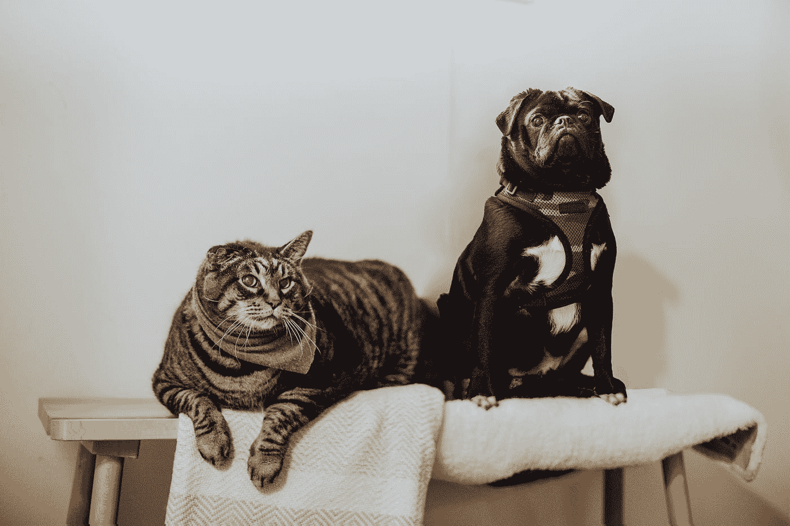

Photo by [Priscilla Du Preez](https://unsplash.com/@priscilladupreez?utm_source=medium&utm_medium=referral) on [Unsplash](https://unsplash.com?utm_source=medium&utm_medium=referral)

> 什么是 CNN，它一般是如何工作的？

卷积神经网络(CNN)是一种神经网络，大部分时间用于处理图像和像素。为了从中获得乐趣，我们将使用谷歌创建的深度学习库 TensorFlow。
但在尝试做出一些预测之前，我们应该使用数学和算法分两步进行图像预处理，然后，显然，用真实照片训练我们的模型。

> TensorFlow 库和一点关于

[TensorFlow](https://www.tensorflow.org) 为我们提供了处理一般神经网络的强大工具。在开始的时候，设置它可能有点困难，但是你一定会喜欢它。但主要的问题是你是否完全了解里面发生了什么…？

## 现在我将试着用一个非常吸引人的例子来解释 CNN 是如何工作的:区分狗和猫

我们的进攻计划分十步走:

*   图像变换
*   初始化 CNN
*   添加第一个卷积层
*   最大池化
*   添加第二个卷积层
*   变平
*   建立完整的连接
*   添加输出层
*   培训模式
*   进行单项预测

## *现在让我们来看看一切在理论上是如何工作的，之后，显然，我会与你分享我的代码*

> 1.卷积运算

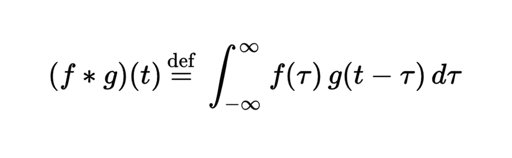

Main math convolutional function

这一步的主要目的是尽可能减小图像的尺寸，并且不要丢失重要的东西。我们使用许多不同的过滤器—特征检测器来获得最佳结果。例如，可以应用锐化、模糊、边缘增强、边缘检测和浮雕过滤器。

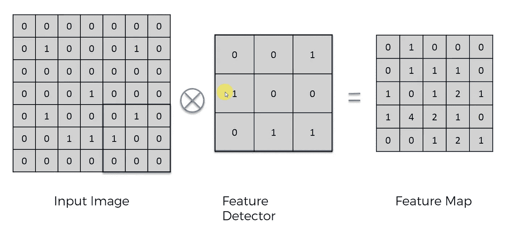

此外，在大多数情况下，我们应该应用[整流器功能](https://en.wikipedia.org/wiki/Rectifier_(neural_networks))，这增加了非线性。也是关于数学的。

> 2.最大池化

最大池是 CNN 中经常使用的技术。目标是对输入表示图像进行下采样，降低其维数，并允许对包含在被装仓的子区域中的特征进行假设。

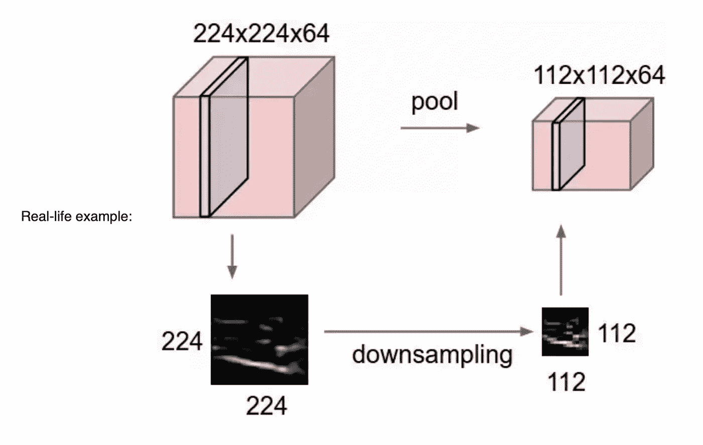

Examples of pooling and downsampling

> 3.变平

这个阶段很容易理解。在收到汇集的特征地图后，我们应该创建一个长的数据向量，稍后将它馈送到 CNN——这就是*展平*所做的。

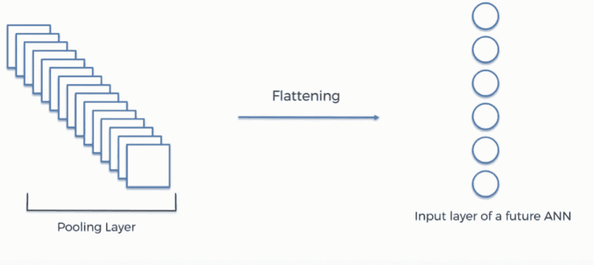

Process of data transformation

> 4.完全连接

创建基本 CNN 的最后一步是全连接过程。在这一部分中，我们在整个章节中涉及的所有内容都将合并在一起。

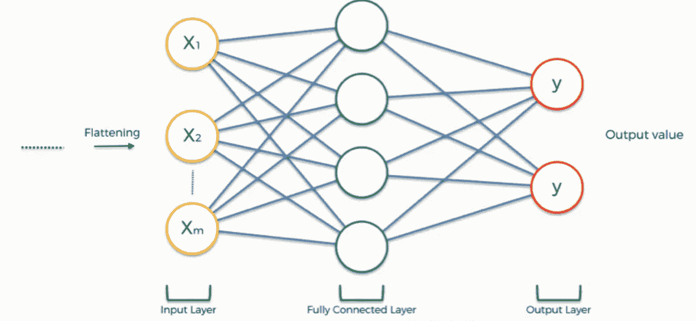

Input layer, fully connected layer, output layer now work together

## *最后，现在我们来看看代码*

1.  导入必要的库

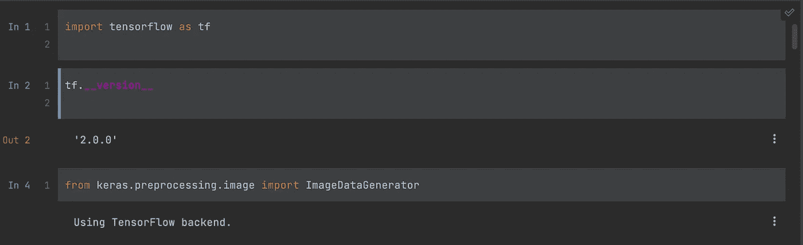

Basically import Tensorflow and Keras libraries

2.图像预处理

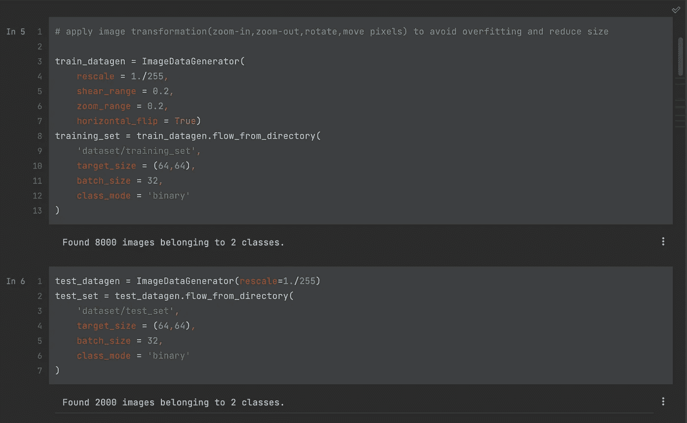

Using ImageDataGenerator module from Keras library

3.初始化 CNN 并添加卷积层

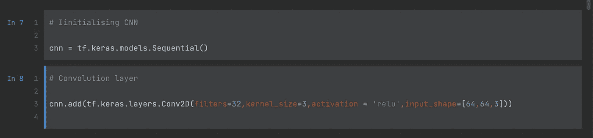

CNN object can be easily supplemented by additional layers

4.应用最大池函数并添加第二个卷积层

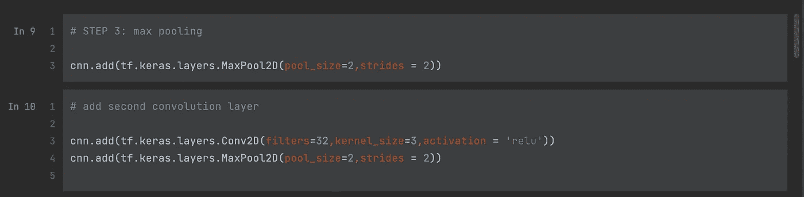

Using CNN object to work with layers and functions

5.应用扁平化，使 CNN 完全连接，并添加输出层

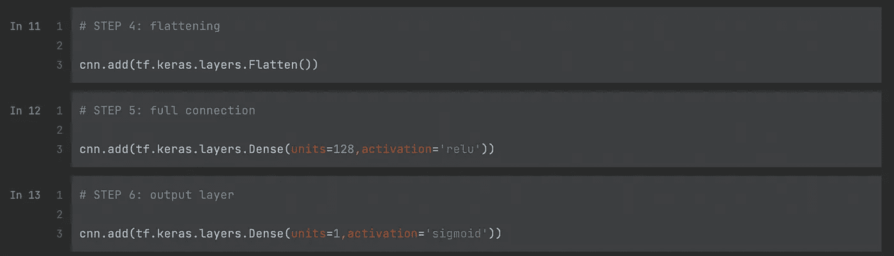

使用整流器和 sigmoid 函数(输出层)作为激活参数，128 个神经元(单元)用于全连接层，1 个神经元用于输出层。

6.编译 CNN，在训练图像上对其进行训练并评估准确性

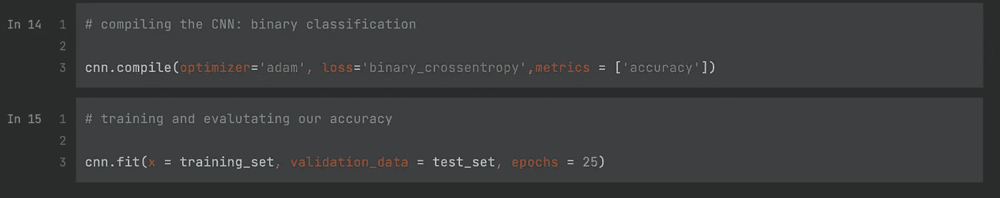

使用二进制分类作为损失函数和 25 个训练周期。准确率差不多 92%！

7.试着用我们的图片做单个预测

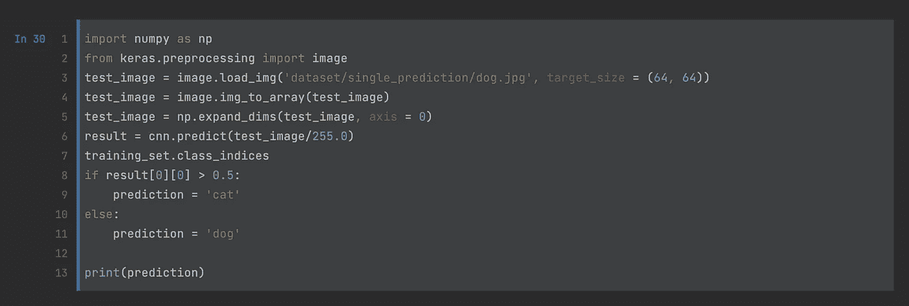

Final step

而且它的工作相当不错！

## 摘要

最后，我想说的是，我花了大约半个小时来训练我的模型，并获得了如此高的准确率——92%。在我让一些朋友给他们的宠物发照片后，我迫不及待地开始测试这个模型。

顺便说一句，即使现在我仍然没有理解所有的数学函数和算法是在后台发生的。这就是为什么深度学习和人工智能总的来说听起来很吸引人。

在这里你可以找到我的[代码](https://github.com/voytmv/DogCatCNNproject)。

 [## Mlearning.ai 提交建议

### 如何成为 Mlearning.ai 上的作家

medium.com](/mlearning-ai/mlearning-ai-submission-suggestions-b51e2b130bfb)