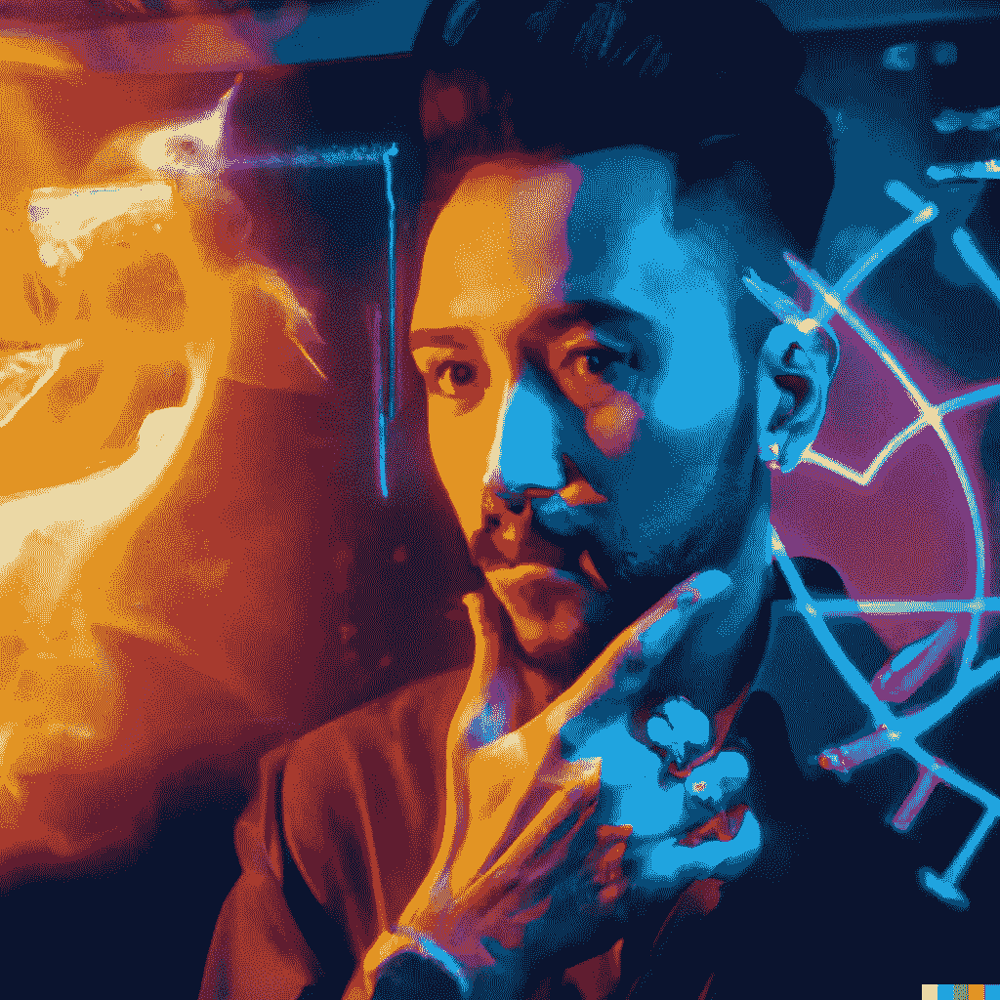

# 如何教人工智能艺术生成器理解我们正在谈论的内容

> 原文：<https://medium.com/mlearning-ai/how-to-teach-the-ai-art-generator-to-understand-what-we-are-talking-about-bca32a632322?source=collection_archive---------1----------------------->

## [机器学习艺术](https://mlearning.substack.com)

## 人工智能艺术的个性化生成

[Train Your AI Art Generator from scratch using only Text. DEMO + CODE](https://mlearning.substack.com/p/train-your-ai-art-generator-from?r=z7zu8&s=w&utm_campaign=post&utm_medium=web)

## 哪里可以创作 AI 艺术？

[**大规模文本到图像模型**](https://mlearning.substack.com/p/how-does-a-diffusion-model-work?r=z7zu8&s=w&utm_campaign=post&utm_medium=web) 最近显示出对自然语言描述进行推理的能力，这是前所未有的。他们让…