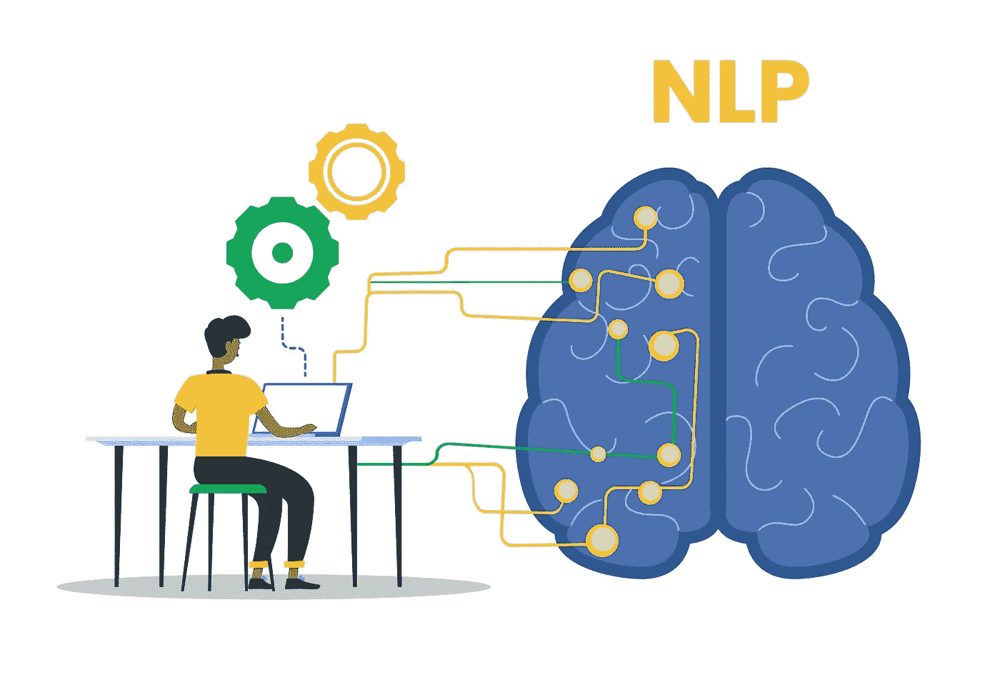

# 如何使用 NLTK 和 NLP 对单词和句子进行分词

> 原文：<https://medium.com/mlearning-ai/how-to-tokenize-words-and-sentences-using-nltk-and-nlp-f5b428a4e822?source=collection_archive---------6----------------------->



NLTK 模块是一个大型工具包，旨在帮助您处理自然语言处理(NLP)的许多方面。NLTK 可以帮助你从段落断句到拆分单词，识别这些单词的词性，强调重要的主题，甚至帮助你的计算机理解文本。在本文中，我们将关注情感分析领域，通常被称为意见挖掘。

您将需要 NLTK 模块以及 Python 来开始。

如果你还没有 Python，去 Python.org 下载最新版本的 Windows。您应该能够在 Mac 或 Linux 系统上执行以下代码:

```
sudo apt-get install python3
```

之后你就需要 NLTK 3 了。Pip3 将是安装 NLTK 模块最方便的方式。

所有用户都可以通过打开 cmd.exe、bash 或您使用的任何一个 shell 并键入:

```
pip3 install nltk
```

之后，我们必须安装一些 NLTK 组件。使用您喜欢的方法和类型打开 python:

```
import nltk
nltk.download()
```

除非您是无头运行，否则会出现一个 GUI。

选取“全部”以下载所有软件包，然后点按“下载”作为结果，您将获得所有的分词器、分块器、各种算法和语料库。如果空间不足，您可以选择手动下载所有内容。nltk 模块将占用大约 7MB，而完整的 NLTK 数据目录(包括您的组块器、解析器和语料库)将占用大约 1.8GB。

如果您正在运行 headless，您可以通过运行 Python 并执行上述代码和以下步骤来安装所有内容:

`d`(供下载)

`all`(用于下载一切)

它会为你下载所有的东西，而你不需要做任何事情。

当你第一次加入自然语言处理(NLP)领域时，这些是你会听到的最常见的单词，尽管还有更多我们将在后面介绍。之后，让我们看一个 NLTK 模块如何被用来标记任何东西的例子。

```
from nltk.tokenize import sent_tokenize, word_tokenize

EXAMPLE_TEXT = "The dog was called Wellington. It belonged to Mrs. Shears who was our friend. She lived on the opposite side of the road, two houses to the left."

print(sent_tokenize(EXAMPLE_TEXT))
```

乍一看，用单词或短语之类的东西来标记似乎是一项简单的任务。它可以出现在很多句子中。简单的. split(' . '))，或者除以句点后跟一个空格，很可能是第一步。然后，您可以使用正则表达式按句点、空格和大写字母分隔文本。问题是像舍尔斯夫人这样的人会给你带来麻烦。按单词拆分可能也很困难，尤其是在处理像 we 和 are to we 're 这样的连接时。通过这个看似简单，但实际上非常复杂的过程，NLTK 将会为您节省大量时间。

上面的代码将生成一个短语列表，您可以使用 for 循环遍历它:

[“这只狗叫威灵顿。”“它属于我们的朋友舍尔斯太太。”，‘她住在路的对面，左边两栋房子。’]

因此，我们开发了记号或短语。相反，这次让我们按单词来标记:

```
print(word_tokenize(EXAMPLE_TEXT))
```

现在我们的输出是:['The '，' dog '，' was '，' called '，' Wellington '，'.'、'它'、'属于'、'属于'、'夫人'、'舍尔斯'、'谁'、'曾经是'、'我们的'、'朋友'、'等等、'她'、'住过'、'对'、'对'、'对面'、'的'、'道'、'的'、'二'、'房子'、'对'、'的'、'左'、'的.']

这里有几件事需要记住。首先，请注意，标点符号被视为一个独特的符号。此外，注意单词“不应该”是如何分为“应该”和“不应该”的最后，观察“粉蓝色”是如何被处理成它想要成为的“一个单词”的。真的很酷！

现在我们面前有了这些标记化的单词，我们必须考虑我们的下一步。我们开始思考如何从这些词中提取意义。许多词可能显然被赋予了货币价值，但有一小部分本质上是无用的。这是一种我们也可能会遇到的“停用词”。无论如何，这就是 NLP 和 NLTK 的基本原理；它既有趣又复杂。