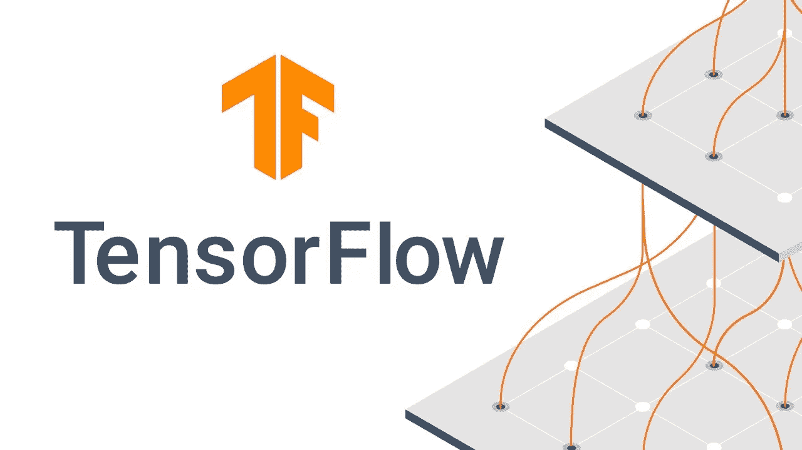
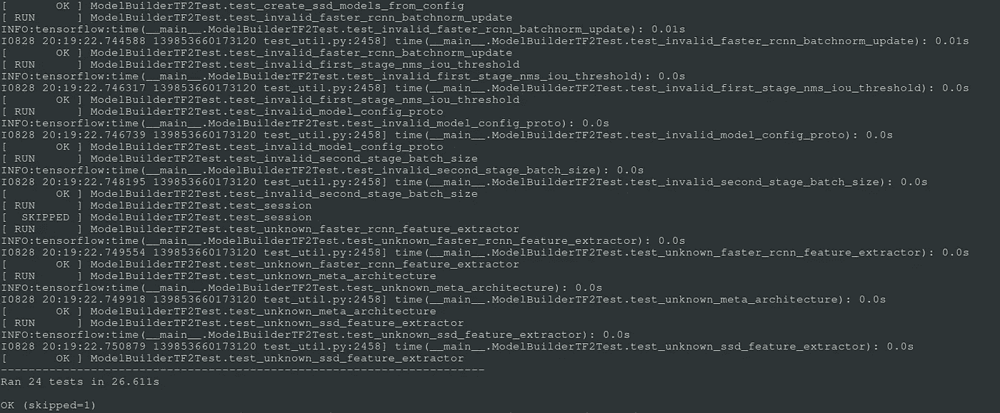
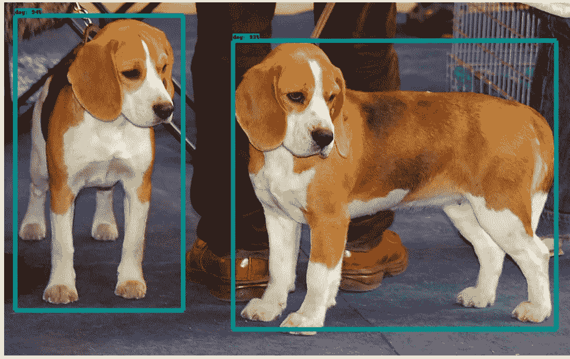

# 如何使用 TensorFlow 对象检测 API 训练自定义对象检测模型—第 1 部分

> 原文：<https://medium.com/mlearning-ai/how-to-train-custom-object-detection-model-using-tensorflow-object-detection-api-part-1-511a61c1316e?source=collection_archive---------4----------------------->

在本文中，我将指导您使用 TensorFlow 对象检测 API 创建自定义对象检测模型。

为了让文章简短，我把教程分成了 3 个部分。在本部分中，我将向您展示如何在系统中安装和测试支持 GPU 的 TensorFlow 和 TFOD 库。

完成本教程后，您将了解:

1.  使用图形处理器安装 TFOD2
2.  为自定义对象检测准备和注释图像数据
3.  从 TFOD 模型动物园配置模型
4.  对模型进行培训和测试



TensorFlow Object Detection API

在这篇文章中，我使用 Ubuntu 机器来安装软件包并训练对象检测模型。下面是我的机器和我将要使用的库的规格。

*   操作系统:Ubuntu 20.04 LTS
*   Python : 3.9
*   TensorFlow : 2.9.0
*   TFOD : v2

# 用 GPU 安装 TensorFlow 对象检测 API

如果您还没有安装启用了 GPU 的 TensorFlow，请查看我的 [**帖子**](/@errolpereira06/how-to-install-tensorflow-2-x-with-cuda-and-cudnn-on-ubuntu-20-04-lts-b73c209d8e88) 进行安装。我还提供了一个 bash 脚本，它将为您处理安装。

一旦 TensorFlow 安装在您的系统上，并且您已经在 GPU 机器上进行了测试，我们将继续安装 TensorFlow 的对象检测 API。

首先，从这个 [**repo**](https://github.com/tensorflow/models) 克隆本地系统中的 TensorFlow 对象检测模型库

克隆存储库后，使用以下命令安装 protobuff 库。如果你还没有激活你的 conda 环境，现在是激活它的好时机。

```
conda activate tensorflow
sudo apt install protobuf-compiler
pip3 install cython
pip3 install pycocotools </code></p>
```

将 protobuff 库安装完毕后，将 cd 放入您的**TF _ repo _ PATH/model/research**文件夹中，并运行以下命令。

```
protoc object_detection/protos/*.proto — python_out=.
```

上述命令不会产生任何输出。TFOD 的下一个依赖项是 COCO API 安装。对于这第一个克隆可可仓库在一个文件夹以外的模型文件夹。克隆 repo 后，使用以下命令构建 coco API，然后将构建后生成的 pycocotools 文件夹复制到 **model/research/** 文件夹中。

```
git clone [https://github.com/cocodataset/cocoapi.git.](https://github.com/cocodataset/cocoapi.git.)
cd cocoapi/PythonAPI
make
cp -r pycocotools PATH_TO_TF/TensorFlow/models/research/
```

一旦 coco API 安装完成，我们将继续在 conda 环境中设置和安装异议检测库。从“研究”文件夹运行以下命令以开始安装。

```
cp object_detection/packages/tf2/setup.py .
python -m pip install — use-feature=2020-resolver .
```

# 测试对象检测应用编程接口

现在我们已经在系统中安装了 API，让我们继续测试它。运行以下命令，该命令将触发使用 TensorFlow Model Zoo 中的一个模型执行的一系列测试，并将显示如下所示的类似输出。该命令需要从研究文件夹中运行。

```
python object_detection/builders/model_builder_tf2_test.py
```



Successful installation output

如果您想查看对象检测的运行情况，可以运行 research/object _ detection/colab _ notebooks/object _ detection _ tutorial . ipynb 中的笔记本。



Object detection demo

如果你已经做到了，恭喜你。在下一篇文章中，我将向您展示我们如何准备数据集来训练自定义对象检测模型。

[](/mlearning-ai/mlearning-ai-submission-suggestions-b51e2b130bfb) [## Mlearning.ai 提交建议

### 如何成为 Mlearning.ai 上的作家

medium.com](/mlearning-ai/mlearning-ai-submission-suggestions-b51e2b130bfb)