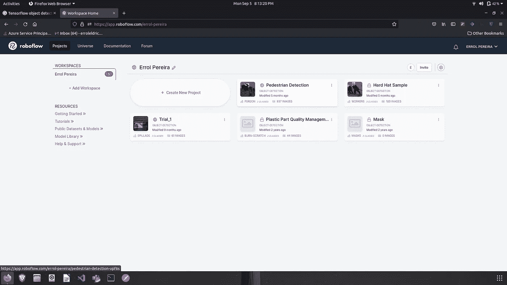
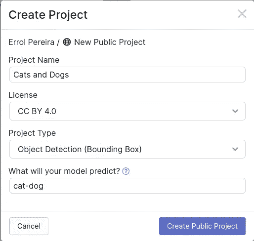
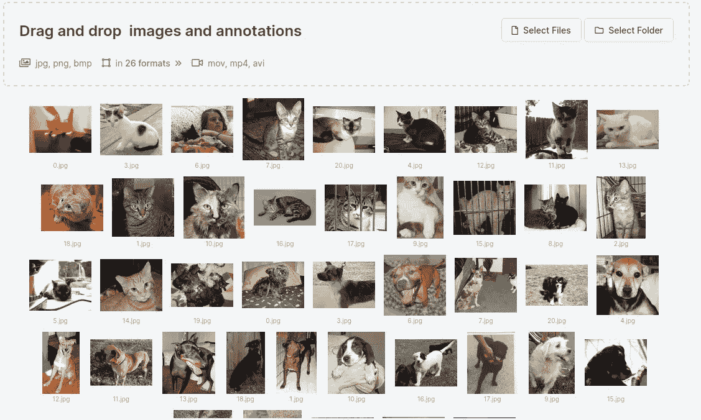
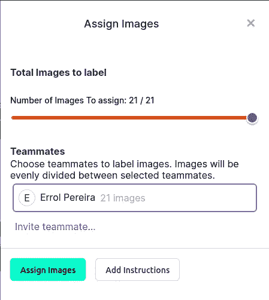
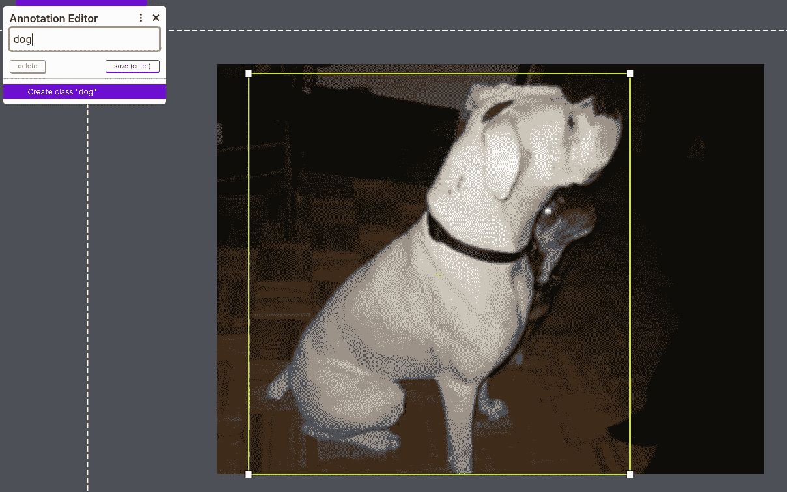
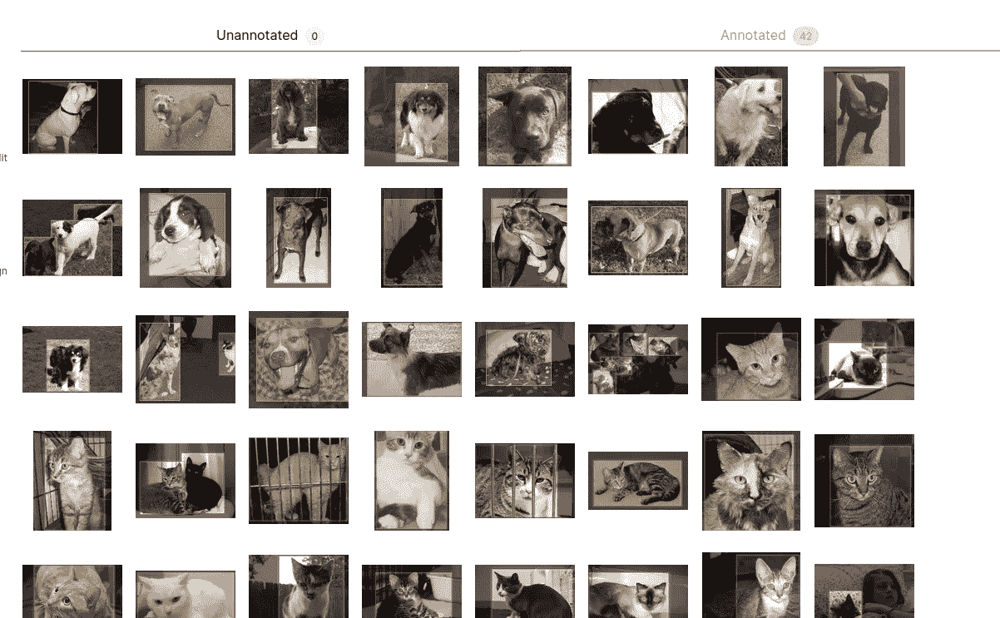
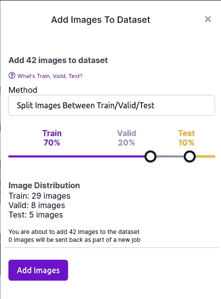
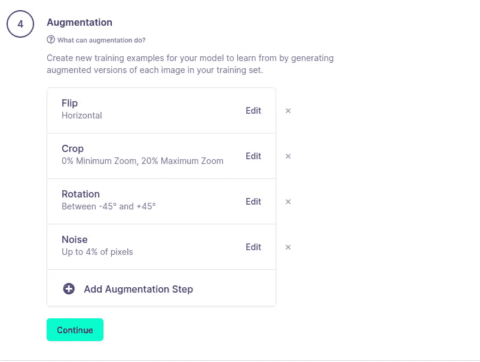
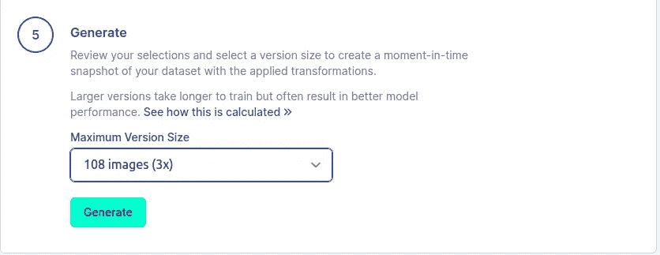
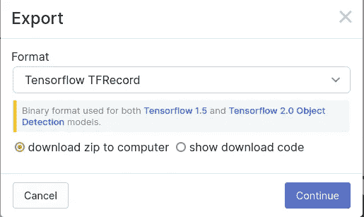

# 如何使用 TensorFlow 对象检测 API 训练自定义对象检测模型—第 2 部分

> 原文：<https://medium.com/mlearning-ai/how-to-train-custom-object-detection-model-using-tensorflow-object-detection-api-part-2-4e74a9e306b2?source=collection_archive---------6----------------------->

在这篇文章中，我将向您展示如何使用 TensorFlow 对象检测 API 来注释图像和创建数据集，以训练我们自己的自定义对象检测模型。

在这篇文章的最后，你会学到

1.  使用 Roboflow 注释图像
2.  增强图像
3.  生成 TFrecord 文件

TensorFlow Object Detection API

# 使用 Roboflow 注释图像

训练任何自定义对象检测模型的第一步是正确地注释图像中的对象。这是物体检测训练过程中最耗时的部分。

这也是一个手动过程，意味着图像中的每个对象都需要手动注释。在这篇文章中，我们将使用 [**Roboflow**](https://www.google.com/url?sa=t&rct=j&q=&esrc=s&source=web&cd=&cad=rja&uact=8&ved=2ahUKEwjkn-79_f35AhW84jgGHQlADfkQFnoECAgQAQ&url=https%3A%2F%2Froboflow.com%2F&usg=AOvVaw1h_eItJcl0qix45QGoUODw) ，这是一个端到端的计算机视觉框架，具有从注释图像到使用这些图像训练最佳模型的能力。

幸运的是，Roboflow 还具有数据增强功能，我们将使用它来增加我们训练数据集中的图像数量。

如果您还没有登录 Roboflow，请登录，让我们在 Roboflow 中创建我们的第一个图像注释项目。登录后，您将被重定向到网站的主页，如下所示

Roboflow home page

我已经创建了一堆对象检测项目，你的主页可能会看起来不同，这取决于你以前是否使用过这个工具。

点击“创建新项目”按钮。为您的项目命名。在这篇文章中，我将训练一个模型来识别图片中的猫和狗。如下图所示填写细节。

Create project in Roboflow

点击“创建公共项目”。这将需要你上传你的项目的一部分。在这里你可以点击**选择文件**或**选择文件夹**选项来上传你的图片。Roboflow 也有许多公共数据集可供选择。如果向下滚动，您可以看到一个选项**公共数据集**。在那里你会发现已经为你做了注释的图片。为了这个项目，我们将上传我们自己的数据集。

使用此[链接](https://drive.google.com/drive/folders/15Bf42bI5fiiLMscBFkTApiWa1H6L5YL5?usp=sharing)下载数据集。下载后，使用选择文件选项上传图像。

Uploading images to the project

上传完所有图片后，点击右上角的“完成下载”按钮。

Roboflow 允许我们与团队合作，其中开发人员有特定的角色。例如，您的团队中可能有人专门注释图像。Roboflow 为您提供了一个选项，将注释任务分配给团队中的某个特定成员。

由于这是一个演示项目，我们没有一个团队，继续下去，并分配给你自己的任务。点击“分配图像”选项，其他一切保持原样。

Assign images

您将在页面的未标注标签中看到您上传的所有图像。单击第一个图像，它会将您重定向到注释工作区。

在这里，您可以用您想要训练自定义对象检测模型的类来注释您的图像。继续创建一个矩形来覆盖图像中的对象。给对象贴上标签，然后点击“保存(输入)”。

Annotating images

类似地，对数据集中的每个图像都执行此操作。完成注释后，返回到项目主页。现在你应该可以在**带注释的**标签中看到你所有的图像，而在**不带注释的**标签中将没有任何图像。

Completed annotation task result page

现在点击右上角的“将图像添加到数据集”按钮。这将在屏幕右侧打开一个页面，要求您输入培训/测试/验证分割策略。对于这个演示，我们将使用 80%的数据作为训练，其余的用于验证。我们不会使用该数据集中的任何图像进行测试。

继续并相应地更改分割策略，然后单击“添加图像”按钮。

Split data into Train and Validation set

点击右上角的“生成新版本”按钮。

# 数据扩充

现在，我们将扩充数据以增加数据库的大小。这也将使我们的模型更好地统帅，并减少过度拟合的风险。

点击屏幕上的第 4 步增强选项。在这里，您可以添加多个增强步骤到您的图像。您可以从 Roboflow 提供的选项列表中添加过滤器，随心所欲地扩充数据。

Data Augmentation

在上面的图片中，你可以看到我添加了 4 个增强步骤。这使我的数据集中的图像数量从 42 个增加到了 108 个。

# 正在创建 TFrecord 文件

TensorFlow 对象检测库支持 TFRecord 文件作为输入。所以我们有必要将我们的注释和图像转换成这种格式。幸运的是，Roboflow 支持许多不同的格式，我们可以从中进行选择。

点击**生成**选项。这将创建数据集的一个版本，并将其保存在您的帐户中。

Generate Dataset

现在，您可以将该数据集导出为您想要的格式。点击右上角的**导出**，选择 *TensorFlow TFRecord* 作为格式。选择 ***下载 zip 到电脑*** 选项，点击**继续**。

这将把数据集保存在本地系统的. zip 文件中。

TFRecord File download

就是这样。我们已经成功地注释了我们的图像，扩充了数据集，并生成了 TFRecord 文件作为输入传递给我们的模型。

目前为止干得不错。我们离创建自己的自定义对象检测模型只有一步之遥。

在这篇文章的下一部分，我将向您展示我们如何最终使用我们创建的数据集，并将其作为训练输入传递给我们的模型。我们还将学习如何为我们的定制类配置模型，触发训练，验证和评估结果，最后在一些测试图像上测试它。

感谢阅读这篇文章。如果你喜欢它，请考虑在任何社交平台上分享它。干杯！

 [## Mlearning.ai 提交建议

### 如何成为 Mlearning.ai 上的作家

medium.com](/mlearning-ai/mlearning-ai-submission-suggestions-b51e2b130bfb)