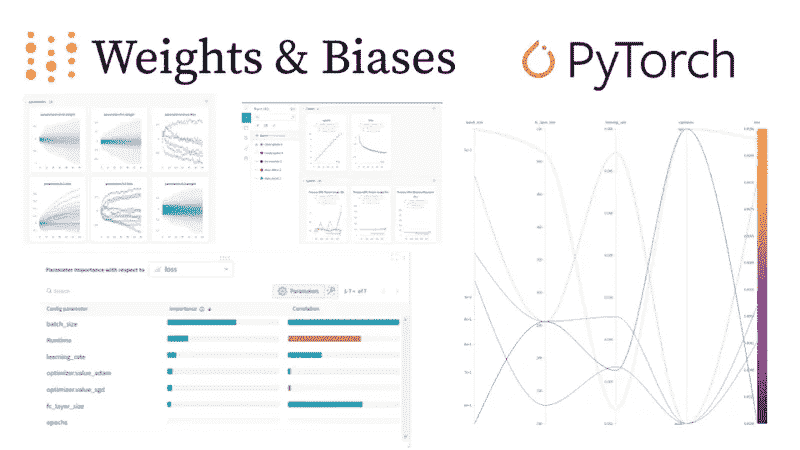

# 如何通过权重和偏差调整超参数(W&B 扫描)

> 原文：<https://medium.com/mlearning-ai/how-to-tune-hyperparameters-with-weights-and-biases-w-b-sweeps-44bd126d2a23?source=collection_archive---------2----------------------->

有很多知名库实现的成熟的机器学习算法。我们需要做的就是使用这些库，用几行代码构建应用程序。然而，找到最佳超参数并不容易。因为有大量的值可供我们选择，单个超参数的微小差异就可能导致巨大的性能差距。