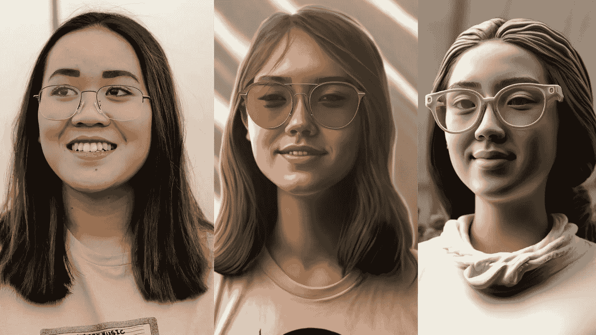

# 如何用 MidJourney 的 V4 模型把自己变成任何东西

> 原文：<https://medium.com/mlearning-ai/how-to-turn-yourself-into-anything-with-midjourneys-v4-model-22848f39ce8e?source=collection_archive---------0----------------------->

First image by [Noémi Macavei-Katócz](https://unsplash.com/@noemimk?utm_source=unsplash&utm_medium=referral&utm_content=creditCopyText) on [Unsplash](https://unsplash.com/?utm_source=unsplash&utm_medium=referral&utm_content=creditCopyText). AI images by [Jim Clyde Monge](https://medium.com/u/819323b399ac?source=post_page-----22848f39ce8e--------------------------------)

来自 [MidJourney](https://www.midjourney.com/) 的最新 [V4 算法](/geekculture/midjourneys-new-v4-algorithm-is-insane-cc56c95960ca)目前正在人工智能艺术社区流传。与以前的模型相比，质量和一致性有了很大的提高。一些用户甚至说 MidJourney 现在是最好的 AI 艺术生成器。

## V4 有什么新功能？

*   更多的知识(关于生物、地点等等)