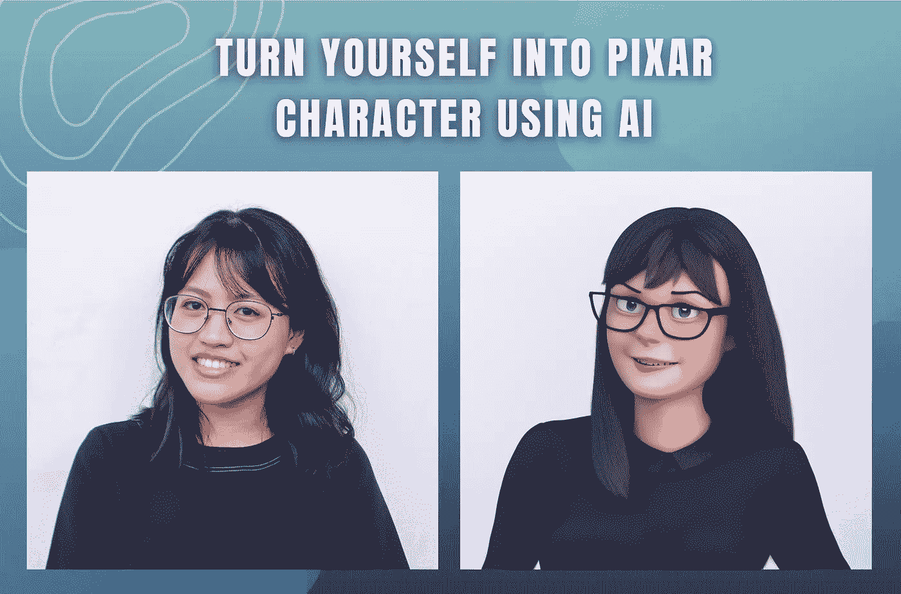

# 如何用稳定扩散 AI 把自己变成皮克斯角色

> 原文：<https://medium.com/mlearning-ai/how-to-turn-yourself-into-pixar-character-using-stable-diffusion-ai-e0c010c2a631?source=collection_archive---------0----------------------->

Image by [Jim Clyde Monge](https://medium.com/u/819323b399ac?source=post_page-----e0c010c2a631--------------------------------)

无论你是想成为下一个伍迪，下一个巴斯光年，还是把你的鱼变成下一个尼莫，[稳定扩散](/codex/stable-diffusion-finally-released-to-the-public-db1aa417d85b)都可以让它发生。有了这个潜在的文本到图像的扩散模型，你可以通过一个简单的文本提示把自己变成任何皮克斯角色的样子。