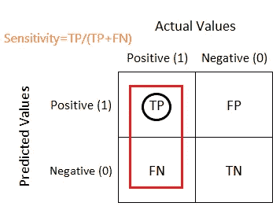
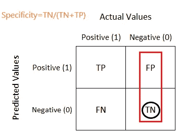
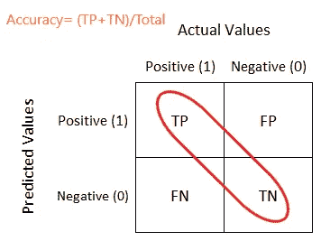
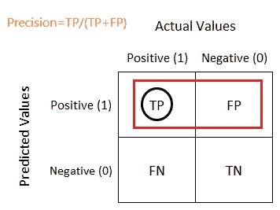
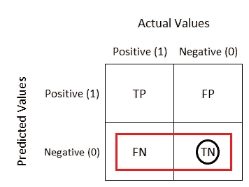

# 如何理解混淆矩阵？

> 原文：<https://medium.com/mlearning-ai/how-to-understand-a-confusion-matrix-d1d6ea0be852?source=collection_archive---------3----------------------->

Photo by [Emily Morter](https://unsplash.com/@emilymorter?utm_source=medium&utm_medium=referral) on [Unsplash](https://unsplash.com?utm_source=medium&utm_medium=referral)

在将数据拟合到 ML 算法之后，就有了自变量的预测。现在，您需要评估您的模型运行情况。此外，我们需要为适合用例的模型设置适当的决策阈值。在本博客中，我们将回顾混淆矩阵。如何被理解和解释？

首先，假设我们的分类问题是二元的，这意味着模型的预测是 1 或 0。预测输出是否属于该类。下图可以说明这一点。

Confusion Matrix for binary classification problem

实际值以列表示，预测值以行表示。现在我们有四种可能。

**1-真阳性:**预测值为正，正确。

**2-真阴性:**预测值为阴性，正确。

**3-假阳性(I 型错误):**预测值为阳性且不正确(未正确预测)。

**4-假阴性(II 型错误):**预测值为阴性且不正确(未正确预测)。

请始终记住，我们需要尽可能最大化 TP、TN 对角线，并且尽可能最小化 FN、FP 对角线，因为它们是正确的预测值。

# **敏感性和特异性:**

**灵敏度(真阳性率-TPR):**是指实际阳性结果中的正确阳性数(TP)。这个比率衡量我们的模型预测真实正值的敏感度。又称**召回。**

Sensitivity (TPR) from Confusion Matrix

**特异性(真阴性率-TNR):**是预测的阴性值中正确的阴性数。它衡量模型的具体程度。

让我们假设我们的 ML 模型是用于检测信用卡交易欺诈的。在这种情况下，我需要分类每一个欺诈交易，即使它是一个正常的。因此，我需要建立一个高灵敏度的模型，因为得到所有 TP 更重要(FN 应该是最小的)。

另一方面，如果我们的 ML 模型是用来检测垃圾邮件的。在这种情况下，如果用户收到的电子邮件不是垃圾邮件，但模型将其归类为垃圾邮件，则用户可能会错过一封重要邮件。因此，需要一个具有高特异性的模型，因为 FP 应该是最小的，以降低将邮件分类为垃圾邮件而不是垃圾邮件(FP)的概率。

# 准确度和精密度:

**准确度:**是所有正确预测的值占所有预测的百分比。它告诉我们我们的模型有多精确。

Accuracy from Confusion Matrix

**精度:**是真实阳性预测值占总预测阳性值的百分比。又称**阳性预测值。**

Precision from Confusion Matrix

**负面预测值:**真实负面预测占所有负面预测的百分比。

Negative Prediction Value from Confusion Matrix

提示:要记住所有的公式，想象你头脑中的混乱矩阵，并应用以下规则。

1-敏感性(回忆)，特异性→垂直列，提名者中的真值。

2-精度，负预测值→水平行，命名器中的真值。

3-精确度→所有真值/总数。

# **感谢阅读。**

你可以打电话给我

https://www.linkedin.com/in/bassemT4【essam