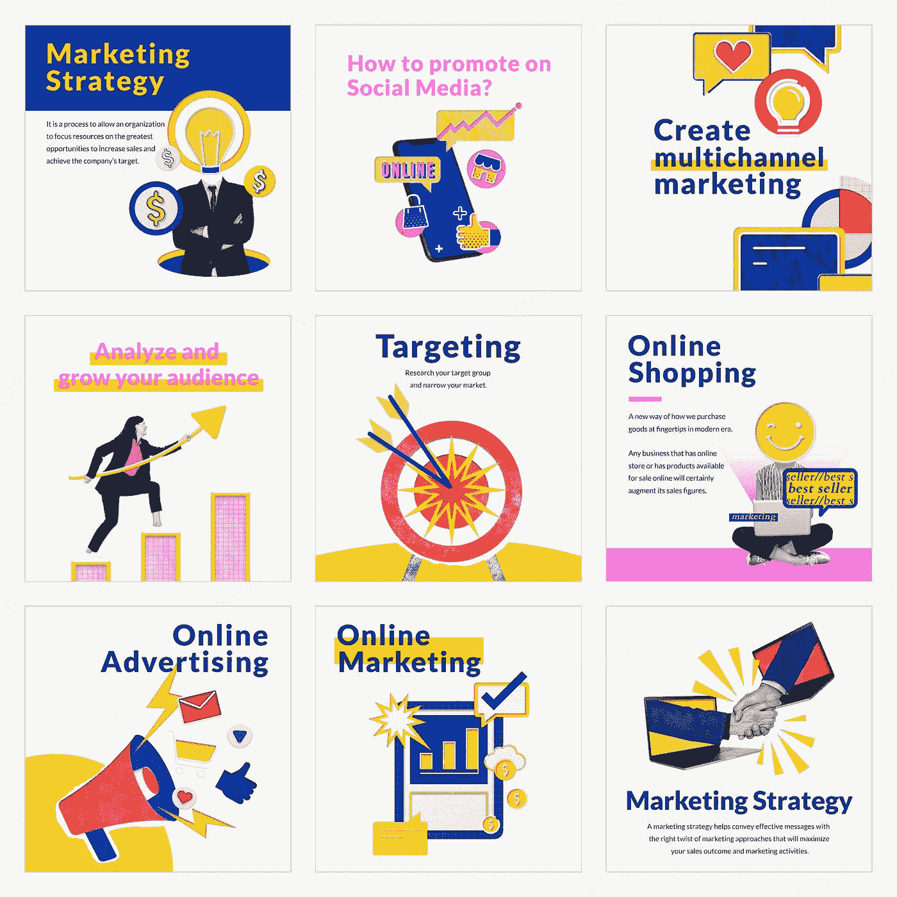

# 如何在社交媒体营销中使用人工智能

> 原文：<https://medium.com/mlearning-ai/how-to-use-artificial-intelligence-in-social-media-marketing-a451735a8e93?source=collection_archive---------7----------------------->

## 今天的数字营销格局比以往任何时候都更具竞争力。

**Image Source: FreeImages** [https://img.freepik.com/free-vector/social-media-marketing-templates-vector-e-commerce-business-remixed-media-compatible-with-ai-collection_53876-140550.jpg?w=2000](https://img.freepik.com/free-vector/social-media-marketing-templates-vector-e-commerce-business-remixed-media-compatible-with-ai-collection_53876-140550.jpg?w=2000)

为了脱颖而出，为你的网站带来流量，你需要一个社交媒体营销策略，让你比竞争对手更有优势。