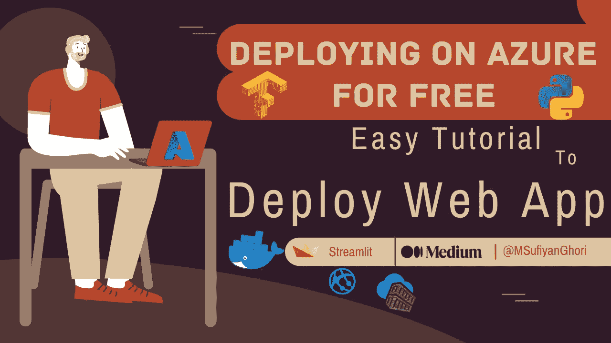
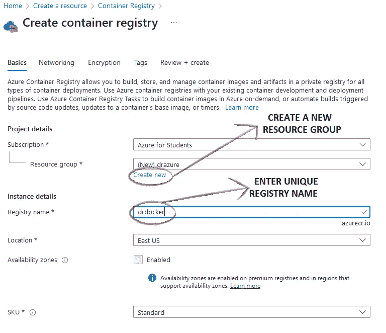
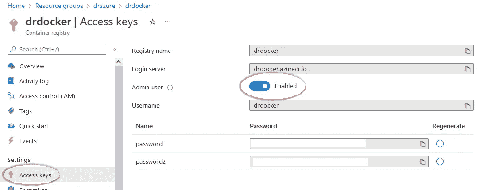
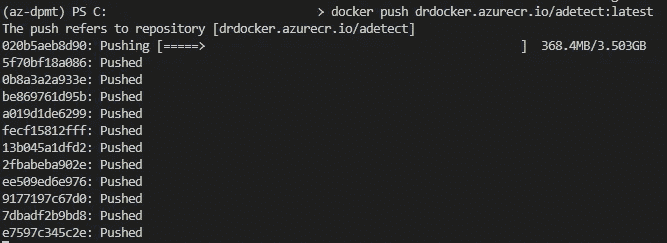
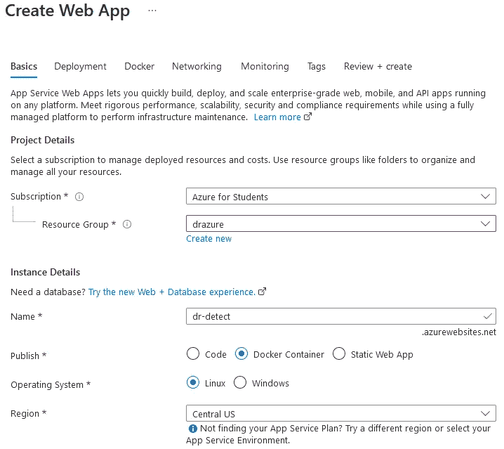
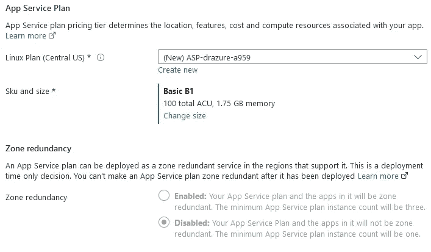
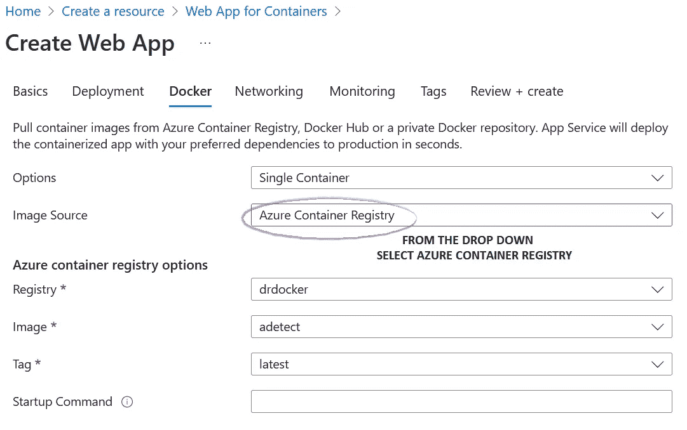
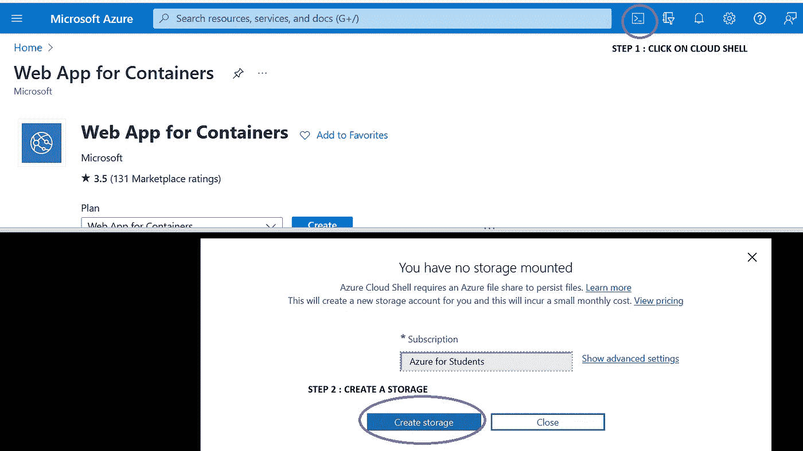
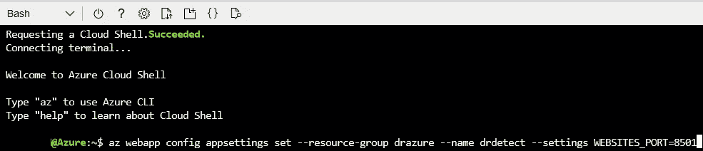

# 如何使用 Azure 免费部署你的 Web App 容器？

> 原文：<https://medium.com/mlearning-ai/how-to-use-azure-to-deploy-your-web-app-container-for-free-e11986bc3374?source=collection_archive---------4----------------------->

## 数据科学/部署

## 部署使用 Streamlit 制作的 web 应用程序的学生指南



Made Using [Canva](https://www.canva.com/design/DAFHMVkQe_M/yCkRN2ZbZYO4HYUcTavYmA/edit?layoutQuery=thumbnail+education)

之前我已经讨论过如何为我们的 ML/DL 模型构建一个容器，以及如何在 Heroku 上免费部署它。现在我将讨论为 DL 模型构建一个容器并将其免费部署在 Azure 上的步骤。将被容器化和部署的网络应用是检测博士。

部署容器涉及的不同步骤有

1.  [**先决条件**](#f759)
2.  [**创建 Dockerfile**](#fb16)
3.  [**构建一个图像**](#04cb)
4.  [**在 Azure 中创建容器注册表**](#b0df)
5.  [**将图像推送到 Azure 容器注册表**](#eae7)
6.  [**为容器创建 Web 应用**](#8b21)
7.  [**设置网站端口**](#dffb)
8.  [**Web App 准备启动**](#e8fb)
9.  [**外卖**](#65dc)

# 1.先决条件

**1.1。Azure 帐户** Azure for Students 为您提供 100 美元的 Azure 信用点数，可在前 12 个月内使用。您不需要输入您的信用卡详细信息；只有大学邮件 ID 可以。

**1.2。你可以参考我以前的文章来设置 Docker 桌面。**

> [https://medium . com/mlearning-ai/a-初学者指南-构建和部署-容器-for-your-ml-model-3c BC 45d 16 e 9 f](/mlearning-ai/a-beginners-guide-to-building-and-deploying-a-container-for-your-ml-model-3cbc45d16e9f)

**1.3。构建 web 应用程序(或使用现有的 web 应用程序)**

在本文中，我们将使用 Dr. Detect web app 在上一篇文章中，我讨论了如何在 Heroku 上部署它。现在，我们将尝试将其容器化，然后部署在 Azure 上。

> ***检测 Github 链接*** [https://github.com/MSufiyanAG/dr-detect-azure](https://github.com/MSufiyanAG/dr-detect-azure)

# 2.创建 Dockerfile 文件

Dockerfile 是一个文本文档，它包含用户可以在命令行上调用的所有命令来组合一个图像。使用 docker build，用户可以创建一个连续执行几个命令行指令的自动化构建。

**Dockerfile :**

```
FROM python:3.8COPY . /usr/app/WORKDIR /usr/app/RUN pip install -r requirements.txt \
    &&  apt-get update && apt-get install libsm6 libxrender1      libfontconfig1 libice6 ffmpeg libxext6 -yEXPOSE 8501CMD streamlit run app.py
```

**EXPOSE** —通知 Docker 容器在运行时监听指定的网络端口。

# 3.**建筑形象**

```
$ docker build -t adetect .
```

docker build 命令从 docker 文件构建 Docker 映像。

# 4.创建容器注册表

> 登陆网站:[https://portal.azure.com/](https://portal.azure.com/#home)

Azure Container Registry 是一个托管容器图像的私有注册表。

我们创建一个新的容器注册表和一个资源组。



除了基本信息外，任何其他选项卡都不需要更改；我们需要单击下一步，然后单击创建。
一旦创建了容器注册表，您就可以在 Azure 门户中启用管理员用户，方法是导航您的注册表，选择**设置**下的**访问键**，然后选择**管理员用户**下的**启用**。



然后在 CMD 上使用以下命令。

```
$ docker login Login_server
Username : Username
Password : password or password2
```

# 5.将图像推送到 Azure 容器注册表

```
$ docker tag adetect:latest <Login_Server>/adetect:latest$ docker push <Login_Server>/adetect:latest
```



一旦映像被成功推送，您就可以检查该映像是否列在 Container Registry 的 Services 下的存储库中。

# 6.为容器创建 Web 应用程序

它允许客户使用他们自己的容器，并将它们作为 web 应用程序部署到应用程序服务。此外，它还提供了与 DockerHub、Azure Container Registry 等集成的 CI/CD 功能。⁴



选择我们随容器注册表一起创建的资源组，并为 web 应用程序分配一个惟一的名称；单击下一步，直到我们到达 Docker 选项卡。



从 Docker 标签的下拉列表中选择 Azure container registry，它会自动填充 Azure Container registry 选项。然后单击“审阅”选项卡旁边的，创建 Web 应用程序。

# 7.设置网站端口

一旦 Web 应用程序被部署，在 Azure portal⁵.中创建一个云外壳



在 Azure Cloud Shell 中，使用`az webapp config appsettings set`设置`WEBSITES_PORT`环境变量，如应用程序 code⁶.所预期的那样
将网站端口设置为 Dockerfile 中暴露的端口。

```
$ az webapp config appsettings set — resource-group myResourceGroup — name <app-name> — settings WEBSITES_PORT=8000
```



# 8.**网络应用准备启动**

一旦为容器设置了网站端口，重新启动 web 应用程序并单击 Web 应用程序链接。


有时，尽管代码没有错误，但容器需要很长时间才能成功运行，所以需要一些耐心。

> 网络应用链接:[https://dr-detect.azurewebsites.net/](https://dr-detect.azurewebsites.net/)
> 由于我使用了免费的信用点数，过一段时间后我会删除这些资源。

# 9.外卖

*   利用 web 应用程序中监控部分下的日志流来了解错误(如果有)。也可以使用部署中心中的日志。
*   如有疑问，请参考 Azure 官方文档。
*   部署 web app 后监控成本管理+计费。为了节省免费额度，在 web app 的目的服务后，适当删除所有资源。
*   DockerHub 和 GitHub 可以用来存储或拉容器来构建 Web App。

> 适当删除所有资源，并在成本管理+计费中检查支出。

**敬请期待**

**快乐学习**

**参考文献**

[1]:学生用天蓝色。【在线】。可用:[https://azure.microsoft.com/en-in/offers/ms-azr-0170p/](https://azure.microsoft.com/en-in/offers/ms-azr-0170p/)

[2] : Dockerfile 参考。【在线】。可用:[https://docs.docker.com/engine/reference/builder/](https://docs.docker.com/engine/reference/builder/)

[3]:集装箱登记。【在线】。可用:[https://docs . Microsoft . com/en-us/azure/container-registry/container-registry-get-started-portal？tabs=azure-cli](https://docs.microsoft.com/en-us/azure/container-registry/container-registry-get-started-portal?tabs=azure-cli)

[4]:集装箱登记。【在线】。可用:[https://docs . Microsoft . com/en-us/azure/devo PS/pipelines/apps/CD/deploy-docker-web app？view = azure-devo PS&tabs = Java % 2c YAML](https://docs.microsoft.com/en-us/azure/devops/pipelines/apps/cd/deploy-docker-webapp?view=azure-devops&tabs=java%2Cyaml)

【5】:Azure 云壳概述。【在线】。可用:[https://docs.microsoft.com/en-us/azure/cloud-shell/overview](https://docs.microsoft.com/en-us/azure/cloud-shell/overview)

[6]:使用自定义容器将自定义软件迁移到 Azure 应用服务。【在线】。可用:[https://docs . Microsoft . com/en-us/azure/devo PS/pipelines/apps/CD/deploy-docker-web app？view = azure-devo PS&tabs = Java % 2c YAML](https://docs.microsoft.com/en-us/azure/app-service/tutorial-custom-container?pivots=container-linux)

[](/mlearning-ai/mlearning-ai-submission-suggestions-b51e2b130bfb) [## Mlearning.ai 提交建议

### 如何成为 Mlearning.ai 上的作家

medium.com](/mlearning-ai/mlearning-ai-submission-suggestions-b51e2b130bfb)