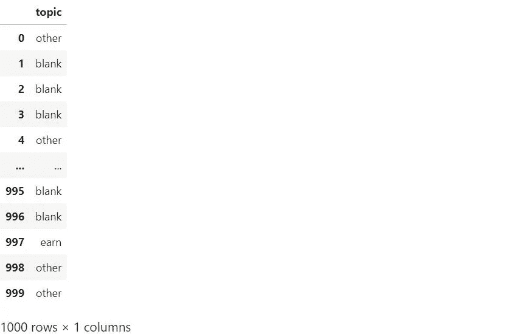
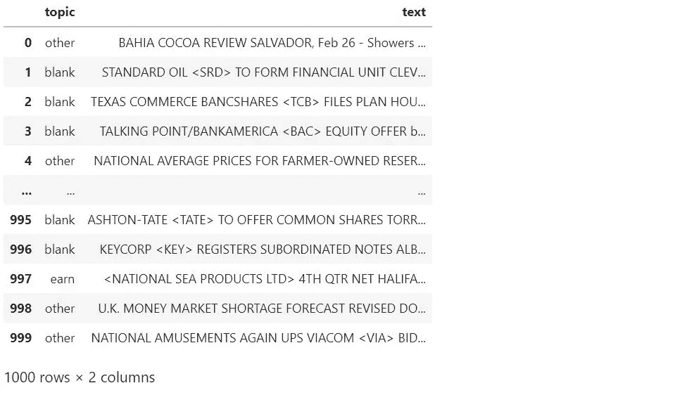

# 如何使用漂亮的 Soup 为 NLP 项目解析文本

> 原文：<https://medium.com/mlearning-ai/how-to-use-beautiful-soup-to-parse-text-for-nlp-projects-48acc9145f89?source=collection_archive---------2----------------------->


Photo by [Monika Grabkowska](https://unsplash.com/@moniqa?utm_source=unsplash&utm_medium=referral&utm_content=creditCopyText) on [Unsplash](https://unsplash.com/s/photos/soup?utm_source=unsplash&utm_medium=referral&utm_content=creditCopyText)

互联网上充斥着词汇，在每个网页背后，这些词汇都隐藏在 HTML 标签的层次结构中。Beautiful Soup 是一个 Python 库，可以使用这些标签从网页中提取文本，一旦有了文本，就可以将其用作自然语言处理或其他数据科学项目的数据。

在我开始概述它是如何工作的之前，我觉得有必要回答这个问题，*为什么这个库被称为美丽的汤？*根据[维基百科](https://en.wikipedia.org/wiki/Tag_soup)，“‘标签汤’是一个贬义词，指为网页编写的语法或结构不正确的 HTML，”这个库显然是从术语“标签汤”得名的

# 从新闻网站提取标题

为了给出一个漂亮的 Soup 如何工作的一般例子，我将使用它从一个虚构的新闻网站的首页提取所有标题。(我在这个例子中使用了一个虚构的站点，因为许多站点不允许网络抓取。)

一旦你在你的机器上安装了 Beautiful Soup(见[文档](https://www.crummy.com/software/BeautifulSoup/bs4/doc/#installing-beautiful-soup))，启动一个 Jupyter 笔记本，只需输入它的 URL 就可以把网站拉进去。但是注意不能在美人汤直接访问网站。你需要用`requests`获取网页背后的文档，然后使用`requests`的`content`属性和一个 HTML 解析器将该文档放入漂亮的汤里。

回到浏览器，使用浏览器的检查器来查看网页背后的 HTML。根据浏览器的不同，检查器的名称略有不同，但键盘快捷键在基于 Windows 的浏览器中是 *control-shift-I* ，在 Safari 中是 *command-option-I* 。从那里，我可以看到主页上的所有标题都在一个`<h3>`标签内。

让我们来看看前三个使用`findAll()`的人。

```
[<h3 class="rr562" size="300">Russia's Invasion of Ukraine Enters New Phase<div class="jk500"></div></h3>,
 <h3 class="rr562" size="300">Big Tech Firm Launching New Product</h3>,
 <h3 class="rr562" size="400">Five Tips for Tax Season</h3>]
```

你看，我得到了所有的 HTML 和 CSS 语法以及标题，而我只想要真正的标题。但是我可以把美汤的`text`属性(或者它的`get_text()`功能)的文字隔离出来。这里，我使用一个`for`循环来列出主页上的所有标题，然后我将显示前四个:

```
['Russia's Invasion of Ukraine Enters New Phase',
 'Big Tech Firm Launching New Product',
 'Five Tips for Tax Season',
 'Biden Announces Initiative']
```

就是这样！我从这个虚构的网站上抓取了当天的头条，并用 Python 把它们做成字符串列表。

# 用漂亮的汤做一个数据框

对于一个自然语言处理项目，我以类似的方式使用了 Beautiful Soup。我的数据集包含了 1987 年出现在路透社新闻专线上的大约 22，000 篇商业新闻文章。这些文章以 SGM 文件的形式提供，这是一种降价形式。

(以下示例中使用的数据集称为“Reuters-21578，Distribution 1.0。”可以在这里找到[，并且已经提供给公众使用。自述文件这里是](http://www.daviddlewis.com/resources/testcollections/reuters21578/)[这里是](http://www.daviddlewis.com/resources/testcollections/reuters21578/readme.txt)。)

每篇文章都可以贴上 135 个主题中的一个或多个，通常是关于商品的(燕麦、谷物、黄金等)。)，但有些根本没有被贴上任何话题的标签。我的项目的目标是为主题 ***earn*** 开发一个 NLP 分类器，表明文章涉及一个企业的收益。

在这里，我正在读取其中一个数据文件，并检查前 1000 个字符。

```
'<!DOCTYPE lewis SYSTEM "lewis.dtd">\n<REUTERS TOPICS="YES" LEWISSPLIT="TRAIN" CGISPLIT="TRAINING-SET" OLDID="5544" NEWID="1">\n<DATE>26-FEB-1987 15:01:01.79</DATE>\n<TOPICS><D>cocoa</D></TOPICS>\n<PLACES><D>el-salvador</D><D>usa</D><D>uruguay</D></PLACES>\n<PEOPLE></PEOPLE>\n<ORGS></ORGS>\n<EXCHANGES></EXCHANGES>\n<COMPANIES></COMPANIES>\n<UNKNOWN> \n&#5;&#5;&#5;C T\n&#22;&#22;&#1;f0704&#31;reute\nu f BC-BAHIA-COCOA-REVIEW   02-26 0105</UNKNOWN>\n<TEXT>&#2;\n<TITLE>BAHIA COCOA REVIEW</TITLE>\n<DATELINE>    SALVADOR, Feb 26 - </DATELINE><BODY>Showers continued throughout the week in\nthe Bahia cocoa zone, alleviating the drought since early\nJanuary and improving prospects for the coming temporao,\nalthough normal humidity levels have not been restored,\nComissaria Smith said in its weekly review.\n    The dry period means the temporao will be late this year.\n    Arrivals for the week ended February 22 were 155,221 bags\nof 60 kilos making a cumulative total for the season of 5.93\nmln against 5.81 at the sa'
```

这很难读懂，但你可以在那里认出一些尖括号标签，独特的标签如`<companies>`、`<topics>`和`<exchanges>`。这种格式似乎不是 HTML，而是允许定制标签的 XML。美丽的汤有一个 XML 解析器。我将在这里使用它来解析文档，然后使用 Beautiful Soup 的`prettify()`函数来提高可读性。在这里，我将打印前 300 个字符。

```
<!DOCTYPE lewis SYSTEM "lewis.dtd">
<html>
 <body>
  <reuters cgisplit="TRAINING-SET" lewissplit="TRAIN" newid="1" oldid="5544" topics="YES">
   <date>
    26-FEB-1987 15:01:01.79
   </date>
   <topics>
    <d>
     cocoa
    </d>
   </topics>
   <places>
    <d>
     el-salvador
    </d>
    <d>
```

啊，这样看起来容易多了。使用这种技术并检查更多的数据，我发现每篇文章都用一个`<reuters>`标签来划分，主题在`<topics>`标签下，所有文章内容都在`<text>`标签中。

为了创建我的数据框架以输入机器学习模型，首先，我找到所有的`<topics>`。我创建了一个漂亮的 Soup 对象，类似于字符串列表。

```
[<topics><d>cocoa</d></topics>,
 <topics></topics>,
 <topics></topics>,
 <topics></topics>,
 <topics><d>grain</d><d>wheat</d><d>corn</d><d>barley</d><d>oat</d><d>sorghum</d></topics>,
 <topics><d>veg-oil</d><d>linseed</d><d>lin-oil</d><d>soy-oil</d><d>sun-oil</d><d>soybean</d><d>oilseed</d><d>corn</d><d>sunseed</d><d>grain</d><d>sorghum</d><d>wheat</d></topics>,
 <topics></topics>,
 <topics></topics>,
 <topics><d>earn</d></topics>,
 <topics><d>acq</d></topics>]
```

和第一个例子中混乱的 HTML 和 CSS 一样，我需要去掉所有的 XML 标签，制作一个新的、看起来干净的列表。我可以用美汤的`text`属性做到这一点。

```
[['cocoa'],
 [],
 [],
 [],
 ['grain', 'wheat', 'corn', 'barley', 'oat', 'sorghum'],
 ['veg-oil',
  'linseed',
  'lin-oil',
  'soy-oil',
  'sun-oil',
  'soybean',
  'oilseed',
  'corn',
  'sunseed',
  'grain',
  'sorghum',
  'wheat'],
 [],
 [],
 ['earn'],
 ['acq']]
```

接下来，我让函数拉出 ***赚*** 题目，这是我的初级分类器。如果文章被单独标记为*或*带任何其他主题，则被归类为*。如果不包括 ***赚*** ，我就叫它 ***其他*** 。有些文章没有被指定任何主题。在项目的这一点上，我不确定为什么，所以我保留那些并将那些 ***称为空白*** 。***

**现在，我用主题列创建我的数据框架。**

****

**Image by author**

**看起来不错。对于所有文章的内容，我都遵循类似的流程。我在美丽的 Soup 对象中找到所有带有`<text>`标签的东西，以创建一个美丽的 Soup 元素。然后，我创建一个空列表并遍历元素，将每篇文章的文本作为单个字符串添加。**

**现在，我可以将这个列表添加到我的数据框架中。**

****

**Image by author**

**这个数据框是我想要创建的。现在，我可以执行为 NLP 建模准备文本所需的其他任务，比如执行探索性数据分析、删除停用词、标记文章的文本，等等。**

# ****总结****

*   **将数据放入一个漂亮的 Soup 对象中并解析它**
*   **检查漂亮的汤对象以找到有用的标签**
*   **用标签制作新的漂亮汤品**
*   **使用`text`属性或`get_text()`函数只提取文本**
*   **使用循环创建要添加到数据帧中的列表**

**[](/mlearning-ai/mlearning-ai-submission-suggestions-b51e2b130bfb) [## Mlearning.ai 提交建议

### 如何成为 Mlearning.ai 上的作家

medium.com](/mlearning-ai/mlearning-ai-submission-suggestions-b51e2b130bfb)**