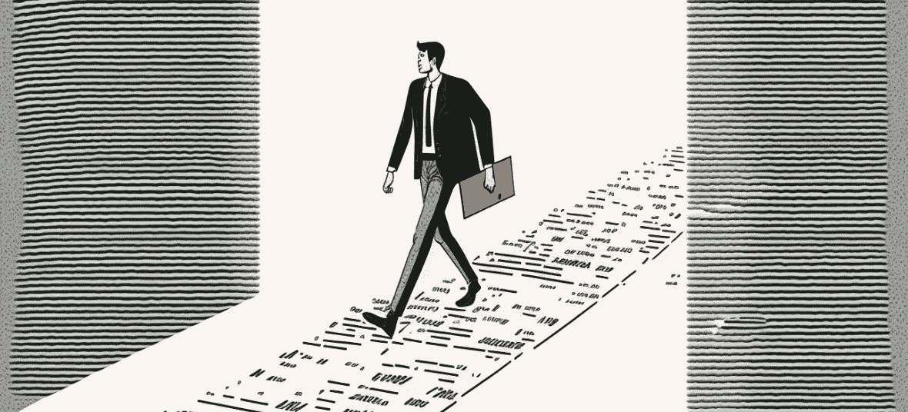

# 如何使用 ChatGPT 创建 AI 艺术提示

> 原文：<https://medium.com/mlearning-ai/how-to-use-chatgpt-to-create-ai-art-prompts-7a63e402814d?source=collection_archive---------0----------------------->

made by author on Midjourney

如果你对提示有很好的想法，但它们似乎缺乏让你的艺术更有趣所需的细节，有一种新的人工智能工具可以帮助你。

[ChatGPT](https://chat.openai.com/chat) 是 OpenAI 最新推出的基于对话的 AI 聊天机器人，能够用自然语言进行理解和响应。它最近席卷了互联网。