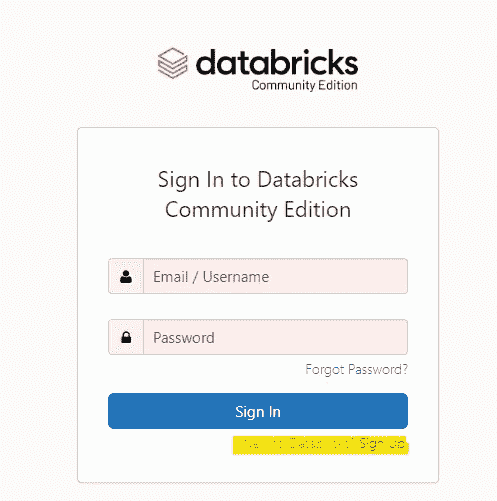
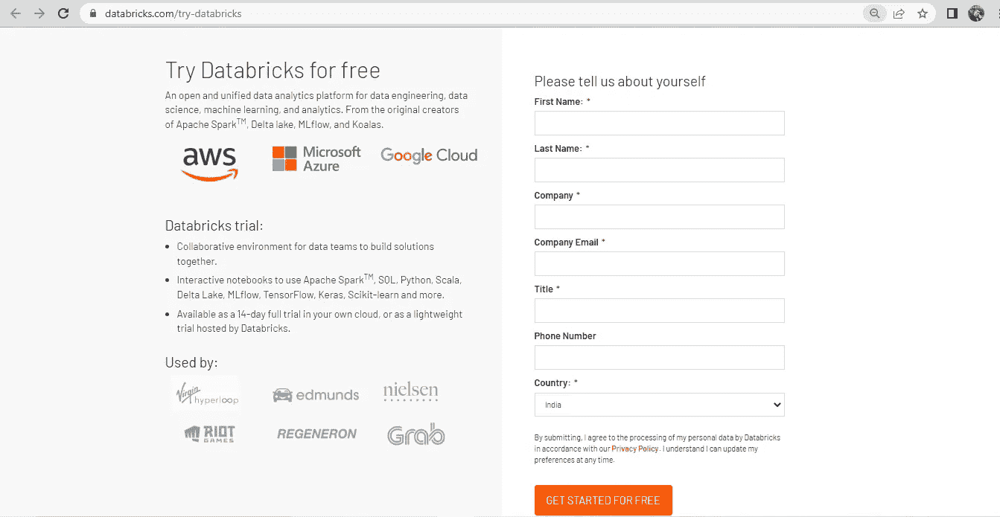
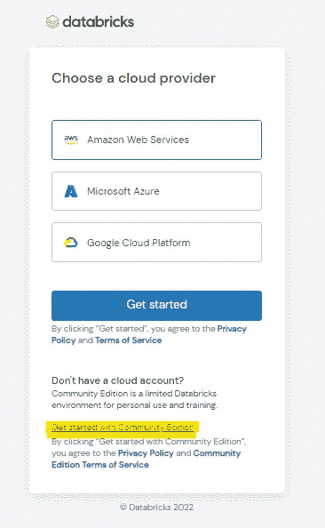
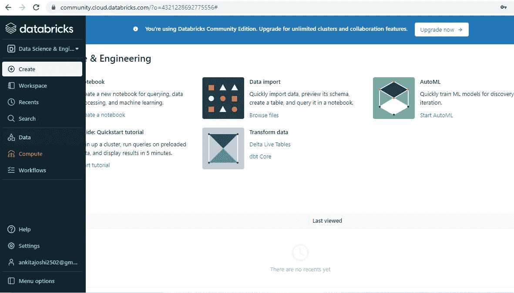
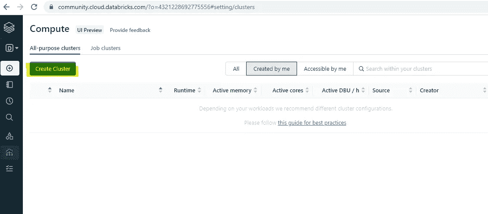
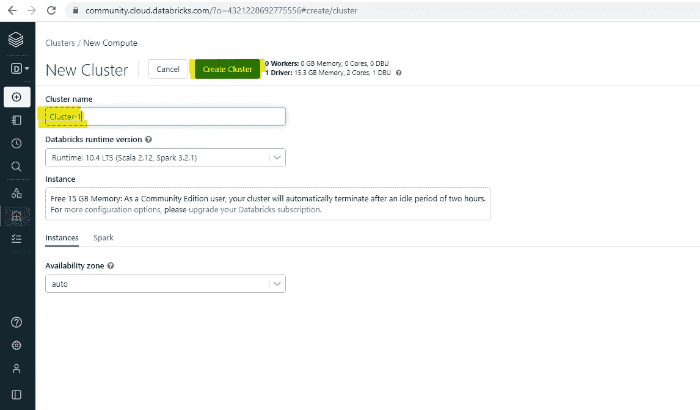

# 如何使用数据砖社区版？

> 原文：<https://medium.com/mlearning-ai/how-to-use-data-bricks-community-edition-9b899a2c0f40?source=collection_archive---------12----------------------->

Photo by [Joshua Sortino](https://unsplash.com/@sortino?utm_source=medium&utm_medium=referral) on [Unsplash](https://unsplash.com?utm_source=medium&utm_medium=referral)

在这篇文章中，你将学习如何获得你的数据砖社区版！

Databricks **为您的所有数据**提供了一个统一、开放的平台。它为数据科学家、数据工程师和数据分析师提供了一个简单的协作环境，让他们能够运行交互式的预定数据分析工作负载。你可以得到你自己的一块馅饼来做实验。

遵循以下步骤:

*   去 https://community.cloud.databricks.com/login.html 的
*   点击“Databricks 新手？[报名](https://databricks.com/try-databricks)

*   填写表格，点击免费开始

*   这将带您设置一个云帐户页面，您可以选择“社区版入门”。

*   将会进行某些验证。
*   检查你的电子邮件！
*   一旦电子邮件通过验证，我们就可以登录到我们的工作区，现在这个功能有限，但它是一个非常适合开始实验的地方。
*   我们必须创建一个集群，并将其附加到笔记本上以供执行。

# 创建您的第一个集群

*   要创建您的第一个集群，请在左侧导航栏中单击 compute。

*   在左上角，寻找“*创建集群*按钮。

*   给你的第一个集群命名，其他设置保持默认。

*   单击“*创建集群*”，请注意，在 community edition 中，我们只能创建 1 个集群。

瞧啊。！我们都准备好尝试数据砖块了！

因为学习是一个连续的曲线，我们必须永不停止！

下一集再见！

 [## Mlearning.ai 提交建议

### 如何成为 Mlearning.ai 上的作家

medium.com](/mlearning-ai/mlearning-ai-submission-suggestions-b51e2b130bfb)