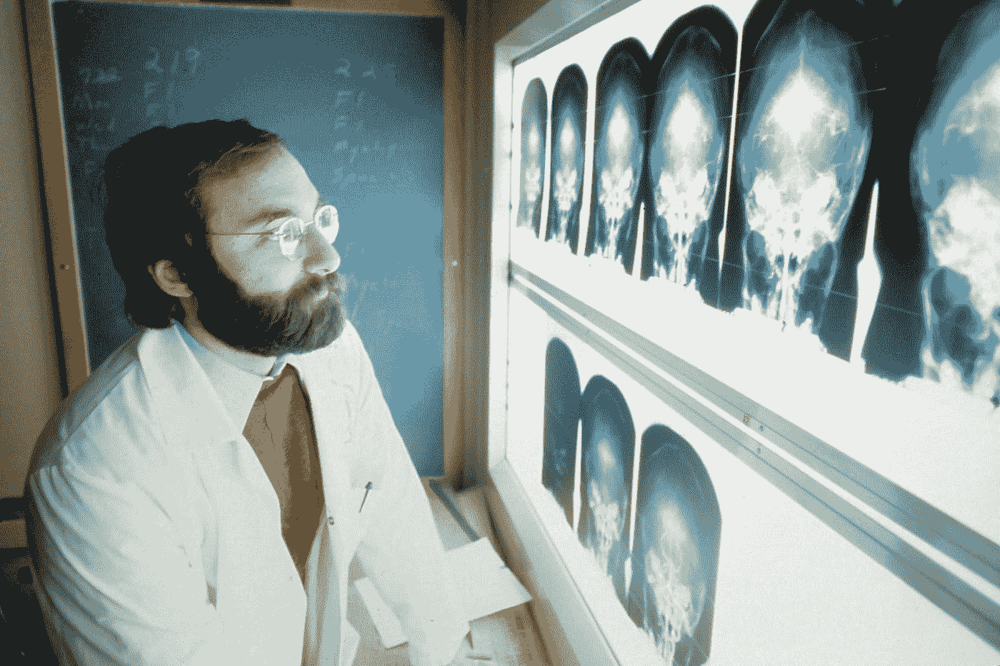

# 如何使用 MONAI 和 Pytorch 将深度学习用于医学成像

> 原文：<https://medium.com/mlearning-ai/how-to-use-deep-learning-for-medical-imaging-using-monai-and-pytorch-8abdb8fc790e?source=collection_archive---------2----------------------->

## 我和我的兄弟学到了应用深度学习解决医疗保健行业的医学成像问题

# 医学成像

image from Unsplash

在生活中的某个时刻，我们都不得不做某种类型的医学扫描。一些已知的扫描类型包括…