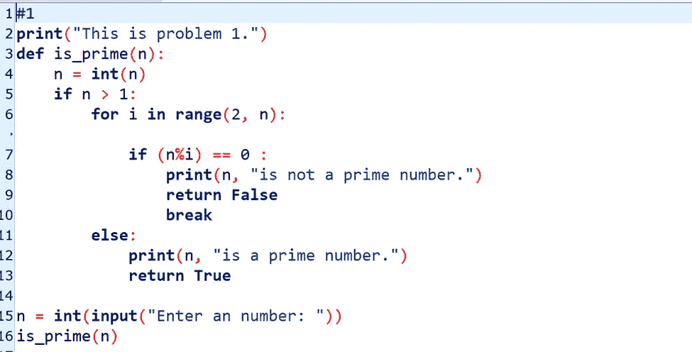
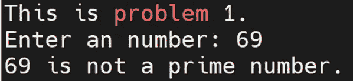
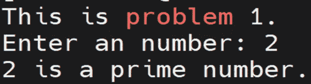
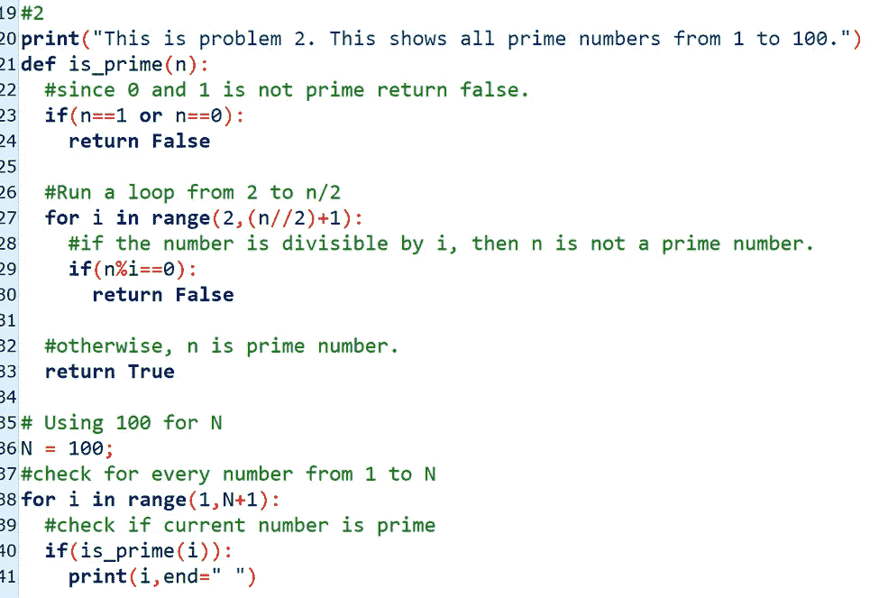
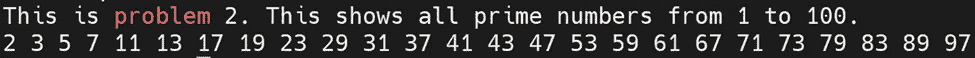

# 如何使用 is_prime()函数

> 原文：<https://medium.com/mlearning-ai/how-to-use-is-prime-function-a8860892b444?source=collection_archive---------5----------------------->

Image Credit from Unsplash.com

这篇文章将讨论在 Python 中使用 is_prime()函数来确定一个素数。

在我们开始之前，我们应该讨论一下什么是质数。质数是只能被一整除的数。数字 0 和 1 不是质数。

函数 is_prime()的主要用途是检查一个数是否是质数，并返回布尔值。

在这里，当您输入数字 69 时，输出显示“69 不是质数。”

但是，如果您输入一个质数，例如 2，输出将显示“2 是一个质数。”

在另一个场景中，假设您想知道 1 到 100 之间有多少个质数。在下面的第一张图中，当你对 n=0 和 n=1 使用 if 语句时，is_prime()函数将返回布尔值。此外，当您在“范围内”功能中设置时，此功能可以打印质数。第二张图片显示了以下代码的输出。

感谢你阅读这篇文章！我希望你从这篇文章中学到了一些技巧。请随时提供反馈。

 [## Mlearning.ai 提交建议

### 如何成为 Mlearning.ai 上的作家

medium.com](/mlearning-ai/mlearning-ai-submission-suggestions-b51e2b130bfb)