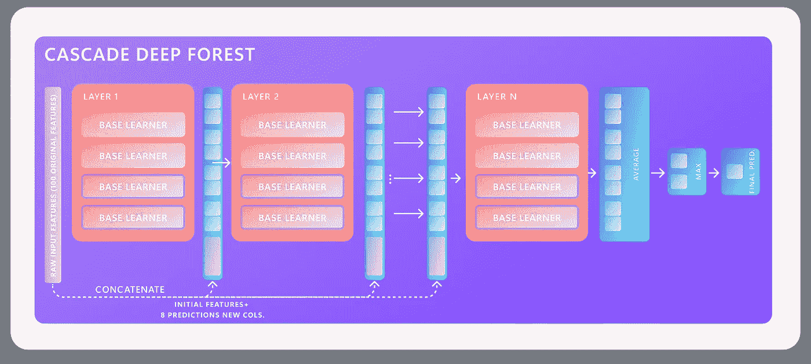

# 多样性和一种称为深度森林的新型深度学习模型:将一个重要概念应用于一个有前途的框架

> 原文：<https://medium.com/mlearning-ai/how-to-use-its-own-base-learner-to-improve-diversity-deep-forest-model-a-novel-deep-learning-9200165e2a2e?source=collection_archive---------4----------------------->

如今，多样性是模型准确性的圣杯:deep forest 是一个基于深度学习层的有前途的框架，但没有神经元和反向传播。革命性的深林框架使多样性的引入成为可能。接下来的文章将介绍框架和多样性，以及演示如何将您的多样性集合模型应用到这个新颖的框架中。

虽然现在集成方法给出了很好的结果，和[吉峰](https://scholar.google.co.id/citations?user=PHgGTBsAAAAJ&hl=en)我在他们关于一种新颖的深度学习方法的工作中指出，在随机森林对你的数据产生不错的结果的地方，应用深度森林，你会感到惊喜。“周志华和季峰提出的革命性深度学习框架 Deep Forest (DF)可以被认为是 2017 年机器学习领域最重要的事件之一。DF 采用了许多基于集成的方法，最著名的是随机森林(RF)和堆叠，以生成类似于多层神经网络的结构，只是每一层都由 RF 而不是神经元组成。DF 特别有利于训练，因为它需要少量的超参数，不需要反向传播，并且在只有小规模训练数据可用时优于一些众所周知的技术，包括深度神经网络`[1，2]。

多样性增强是一种需要将众多的“*弱*”或“*弱*”/*高性能*”学习者组合成单个“*强*”学习者的技术，其中“*弱*”是相对的。因此，叠加理论应该最小化偏差和变化，并且在避免过度拟合和变化方面特别有效。这，是因为两个原因:

*   每个集成学习者将具有稍微不同的将特征映射到结果的方式，并且想法是通过组合它们，将覆盖搜索区域的更大部分。
*   此外，以集合的第一和第二模型为例，由于过拟合，两者都具有低偏差但高方差，它们在理论上具有过拟合的搜索空间的分离区域；合并后，总体方差将会减少。

因此，专注于多样性的集成学习*(即，仔细选择你的学习者)*将导致总体方差的减少。此外，在实践中，这通常通过在训练过程中注入随机性而添加到系综中[11 —第 IV-B 节]。

> 因为我相信我们的模型的多样性是机器学习中的下一个突破，这里有一个关于 DF 如何包括多样性管理以及为什么它在机器学习中至关重要的更一般的描述，或者更准确地说，集成方法和堆叠。

下面的文章首先概述了 DF 如何工作，接着简要解释了为什么多样性在 DF 中很重要，然后快速介绍了如何用 DF 框架*(实用观点)增强多样性。*

# 深林一般是如何运作的？

因为原始论文非常有效和简洁地陈述了它，所以下面的解释将在范围上是广泛的；因此，对于数学部分，也可以参考原始论文[1，2]。因此，我们将使用下图分析深层森林体系结构的分类和预测组件:

## 一层一层地，下面是深层森林建筑的工作原理:

**(1)** 第一层被提供特征的初始原始向量，然后执行之前配置的 n 个估计器，每个估计器产生预测向量*(即二类分类:两个输出，多类分类:n_class 输出)。***【2】**预测向量与初始原始向量一起连接到第二层的输入，这自然增加了每个后续层的特征的维度，等等。 **(3)** 倒数第二层确定每层结果的平均值，最后****(4)**输出一个最大值函数以获得最终预测。**

*****注意:*** *虽然前面的流程是自动化的，但是第一步可以手动执行，也可以使用框架设计者指定的默认集合组合自动执行。要手动这样做，请阅读本文的剩余部分，了解如何这样做。***

# **多样性在森林深处是如何应用的？**

**多样性是一个巨大的研究课题，在这里我们将讨论一个工程师在选择他的基础学习者*(即算法)时应该如何思考。*接下来，我们将通过展示这三种技术如何应用“多样性”来总结:**

*   **(1)第一种方法似乎遵循随机森林使用；值得注意的是，**以样本为基础。**该技术在逐个样本的基础上应用多样性，这意味着集合中的每个模型将在整个数据空间的不同部分中搜索，因此更有效地覆盖整个数据。**
*   **(2) **超参数方法**，倾向于说直接优化模型比结合精确算法更好，以增加多样性的结果改善；因此，每个模型都有一个基于所选的各种测量的目标函数，从业者应该修改超参数以实现目标函数，以便从超参数的角度来看，总体结果将是多样化的。**
*   **最后，(3) **基于排名的方法**，这需要获取一个学习者列表(多样化或不多样化)，这次根据多样性标准对他们进行排名，并选择 *L* 作为你的最终模型*(例如，基于聚类的方法包括在二维空间中绘制模型的结果，并对它们进行聚类(自动或不自动)，以便只提取那些与给定标准相关的结果)。***

**因此，根据用于为集成选择学习者的方法，多样性将被不同地应用，这取决于视图是基于样本的、基于超参数的还是基于算法的。最后，当您的全体学员被平均化为一个时，DF 将用于最终视角，此时多样性将应用于您之前使用上述简要技术选择的学员的发现。要了解更多，请参考这篇学术文章[11]。**

# **为什么在森林深处有多样性？**

**由于测向理论的主要重点是系综和叠加，分集是包中包含的另一个关键组成部分。但是，为什么它是框架中如此重要的一个组件呢？**

## **什么是集成学习以及打包/提升和堆叠子范例？**

**从 gcForest 到 Deep Forest 论文 2019 年更新[2]: ` **集成学习**【4】**是一种机器学习范式**，通过训练和组合几个学习器(如分类器)来解决一个任务。[…]`.结果，在集成学习方法中，我们有:(1) **Bagging** ，其经常考虑同质的弱学习器，并行地彼此独立地学习它们，然后使用确定性平均过程来组合它们；(2) **Boosting** 经常考虑同质的弱学习者，以高度适应性的方式顺序地学习它们(基础模型依赖于先前的模型)，然后使用确定性策略将它们组合；最后，(3) **堆叠**另一方面，频繁地考虑异类弱学习者，并行地学习它们，并通过训练元模型来聚集它们，以基于许多弱模型的输出生成预测。**

## **为什么多样性必须处理堆叠系综？**

**由于堆叠发生的方式不同，多样性在这方面起着关键作用。正如本文前面简要提到的，多样性使得稳健集合模型的开发成为可能；这一点在 DF 原创论文中也有表述:`[…]要建立一个强大的合奏，个体学习者必须精确且与众不同。组合完全正确的学习者常常不如组合一些准确的学习者和一些相对较弱的学习者，因为互补性优先于纯准确性。尽管如此，科学家们仍在努力解决同一个难题:“多样性到底是什么？”这个问题仍然是这个领域的圣杯。**

**最后，因为多样性是 DF 框架的关键组成部分，其首席工程师在[5]中指出，该框架默认包含多样性，并且能够将多样性纳入学习过程，允许用户根据自己的喜好完全定制它。因此，以下部分将讨论如何使用 Deep Forest 框架(以前称为 gcForest)来处理多样性，这在文献中有时被称为模糊性。**

# **深林(DF)安装**

**我们假设你已经安装了 Python，因为 deep forest 是一个 Python 框架；否则，请参阅 python / pip 手册了解如何安装它们。[6, 7] ;要安装[深林 21](https://github.com/LAMDA-NJU/Deep-Forest) 框架，请遵循以下步骤:**

# **使用自己的估计器的 DF 级联森林分类器**

**下面的示例解释如何用您自己的来重写默认的估计器。这可能是出于各种原因，包括 **(1)** 探索默认分类器之外的分类器的愿望， **(2)** 探索定制的 Scikit learn 分叉分类器(即您的定制分类器)的愿望，或 **(3)** 通过使用高级随机分类器思想进行培训，将两种先前的思想结合起来并增加模型的多样性的愿望。**

**假设我想设计一个 DF 模型，该模型使用 RUSBoost 分类器[8]和随机森林[9]作为其估计器。除了多样性之外，我将复制原论文使用的东西，但是我不会默认允许框架这样做，我将直接从其库的实现中使用一个 ExtraTreesClassifier。*not bene:这完全是主观的；你可以选择任何基础学习者和任何分类器来增加你想要的多样性；我在上面随机选择它们仅仅是为了说明:***

****(1)我**举例说明你们的森林深度估算员；如果这个需要额外的估算器，您可以按如下方式组合它们:**

****(2) A** 应用由您的个体分类器和一些有助于训练期间多样性的估计器组成的估计器，并且这个 N 次(即这里必须选择 N 个，见下文):**

**最后，您可以通过调用常用的拟合预测/预测概率函数来执行您的配置，并将提供像往常一样显示分类报告的可能性；混淆矩阵；或者/和使用从默认配置派生的自定义配置来映射模型的要素重要性。**

# **讨论/结论**

**多样性不是一套可以遵循的指令，比如如何安装软件；相反，它更好地理解了如何将 2 到 N 个学习者结合起来，增加了在你当前现实世界中获得高预测准确性的可能性。由于 Deep Forest 在 2017 年发布，这里有一个快速教程来帮助您学习和理解如何使用框架的多样性功能。**

**既然您已经了解了如何使用 Deep Forest 运行自己的学习者，那么让我们使用 Deep Forest 对您的数据和模型进行分析，并根据您的机器学习案例增强其多样性。最后，为了更深入地检查机器学习的多样性，参见[11]和原始森林论文[1]。我希望这已经澄清了为什么多样性很重要，以及使用上面概述的架构实现多样性有多简单。现在就开始使用它，并在下面的评论部分告诉我们您的想法以及您将如何更改它。**

***此外，我已经发表了一篇文章，专门讨论这种创新的测向技术在医学数据中的应用[3]。***

**干杯，伙计们，西蒙。**

> **这个故事是由一个初级计算机科学家写的；欢迎任何希望更新材料的评论。**

# **参考**

> ***[1] Z.-H .周，j .冯，《森林深处》，arXiv 预印本 arXiv:1702.08835，2017。***
> 
> ***[2] Z.-H .周，j .冯，“森林深处”，《国家科学评论》，第 6 卷，第 1 期，第 74–86 页，2019。***
> 
> **[3] Michele L，Provost S，Julien L，Sauer M，Chaptinel M，使用一种新的深度学习方法对睡眠-觉醒状态进行分类。中，*清醒的组织* (2021)。可从以下网址获得:[https://medium . com/awake-together/class ification-of-sleep-wake-States-with-the-use-of-a-novel-deep-learning-approach-b6a 7234 ebb 6 f](/awake-together/classification-of-sleep-wake-states-with-the-use-of-a-novel-deep-learning-approach-b6a7234ebb6f)【2021 年 12 月 10 日获取】。**
> 
> **[4]周·。集成方法:基础和算法。佛罗里达州博卡拉顿:CRC 出版社，2012 年。**
> 
> **[5]徐，杨，2021 .*【问题】n_estimators 如何工作？第 100 期拉姆达-NJU/深林*。[在线]LAMDA-NJU/深林。可从以下网址获取:[https://github . com/LAMDA-NJU/Deep-Forest/issues/100 # issue comment-980591213](https://github.com/LAMDA-NJU/Deep-Forest/issues/100#issuecomment-980591213)【2021 年 12 月 10 日获取】。**
> 
> **[6] Python。, 2021.*下载 Python* 。[在线]Python.org。可在:[https://www.python.org/downloads/](https://www.python.org/downloads/)【2021 年 12 月 10 日获取】。**
> 
> **[7]Packaging.python.org。2021.*安装软件包— Python 打包用户指南*。[在线]可从以下网址获取:[https://packaging . python . org/en/latest/tutorials/installing-packages](https://packaging.python.org/en/latest/tutorials/installing-packages/)【2021 年 12 月 10 日获取】。**
> 
> **[8]c .塞弗特、t .科什戈夫塔尔、j .范胡尔斯和 a .纳波利塔诺，2008 年。RUSBoost:提高训练数据有偏差时的分类性能。 *2008 年第 19 届国际模式识别会议*。**
> 
> **[9]布雷曼，2001 年。*机器学习*，45(1)，第 5–32 页。**
> 
> **[10] Pedregosa，f .、Varoquaux，g .、Gramfort，a .、Michel，v .、Thirion，b .、Grisel，o .、Blondel，m .、Prettenhofer，p .、Weiss，r .、Dubourg，v .、Vanderplas，j .、Passos，d .、Brucher，m .、佩罗特和 Duchesnay，E. 2011 年。sci kit-learn:Python 中的机器学习。*机器学习研究杂志，12* ，第 2825–2830 页。**
> 
> **[11]龚，钟，胡伟，“机器学习中的多样性”，载于 IEEE Access，第 7 卷，第 64323-64350 页，2019 年，doi:10.11109/Access . 20015 . 200101100106**

** [## Mlearning.ai 提交建议

### 如何成为 Mlearning.ai 上的作家

medium.com](/mlearning-ai/mlearning-ai-submission-suggestions-b51e2b130bfb)**