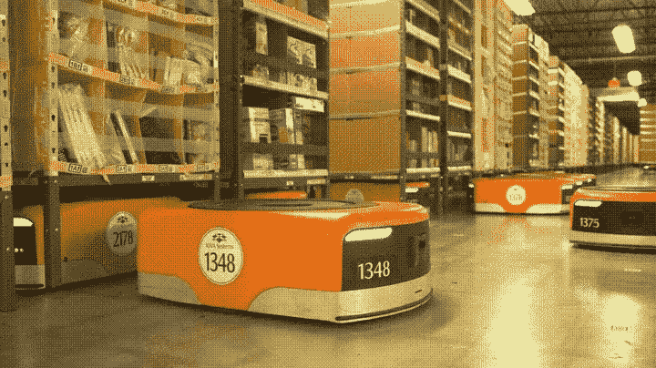

# 如何在库存管理中使用机器学习:库存管理中的人工智能

> 原文：<https://medium.com/mlearning-ai/how-to-use-machine-learning-in-inventory-management-ai-in-inventory-management-b585801a16c?source=collection_archive---------2----------------------->

库存管理，帮助物流供应链和仓储公司通过全自动化系统管理库存，使整个过程更快、更高效。

> 通过训练数据集，可以创造机器人和自动化机器来开发这种人工智能模型。Cogito 为库存管理中使用的人工智能模型提供高质量的训练数据。

许多公司正在使用 [**人工智能进行库存管理**](https://www.cogitotech.com/use-cases/inventory-management/) 以优化他们的运营成本，更高效地管理大量的库存。因此，就在这里，我们带来了机器学习如何在库存管理中使用不同类型的训练数据。

> Cogito 提供不同类型的训练数据集，以开发库存管理中人工智能的机器学习模型。

# 产品计数和数量检查中机器人的培训数据

仓储和存储处理用盒子或纸箱包装的大量库存，由经过机器学习数据集训练的机器人来处理。一个数据集，包含用正确的图像标注技术标注的箱子和纸盒，以使这些库存可识别。Cogito 使用 **3D 长方体注释**为 AI 的精确对象检测注释盒子。

# 面向库存产品识别的语义图像分割

语义分割图像标注技术有助于检测和识别货架或百货商店中的物品。每幅图像都被精确地标注，以使其能够被基于视觉感知的人工智能模型所识别。Cogito 为零售商店、百货商店和其他使用人工智能管理库存的商店的库存管理中的人工智能提供训练数据。

# 仓库库存移动的图像注释

仓库中用于将库存从一个地方移动到另一个地方的机器人的图像注释。如果使用精确的 [**机器人**](https://www.cogitotech.com/use-cases/robotics/) **训练数据集进行良好的训练，仓库中保存的所有类型的物品或存货都可以被检测和移动。**Cogito 为库存检测和移动提供训练数据，以实现最佳精度和无故障的物体移动。

# 人工智能在库存分类和管理中的训练数据

仓库和储藏室的库存可以用人工智能机器人来分类，这些机器人可以在**人工智能库存管理中使用正确的训练数据来检测和识别这些物体。** Cogito 可以对仓库中存放的任何类型的物品或箱子进行注释，以便将它们从一个地方移动到另一个地方。可以使用 [**三维长方体标注**](https://www.cogitotech.com/3d-cuboid-annotation/) 标注尺寸准确的长方体。

# 库存管理培训数据中的 Cogito for AI

开发用于库存管理的**机器人**或使用机器学习为**库存管理建立模型的 AI 公司，可以在 Cogito 获得最佳质量的训练数据。**

它为机器学习和基于人工智能的模型开发提供训练数据集。Cogito 与训练有素、经验丰富的注释者团队合作，为机器人、无人机和其他可以用高质量训练数据集训练的机器提供最佳质量的训练数据集。

*原载于*[*https://cogitotech.blogspot.com*](https://cogitotech.blogspot.com/2020/05/how-to-use-machine-learning-in-inventory-management.html)*。*