# 如何使用 Python 对交易信号进行机器学习优化

> 原文：<https://medium.com/mlearning-ai/how-to-use-machine-learning-optimization-for-trading-signals-with-python-558ba25e638b?source=collection_archive---------0----------------------->


signals in power !

使用交易技术信号和机器学习技术，从头开始创建和编码交易策略。在这篇文章中使用的模型将是决策树，随机森林树，K 最近邻(KNN)。

# 介绍

我比较了最流行的分类器，并通过分层交叉验证过程评估了每个分类器的平均准确度、精确度和召回率。

# **算法:**

*   下载市场数据。
*   计算我们将用作预测变量的指标。
*   定义目标变量。
*   将数据分为训练集和测试集。
*   运行模型
*   显示性能和策略绘图

# 下载数据

我们将使用名为 q(【https://pypi.org/project/quantrautil/】)的库 quantrautil。我们将在网飞数据上测试机器移动学习技术，并将使用基准 SPY(SP500 指数上的 STF)。

```
ticker = ‘NFLX’
benchmark = ‘SPY’
data = q.get_data([ticker,benchmark],’2000–1–1', ‘2020–2–26’)
```

# **创建预测器**

预测变量是可能与市场行为相关的特征。这些数据可以是技术指标、市场数据、情绪数据、广度数据、基本面数据、政府数据等。我们将使用 talib python 库来创建这些预测器

```
df = pd.DataFrame(index = data.index)
 df[‘EMA_10’] = ta.EMA(data[‘Close’, ticker].values, timeperiod=10)
 df[‘EMA_30’] = ta.EMA(data[‘Close’, ticker].values, timeperiod=30)
 df[‘ATR’] = ta.ATR(data[‘High’, ticker].values, data[‘Low’, ticker].values, data[‘Close’, ticker].values, timeperiod=14)
 df[‘ADX’] = ta.ADX(data[‘High’, ticker].values, data[‘Low’, ticker].values, data[‘Close’, ticker].values, timeperiod=14)
 df[‘RSI’] = ta.RSI(data[‘Close’, ticker].values, timeperiod=14)
 macd, macdsignal, macdhist = ta.MACD( data[‘Close’, ticker].values, fastperiod=12, slowperiod=26, signalperiod=9)
 df[‘MACD’] = macd
 df[‘MACDsignal’] = macdsignal
```

*   EMA(指数移动平均线)，我们感兴趣的是价格何时高于平均线，最快的平均线何时高于最慢的平均线。
*   ATR(14)(14 天的平均真实范围)，我们对触发信号的阈值感兴趣。
*   ADX(14)，我们感兴趣的是触发信号的阈值
*   RSI(14)，我们感兴趣的是触发信号的阈值。
*   MACD，我们对 MACD 信号何时出现在 MACD 上空感兴趣。

然后，我们介绍用于机器学习模型的特征:

```
df[‘Close_EMA_10’] = np.where(data[‘Close’, ticker]> df[‘EMA10’], 1, -1)
 df[‘EMA_10_EMA_30’] = np.where(df[‘EMA10’] > df[‘EMA30’], 1, -1)
 df[‘MACD_Signal_MACD’] = np.where(df[‘MACD_signal’] > df[‘MACD’], 1, -1)
```

# 创建目标变量

这些变量的值将由其他变量建模和预测。决策树分析中必须有且只有一个目标变量。

分类算法的目标变量也使用滞后回报，但是因为输出是分类的，所以我们必须转换它。如果回报是正的，我们指定 1，如果是负的，我们指定 0。

因此，决策树算法应该帮助我们选择指标及其参数的最佳组合，以最大化作为目标的预期输出。

我们将在这里为 ticker 和 benchmark 创建目标变量。

目标向量由 1 和 0 组成。

1 表示收益为正，0 表示收益为负。因此这个优化问题是一个监督学习分类问题。概括地说，分类是一项需要使用机器学习算法的任务，这些算法学习如何为来自问题领域的示例分配类别标签。这个案例是为了理解如何将退货分类为“*正*或“*非正*”

```
df[‘return’] = np.log(data[‘Close’, ticker]/data[‘Close’, ticker].shift(1))
df[‘return_’+benchmark] = np.log(data[‘Close’, benchmark]/data[‘Close’, benchmark].shift(1))df[‘target’] = np.where(df.return > 0, 1, 0)
```

然后，我们可以定义特征的 X 矩阵和目标的 y 向量，用于我们的每个模型中。

```
 X = df[[‘ATR’, ‘ADX’,’RSI’, ‘Close_EMA_10’, ‘EMA_10_EMA_30’, ‘MACD_Signal_MACD’]]
 y = df.target
```

# 拆分数据

在对数据进行一些清理之后(在机器学习研究中总是这样)，我们可以使用 sklearn 的 train_test_split 函数，使用数据的拆分来区分训练数据和测试数据。

```
#splitting the data and building the training and testing set
 X_train, X_test, y_train, y_test = train_test_split(X, y, test_size=0.3, random_state=1, stratify=y)
```

然后，我们必须使用 GridSearchCV 为每个模型找到最佳参数:

*   决策树
*   随机森林树
*   额外的树
*   逻辑回归
*   线性判别分析
*   K-最近邻
*   朴素贝叶斯
*   adaboost 算法
*   支持向量机
*   梯度推进
*   逻辑回归
*   线性判别分析
*   多层感知器

# 去结果之前的一些机器学习的一些解释。

*来源:sklearn 官网*

高斯分布:**逻辑回归**是一种线性算法(对输出进行非线性变换)。它假设输入变量与输出变量之间存在线性关系。输入变量的数据转换可以更好地揭示这种线性关系，从而产生更精确的**模型。**

**线性判别分析**是一种监督分类方法，用于创建**机器学习**模型。这些基于降维的模型在应用中使用，例如营销预测**分析**和图像识别等。

**决策树**帮助你评估你的选择。决策树是帮助你在几个行动方案中选择 T21 的优秀工具。

**随机森林**由多个单独的**树**组成，每个树基于训练数据的**随机**样本。它们通常比单个**决策树**更准确**。下图显示了随着更多的**树**被添加，决策**边界变得更加精确和稳定。****

**KNN** 算法可以与最精确的模型竞争，因为它做出高度精确的预测。因此，你可以**将****KNN**算法用于需要高精度但不需要人类可读模型的应用。预测的质量取决于距离度量。

**SVM** 或**支持向量机**是用于分类和回归问题的线性模型。它可以解决线性和非线性问题，并能很好地解决许多实际问题。 **SVM** 的想法很简单:算法创建一条线或一个超平面，将数据分类。我们将使用 RBF 核:径向基函数核不仅仅帮助我们避免计算一些额外的特征。RBF 特征空间有无限多个维度。这意味着我们可以利用内核来构建非常复杂的决策边界。维度越多，我们就越有可能找到一个将我们的数据整齐分开的超平面。

**多层感知器(MLP)** 是一种监督学习算法，通过在数据集上训练来学习函数 f(⋅):Rm→Ro，其中 m 是输入的维数，o 是输出的维数。给定一组特征 X=x1，x2，…，xm 和一个目标 y。

**高斯朴素贝叶斯**是**朴素贝叶斯**的变体，遵循**高斯**正态分布，支持连续数据。**朴素贝叶斯**是一组基于**贝叶斯**定理的监督**机器学习**分类算法。这是一种简单的分类技术，但功能性很强。

**Boosting** 算法是一组弱分类器创建一个强分类器。

**梯度推进**是一种用于回归和分类问题的**机器学习**技术，它以弱预测模型集合的形式产生预测模型，通常是决策树。

# 机器学习模型

我们将使用 python 库 sklearn 来构建我们的分类模型。这里是我们将使用的导入。

```
from sklearn.model_selection import RepeatedStratifiedKFold, StratifiedKFold
from sklearn.model_selection import KFold
from sklearn.model_selection import train_test_split
from sklearn.model_selection import cross_val_score
from sklearn.pipeline import Pipeline
from sklearn.tree import DecisionTreeClassifier
from sklearn.metrics import classification_report
from sklearn.tree import DecisionTreeRegressor
from sklearn.ensemble import RandomForestClassifier
from sklearn.ensemble import ExtraTreesClassifier 
from sklearn.ensemble import AdaBoostClassifier 
from sklearn.ensemble import GradientBoostingClassifier
from sklearn.neighbors import KNeighborsClassifier
from sklearn.ensemble import RandomForestRegressor
from sklearn.metrics import accuracy_score
from sklearn.model_selection import GridSearchCV
from sklearn.model_selection import RandomizedSearchCV
from sklearn import svm
from sklearn.neural_network import MLPClassifier
from sklearn.linear_model import LogisticRegression
from sklearn.discriminant_analysis import LinearDiscriminantAnalysis
from sklearn.naive_bayes import GaussianN
```

首先，我们可以在分类模型中搜索，最好的分类模型。

```
def model_selection(X,Y):
 seed = 7
 models = []
 models.append((‘LogisticRegression’, LogisticRegression(random_state=seed)))
 models.append((‘LinearDiscriminantAnalysis’, LinearDiscriminantAnalysis()))
 models.append((‘KNeighborsClassifier’, KNeighborsClassifier()))
 models.append((‘DecisionTreeClassifier’, DecisionTreeClassifier()))
 models.append((‘GaussianNB’, GaussianNB()))
 models.append((‘RandomForestClassifier’, RandomForestClassifier()))
     models.append((‘ExtraTreesClassifier’,ExtraTreesClassifier(random_state=seed)))
 models.append((‘AdaBoostClassifier’,AdaBoostClassifier(DecisionTreeClassifier(random_state=seed),random_state=seed,learning_rate=0.1)))
 models.append((‘SVM’,svm.SVC(random_state=seed)))
 models.append((‘GradientBoostingClassifier’,GradientBoostingClassifier(random_state=seed)))
 models.append((‘MLPClassifier’,MLPClassifier(random_state=seed)))# evaluate each model in turn
 results = []
 names = []
 scoring = ‘accuracy’
 for name, model in models:
 kfold = KFold(n_splits=10, shuffle=True, random_state=seed) 
 cv_results = cross_val_score(model, X, Y, cv=kfold, scoring=scoring)
 results.append(cv_results)
 names.append(name)
 msg = “%s: %f (%f)” % (name, cv_results.mean(), cv_results.std())
 print(msg) return results, names
```

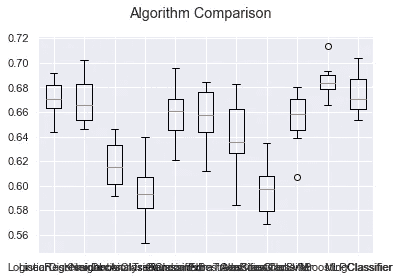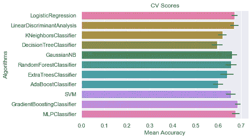

乍一看，我们可以看到梯度推进，逻辑回归和线性判别分析可能是最好的模型使用。

然后，我们使用函数 GridSearchCV 在每个估计器的定义中的可用参数中搜索最佳参数(有关更多信息，请参见 sklearn 网站)。

Scikit-Learn 的 GridSearchCV 会搜索我们。我们需要做的只是告诉它我们希望它试验哪些超参数，以及试验哪些值，它将使用交叉验证评估所有可能的超参数值组合。

完成后，我们可以致电:

```
grid_search = GridSearchCV(estimator = model, param_grid = param_grid, 
 cv = 3, n_jobs = -1, verbose = 2)grid_search.fit(X_train, y_train)
```

我们用属性 best_params_ 获得最佳参数，然后我们可以使用方法 set_params()设置 best_params

# 技术性能分析

该报告显示了一些有助于我们评估算法优劣的参数:

*   **准确度**:准确度分数是真阳性和真阴性在指定标签总数中所占的比例
*   **精度**:表明我们预测的质量。这告诉我们有多少我们预测在某个类中的值实际上在那个类中。本质上，这告诉我们如何在假阳性方面表现。
*   **回忆**:表明我们预测的质量。这告诉我们每个类中有多少值被赋予了正确的标签，从而告诉 use 它相对于假阴性的表现如何。
*   **F1-得分**:显示精度和召回率的调和平均值。这是一个精度和召回规模的加权平均值，1 为最好，0 为最差。这使用了调和平均值，因此该值更接近较小的数字，并防止在一个参数高而另一个参数低的情况下高估模型的性能。
*   **支持**:作为权重计算精度、召回率和 F-1 的平均值。

任何高于 0.5 的数字通常被认为是一个好数字。

```
report = classification_report(y_test, y_pred)
print(report)
```

然后我们可以构建一个图表来显示测试数据上的策略:

```
plt.plot((df.strategy_returns[train_length:]+1).cumprod(),’b-’,label=’Strategy returns decision tree ‘)
plt.plot((df.return[train_length:]+1).cumprod(),’g-’,label=’Strategy returns Buy and Hold ‘)
plt.plot((df[‘return_’+benchmark][train_length:]+1).cumprod(),’r-’,label=benchmark+’ returns Buy and Hold ‘)plt.ylabel(‘Strategy returns(%)’)
plt.legend()
plt.show()
```

# 如何创建一个函数来测试 sklearn 库中的所有模型以进行分类

10 重交叉验证程序用于评估每种算法，重要的是使用相同的随机种子进行配置，以确保对训练数据执行相同的分割，并以完全相同的方式评估每种算法。

```
def model_selection(X,Y):
 seed = 5
 models = []
 models.append((‘LR’, LogisticRegression()))
 models.append((‘LDA’, LinearDiscriminantAnalysis()))
 models.append((‘KNN’, KNeighborsClassifier()))
 models.append((‘CART’, DecisionTreeClassifier()))
 models.append((‘NB’, GaussianNB()))
 models.append((‘SVM’, svm.SVC()))
 models.append((‘RFT’, RandomForestClassifier()))

 results = []
 names = []
 scoring = ‘accuracy’
 for name, model in models:
 kfold = KFold(n_splits=10, shuffle=True, random_state=seed) 
 cv_results = cross_val_score(model, X, Y, cv=kfold, scoring=scoring)
 results.append(cv_results)
 names.append(name)
 msg = “%s: %f (%f)” % (name, cv_results.mean(), cv_results.std())
 print(msg)
 return results, namesdef plot_models(results, names):
 fig = plt.figure()
 fig.suptitle(‘Algorithm Comparison’)
 ax = fig.add_subplot(111)
 plt.boxplot(results)
 ax.set_xticklabels(names)
 plt.show()
```

运行该示例会提供每个算法的简称、平均精度和标准偏差精度的列表。

从这些结果中，我们可以看出，逻辑回归和线性判别分析都可以更好地拟合我们建模研究的数据。

## 模型逻辑回归的绘图性能

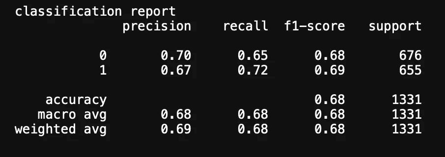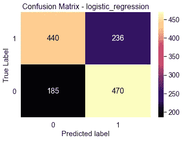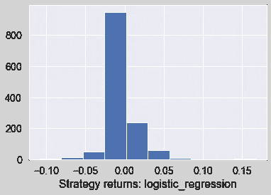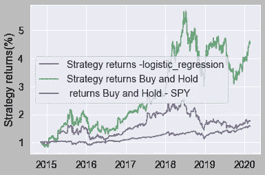

## **绘制模型决策树的性能**

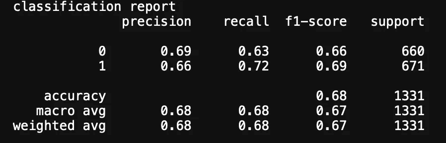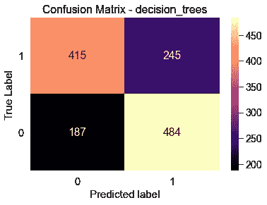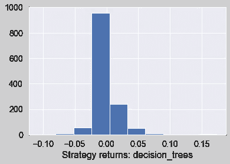

histogram of strategy returns

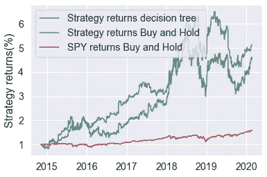

strategy plotting for decision trees algorithm comparing to the benchmark and classical buy&hold strat

## 模型随机森林树的绘图性能

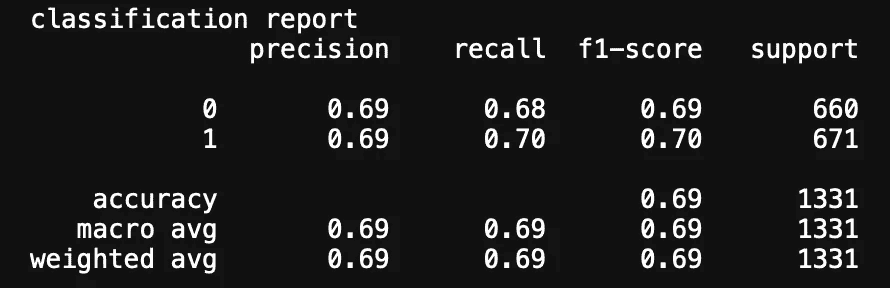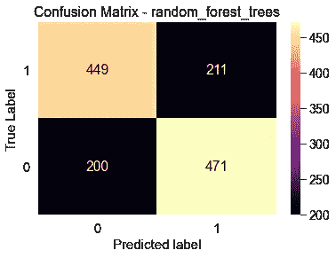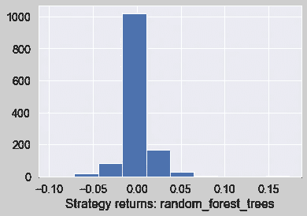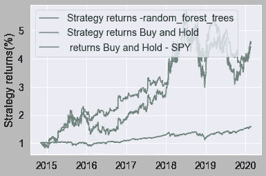

## 模型 K 最近邻的绘图性能

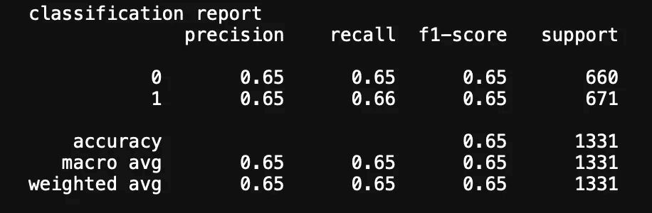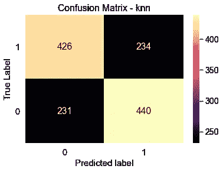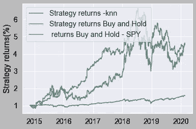

## 模型支持向量机的绘图性能:SVM

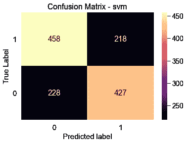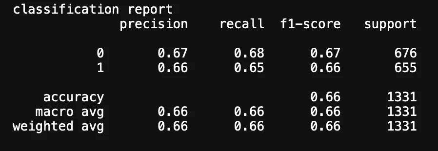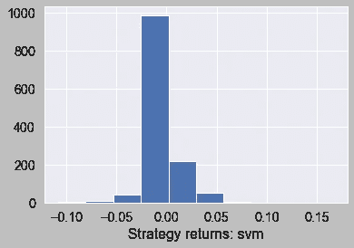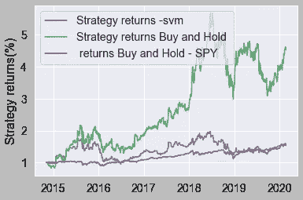

## 模型神经网络的绘图性能:**多层感知器**

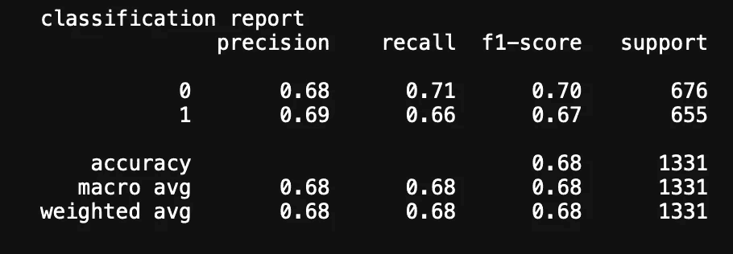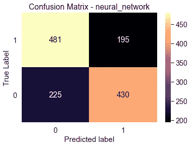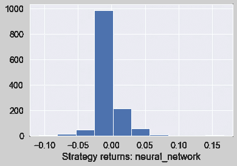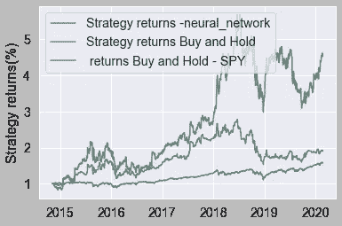

**结论**

感谢你阅读这篇文章。关于机器学习和交易，我甚至还没有触及我所能谈论的一切的表面，但是我希望这篇文章已经成为这个领域中一些话题的介绍。看到机器学习在未来几年将走向何方，以及它将如何改善我们的生活，这将是令人兴奋的。

**法律免责声明(请仔细阅读！)**

— — — — — — — — — — — — — — — — — — — — — — — — — — — — — — -

本课程仅用于一般信息和教育目的。它既不是直接也不是间接的建议、意见或号召投资、交易或采取任何行动。任何观点、新闻、研究、分析、价格、代码示例或其他信息都是作为一般市场评论提供的，并不构成投资建议。课程中展示的例子仅用于说明目的，并非投资建议或交易诱因。过去的表现并不代表未来的表现。

所有内容、视频、Python 代码、Jupyter 笔记本和其他材料都没有担保或陈述。作者不保证所提供信息的正确性或完整性。作者不承担任何损失或损害的责任，包括但不限于任何利润损失，这些损失可能直接或间接由使用或依赖此类信息引起。