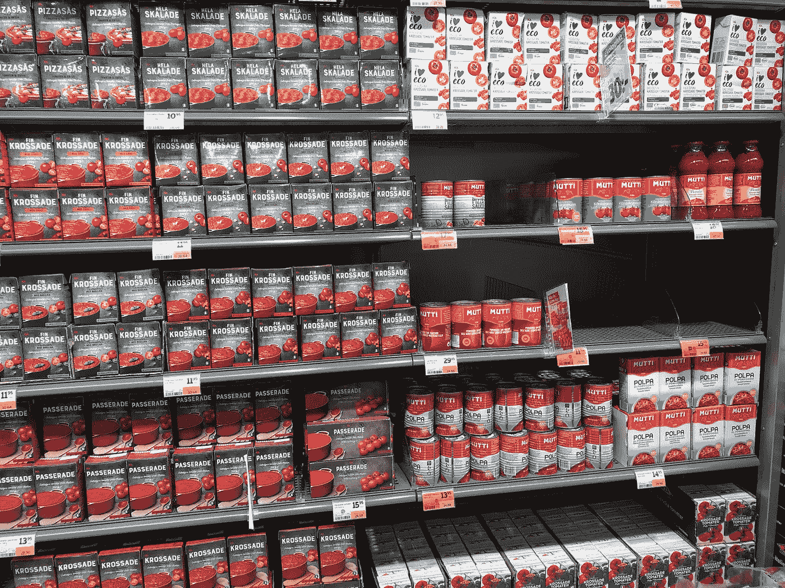
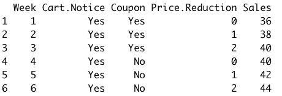
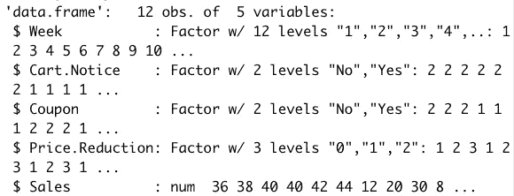
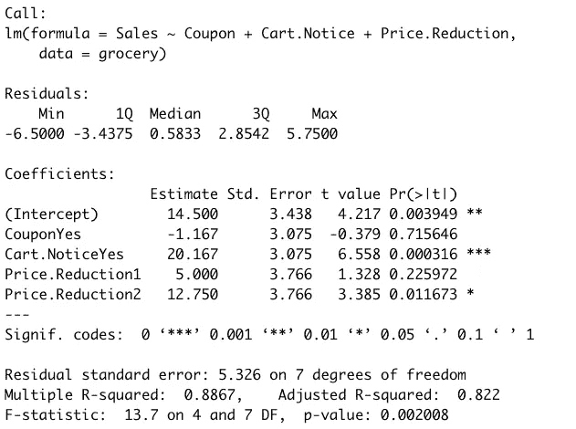
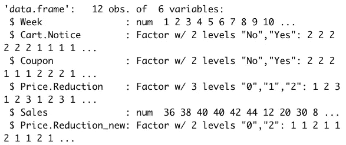
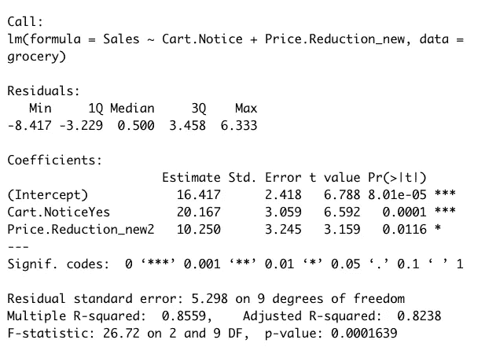
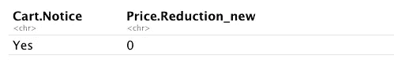
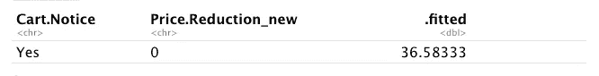

# 如何在 R 中使用多元线性回归来确定哪些营销行为推动了销售

> 原文：<https://medium.com/mlearning-ai/how-to-use-multiple-linear-regression-in-r-to-determine-which-marketing-actions-drives-sales-cf733eeae28e?source=collection_archive---------0----------------------->

降价会增加销量吗？



My local grocery store canned goods tomato aisle

我们将使用多元线性回归来确定促销、优惠券或降价是否会推动罐装番茄杂货产品的销售。继续阅读 [Wayne L. Winston 的《营销分析:使用 Microsoft Excel 的数据驱动技术》](https://www.amazon.com/Marketing-Analytics-Data-Driven-Techniques-Microsoft/dp/111837343X)一书，我将构建一个多元线性回归模型来回答以下问题:

1.确定促销、优惠券或降价是否会影响销售。

2.预测一周内罐装西红柿的销售情况，在这一周内，你使用购物车通知、优惠券，并将价格降低 1 美分。

我们的数据集包含超市中罐装番茄 12 周的销售数据。



Preview grocery store sales data

**周:**观察销售的周数。
**大车。注意:**是否有促销。
**优惠券:**是否有优惠券发售。
**价格。降价**:提供的降价。要么不降价，要么减 1 分钱，要么减 2 分钱。
**销量:**一周卖出的番茄罐头的箱数。

我们需要通过将我们的字符变量转换为因子类型变量来准备我们的数据集，这可以在 ***Cart 的一行代码中完成。注意*** 和 ***息*** 变量。然而， ***的价格。Reduction*** 是一个数值变量，所以我们将单独转换这个变量。

```
#Convert all character variables into factor in one line: Make sure tidyverse package is loaded.
grocery <- grocery %>% mutate_if(is.character, as.factor)#Factor Price Reduction variable
grocery$Price.Reduction <- as.factor(grocery$Price.Reduction)
```



Transformed dataframe

**虚拟变量回归**

在回归中处理分类变量时，变量采用的值是一个标签，因此它没有数字解释。例如，我们的优惠券变量有两个标签(是或否)。由于它只能取 2 个值，为了将它们包含在我们的回归模型中，我们使用了一种称为虚拟变量回归的技术。

幸运的是，简单地将我们的变量转换为因子类型就可以标记我们的变量，所以当我们将分类变量输入到函数中时，R 会自动使用其中一个分类作为参考变量。回归中所需的虚拟变量数量比分类变量中的类别数量少一个**。**

**多元线性回归模型**

现在，我们使用 lm()函数构建多元回归模型。多元回归仅仅意味着我们的模型中有两(2)个或更多的独立变量或解释变量。我们将车型*解释为 ***【券】******大车。注意*** 和 ***价格。*还原**。我们不需要 ***周*** 列。*

```
*# All variables with the exception of Week as an independent variable
grocery_model_lm <- lm(Sales ~ Coupon + Cart.Notice + Price.Reduction, data = grocery)*
```

*模型摘要输出:*

**

*Multiple linear regression output*

*我们来解读一下输出。*

***拦截***

*截距是所有自变量为零时因变量(销售额)的值。在没有优惠券、没有购物车通知、没有降价的情况下，我们每周可以卖出 14.5 箱西红柿。*

***系数***

**夫妻关系**

*CouponYes 系数为-1.17(负系数)，但 p 值不显著；因此，我们估计的系数在统计上与 0 没有区别。换句话说，我们不能排除该系数的真实值为零。这意味着不管有没有优惠券促销，西红柿的销售都没有什么不同。*

**推车。注意事项**

*推车。注意力系数为 20.17(正系数)，p 值具有统计学意义。当有购物车通知时，我们可以预计多卖 20 箱西红柿，同时保持所有其他变量在同一水平。*

**价格。缩减 1**

*价格。Reduction1 系数为 5(正系数)，但 p 值不显著；因此，我们估计的系数在统计上与 0 没有区别。这意味着当降价 1 美分时，销售没有什么不同。*

**价格。缩减 2**

*价格。缩减 2 系数为 12.8(正系数)，p 值具有统计学意义。当价格降低 2 美分时，我们可以预期多卖出 12.8 箱西红柿，而所有其他变量保持在同一水平。*

***无关紧要的变量***

*我们可以得出结论，优惠券和 1 美分的降价在影响销售方面并不显著。我们将删除无关紧要的变量，并再次运行我们的回归模型。首先，我简单地创建了一个新列，将所有 1 美分的降价记录为 0，并将这个新变量作为因子，然后检查结果。*

```
*#Create new price reduction variable
grocery <- grocery %>% 
    mutate(Price.Reduction_new =
      case_when(
        Price.Reduction == 2 ~ 2,
        Price.Reduction == 1 ~ 0,
        Price.Reduction == 0 ~ 0))#We need to factor Price.Reduction_new
grocery$Price.Reduction_new <- as.factor(grocery$Price.Reduction_new)#Check levels
levels(grocery$Price.Reduction_new)#Inspect results
str(grocery)*
```

**

*Inspect the results of our new Price.Reduction variable*

***最终回归模型***

*仅使用重要变量构建模型，并检查模型输出。*

```
*#Model sales as explained by Cart.Notice and Price.Reduction_new
grocery_model_lm_signifvars <- lm(Sales ~ Cart.Notice + Price.Reduction_new, data = grocery)#Print model output
summary(grocery_model_lm_signifvars)*
```

**

*Final regression summary model output with significant variables only*

*移除无关紧要的变量肯定会对模型拟合产生影响。*

***拟合优度测量***

*0.855 的 R 平方表明，在给定所有独立变量的情况下，该模型能够解释约 86%的番茄销售变化。剩下的 14%无法解释。*

*模型本身的 p 值为 0.0001639，小于 0.05，表明该模型具有预测能力。*

*回归模型的剩余标准误差是 5.29，并且测量我们的模型有多远。你必须解释相对于你预测的标准误差。实际上，观察销售和预测销售之间的典型差异是 5.29 例。只要残差是正态的，那么我们预测的 68%应该落在 1 个标准误差内(5.29 例)，95%应该准确在 2 个标准误差内(10.58 例)。大于 2 个标准误差的预测将被视为异常值。*

*值得注意的是，去除无关紧要的变量并没有改善 R 平方。但是如果我们看一下我们调整后的 R 平方，第二个模型确实改善了一点点。更重要的是，模型 2 确实降低了我们的剩余标准误差。如果您的目标是建立准确的预测，那么减少剩余标准误差在评估模型时变得非常重要。*

***预测销售额***

*我们将预测一周内罐装西红柿的销售情况，在这一周内，你将使用购物车通知、优惠券，并将价格降低 1 美分。*

*首先，创建一个新的数据框来保存我们想要预测的值*(样本外数据)*。正如我们的第一个回归模型所示，由于优惠券和 1 美分的降价对销售没有影响，我们将在新的数据框架中完全忽略 ***优惠券*** 变量，但我们需要包括 ***价格。*** 化简，但将其编码为零(0)以便符合模型。*

```
*# Create new data frame and print output
(new_data_02 <- data.frame(Cart.Notice = "Yes", Price.Reduction_new="0"))*
```

**

*Output of new data frame with the values we want to predict*

*其次，加载 broom 包，因为我们将使用 augment()函数来进行预测。我们的回归模型是第一个参数，新数据框架是第二个参数。我们将使用只有显著变量的回归模型。*

```
*#Using broom package
augment(grocery_model_lm_signifvars, newdata = new_data_02)*
```

*augment 函数返回一个包含名为**的新列的 tibble。拟合**保存我们的预测。*

**

*Augment function output contains a new column .fitted with our predicted sales*

*我们预计能卖出 36.5 箱西红柿。*

# ***最终总结***

*1.确定促销、优惠券或降价是否会影响销售。*

*影响西红柿销售的最重要因素是提车通知，随后降价 2 美分。*

*2.预测一周内罐装西红柿的销售情况，在这一周内，你使用购物车通知、优惠券，并将价格降低 1 美分。*

****36.5 例。****

*完整代码可以在 [Github](https://github.com/bonheurgirl/Forecasting-in-R/blob/main/Multiple%20Linear%20Regression%20to%20Determine%20If%20a%20Price%20Cut%20Increases%20Sales.Rmd) 上找到。*