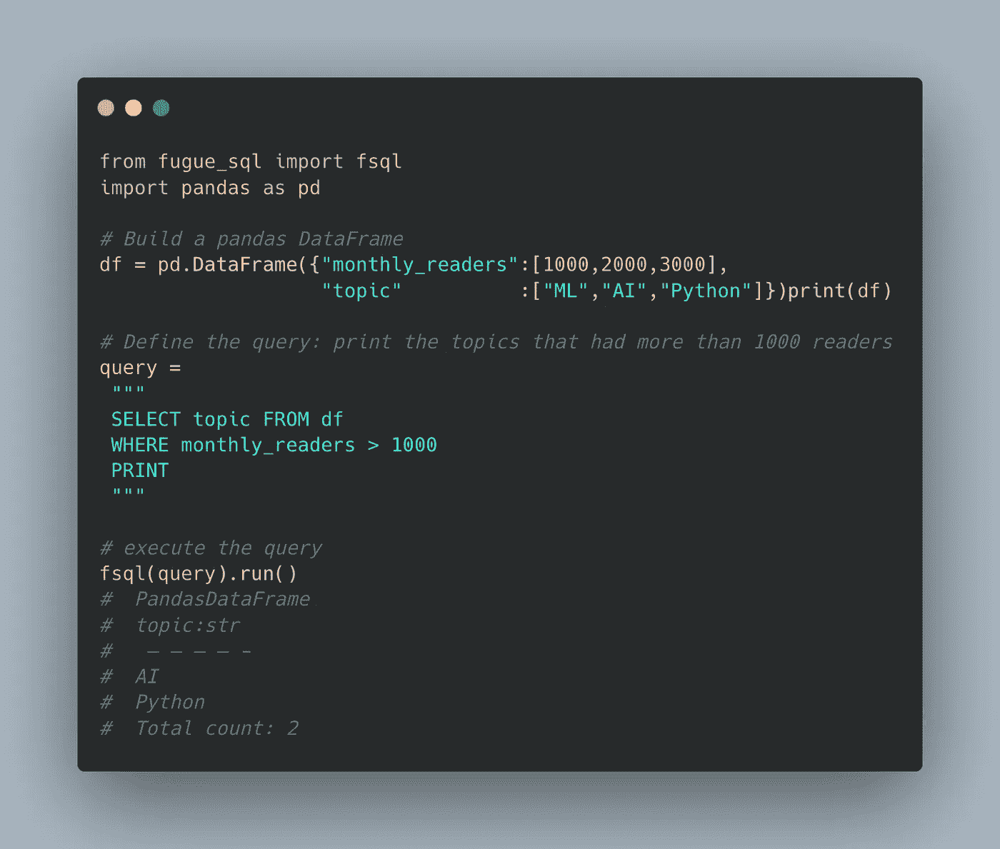

# 如何使用 Python & SQL 在 1 分钟内操作数据

> 原文：<https://medium.com/mlearning-ai/how-to-use-python-sql-to-manipulate-data-in-1-min-bbf9ec17dc5d?source=collection_archive---------0----------------------->

请继续阅读！

Image created by the author using an online free tool.

# 1.介绍

大家好。这篇文章将有点独特，不会像我以前的文章那样冗长。

我刚刚发现了一个很棒的 python 库，我想和我的观众分享一下。

> 您想同时使用 Python 和 SQL 来操作数据吗？