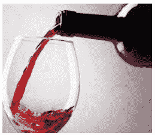

# 如何在 Python 中使用半监督学习对部分标记数据进行预测

> 原文：<https://medium.com/mlearning-ai/how-to-use-semi-supervised-learning-to-predict-on-partially-labelled-data-in-python-f6d2380767dd?source=collection_archive---------2----------------------->

我没有写很多关于无监督或半监督学习的文章，主要是因为免费数据科学网站 Kaggle 没有涉及太多。事实上，据我所知，Kaggle 只出过一道监督竞赛题，没有半监督竞赛题。