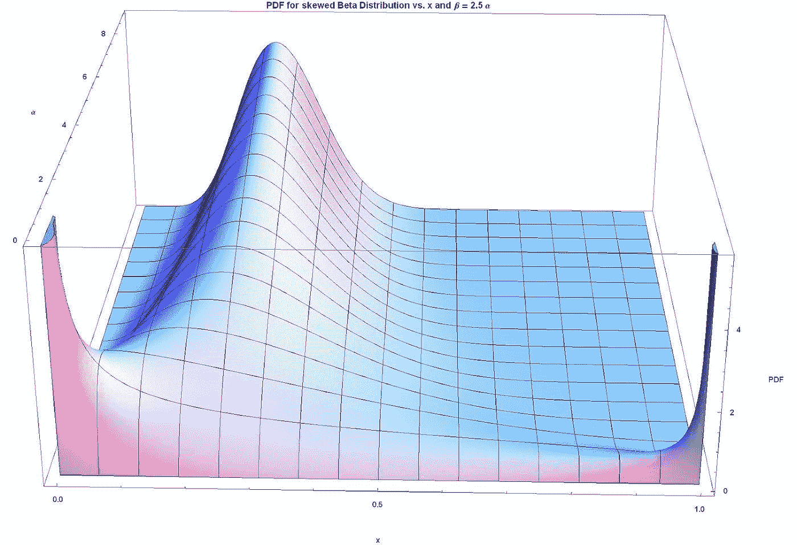

# 如何使用 sklearn 转换数据集中的倾斜标签

> 原文：<https://medium.com/mlearning-ai/how-to-use-sklearn-to-transform-a-skewed-label-in-a-dataset-c54c9110236d?source=collection_archive---------0----------------------->

通过参加 Udacity 的机器学习入门课程和 Kaggle 的 30 天机器学习课程，我发现了一个事实，即它们往往会重复很多相同的材料，而我希望在每门课程中都学到一些新东西。一部分原因可能是因为在 Kaggle 工作的一个人也在 Udacity 工作，所以不可避免的是很多…