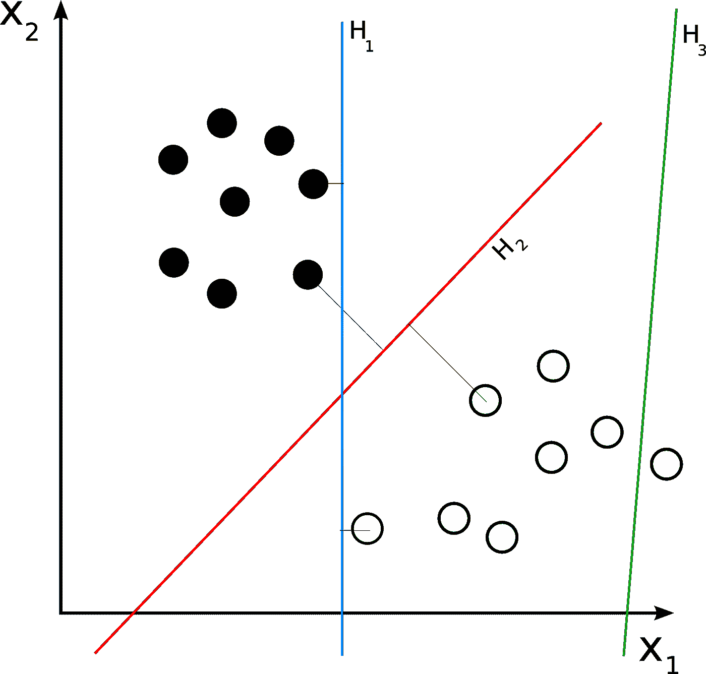

# 如何使用支持向量机(SVM)作为分类器

> 原文：<https://medium.com/mlearning-ai/how-to-use-the-support-vector-machine-svm-as-a-classifier-e3b597d1b125?source=collection_archive---------2----------------------->

随着我在正在学习的机器学习课程中的进步，我已经进步到支持向量机，或 SVMs。SVM 是一种监督学习分类算法。支持向量机与其他分类算法的不同之处在于，它们选择的决策边界最大化了所有类别的最近数据点之间的距离。