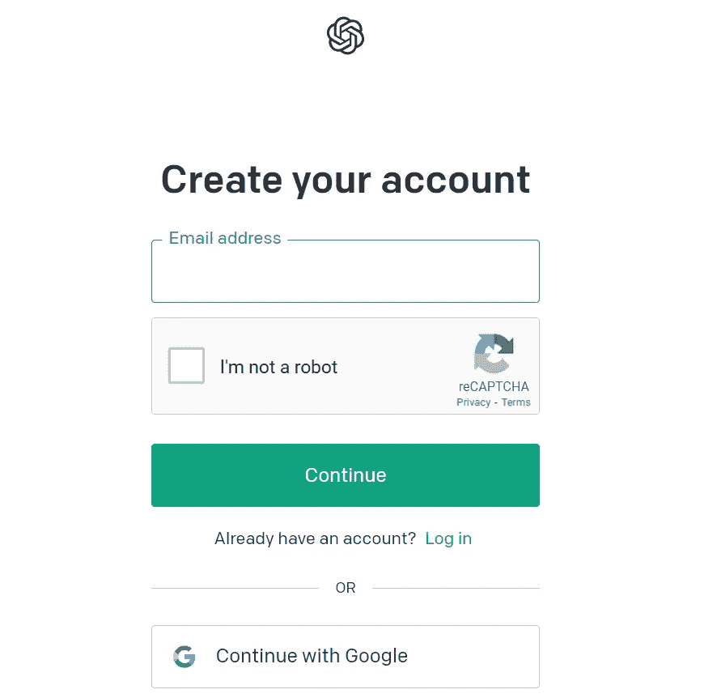
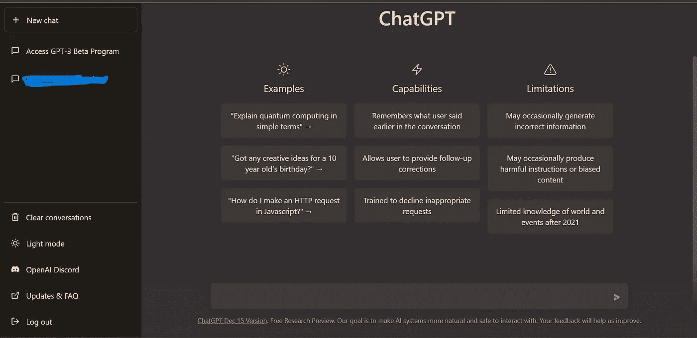
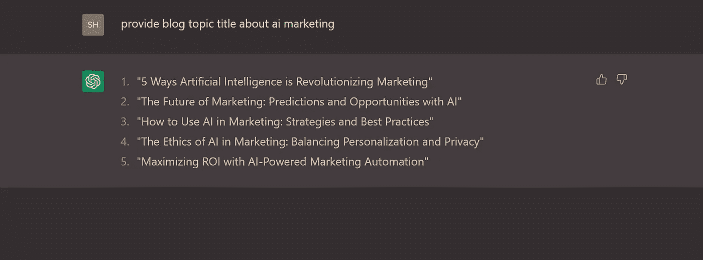
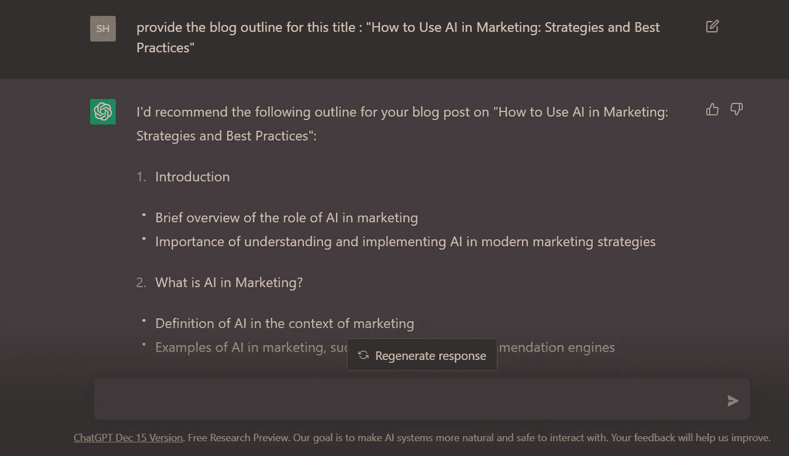
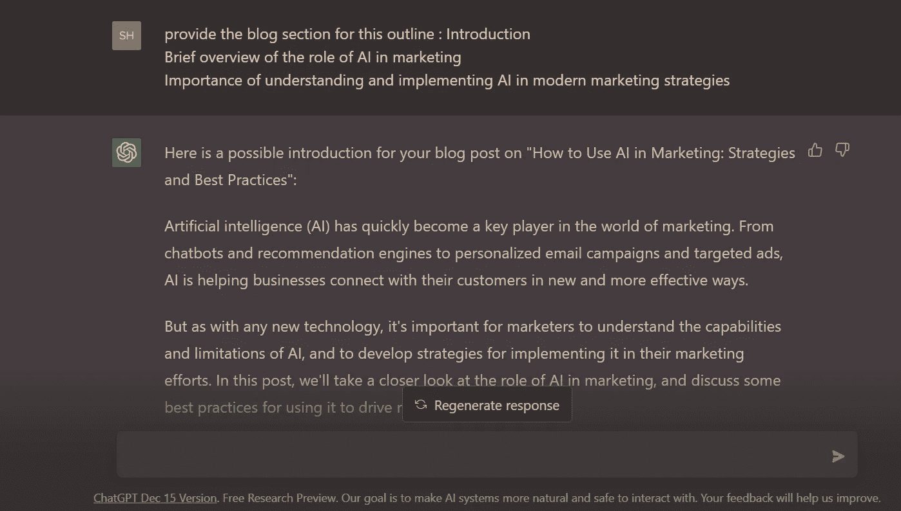
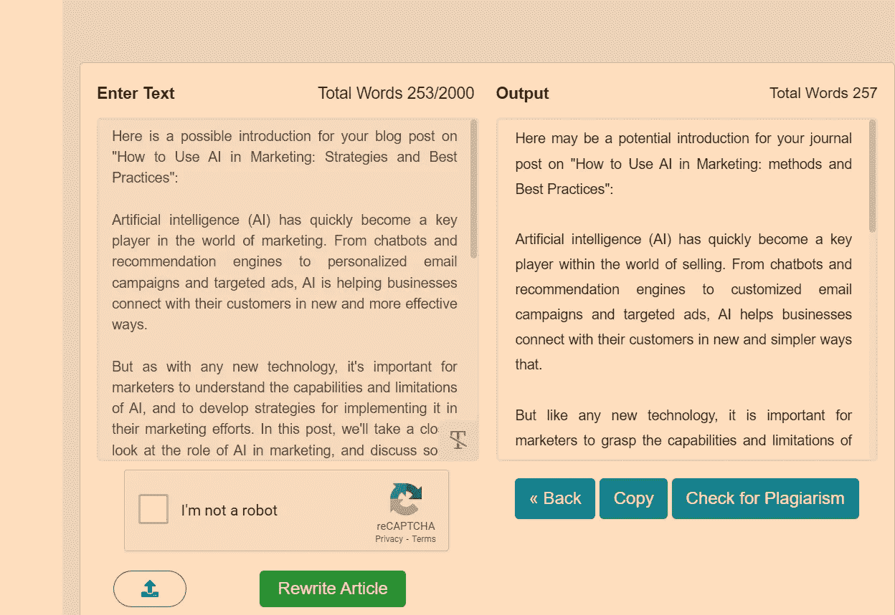
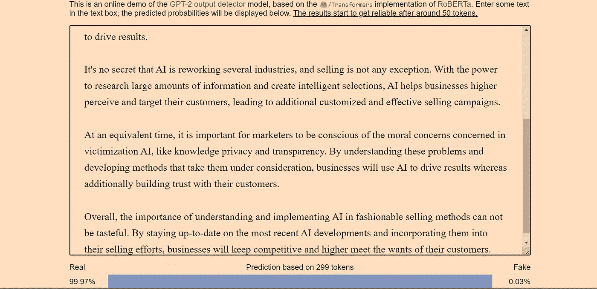

# 如何用 ChatGPT 写博客

> 原文：<https://medium.com/mlearning-ai/how-to-write-a-blog-using-chatgpt-69dbeb5868ba?source=collection_archive---------0----------------------->

Image by [StockSnap](https://pixabay.com/users/stocksnap-894430/?utm_source=link-attribution&utm_medium=referral&utm_campaign=image&utm_content=923882) from [Pixabay](https://pixabay.com//?utm_source=link-attribution&utm_medium=referral&utm_campaign=image&utm_content=923882)

## 介绍

写博客有很多好处。从赚钱到向人们传授知识等等。今天在这篇文章中，我将向你展示如何使用 openAI 新的高级人工智能 ChatGPt 来写一篇博客文章。它可以免费使用，使用 ChatGPT 写一篇文章花费的时间也少得多。所以让我们深入研究一下。

我们将一步一步来。让我们开始吧

## 步骤 1:在 OpenAI 中创建一个帐户来访问服务

创建一个帐户以访问 chatgpt。这很容易也很简单。你可以用谷歌注册。

## 步骤 2:访问 ChatGPT

转到左下方的 chatGPT 部分或标题中的 TRY 部分。如果你成功了，你应该会看到这样的界面

## 第三步:寻找需求和低竞争利基

如果你已经决定了写什么主题，那就没问题了。否则，你可以从关键字搜索工具中获得帮助，例如 [vidIQ](https://app.vidiq.com/channels/851e141b-aa52-4d99-ac82-4766e27ad64b/keywords)

在这里你可以找到高搜索量和低竞争的关键字，就像我找到的一样。这个工具非常有用。

## 步骤 4:在 chatgpt 中搜索，提供关于关键词的博客标题

就在那里。chatgpt 回复了 5 个关于您提供的关键字的博客标题。选择其中一个来写一篇文章。

## 步骤 5:在 chatgpt 中搜索大纲

在搜索框中搜索“提供此标题的大纲:标题”。

你可以看到回应。它会回复成 5-6 个轮廓。

## 步骤 6:搜索博客版块

搜索“提供此大纲的博客部分:大纲”

正如你所看到的，它在博客部分做出了回应。

现在将所有这些复制并粘贴到一个. doc 文件中

**对每个轮廓逐一重复第 5 步和第 6 步，然后粘贴到同一个轮廓中。文档文件按顺序排列。一旦你复制并粘贴了所有的大纲和博客部分，你就可以进入下一步**

## 第七步:重写文章

转到 duplichecker 文章重写器

复制中的所有内容。到目前为止，已经复制并粘贴了。粘贴在中间的盒子里。解决验证码，然后点击重写文章。

在右边部分，你会看到一篇新的重写的文章。按下一步，点击复制按钮复制所有内容

粘贴回。文件来代替前一篇文章。

这是你新改写的文章。这篇文章可能有一些拼写错误和字体问题。修改一下，我们就可以开始了。

## 步骤 8 : GPT-2 输出探测器演示

你可以遵循的一个额外步骤是，你可以在这个工具中检查抄袭。你的文章有多少是真实的，从某处抄袭的。

## 第九步:发布

如果你正确地遵循了所有的步骤，那么你就可以在任何平台上发表你的文章了。Medium 是其中之一，你也可以在其他任何平台或你自己的网站上发布它们。

感谢阅读这篇文章。如果你在媒体上，你可以关注我更多这样的内容。

这是我的推特

 [## Mlearning.ai 提交建议

### 如何成为 Mlearning.ai 上的作家

medium.com](/mlearning-ai/mlearning-ai-submission-suggestions-b51e2b130bfb)