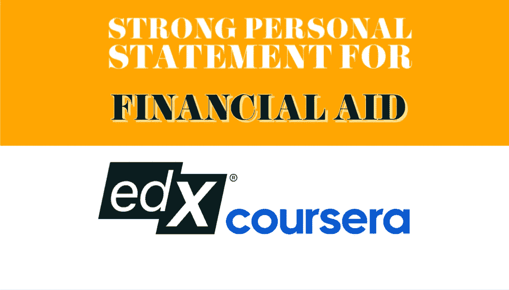

# 如何为 Coursera 和 edX 助学金写一份强有力的个人陈述？

> 原文：<https://medium.com/mlearning-ai/how-to-write-a-strong-personal-statement-for-coursera-and-edx-financial-aid-dd8a9e340f23?source=collection_archive---------1----------------------->

***个人陈述是 Coursera 和 edX 平台获得经济资助的重要组成部分。我多次获得经济资助，这里有一些关于你如何也能得到资助的建议。***

Image by the author

Coursera 和 edX 是在线学习平台，提供来自世界顶尖大学、公司和世界级教师的课程。的…