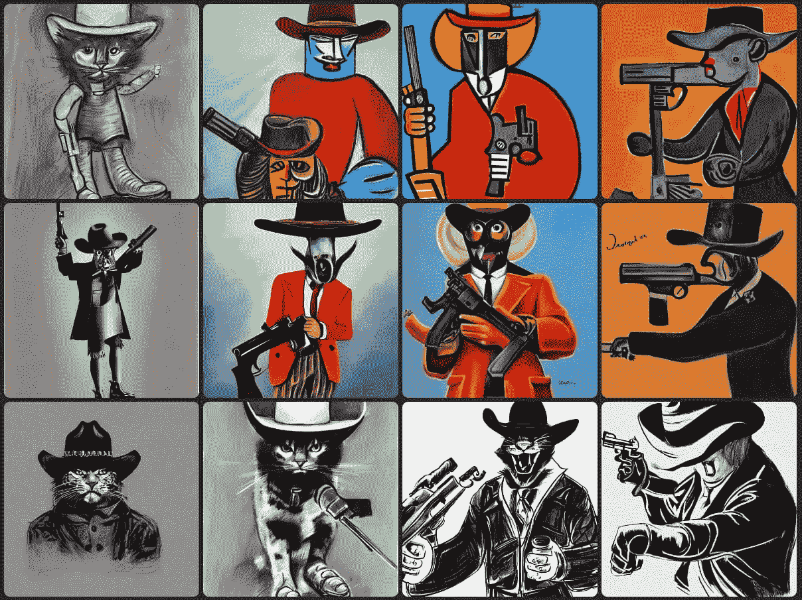

# 如何创建定制的人工智能艺术:写好提示的关键

> 原文：<https://medium.com/mlearning-ai/how-to-write-good-prompts-for-ai-image-generation-52bda91becf5?source=collection_archive---------1----------------------->

## 人工智能实验

## 用人工智能生成令人惊叹的图像的分步指南

Image by [Samuele](/@el3um4s)

是的，这是我连续第四篇致力于人工智能的文章，特别是那些专门从文本提示生成图像的文章。我发现…