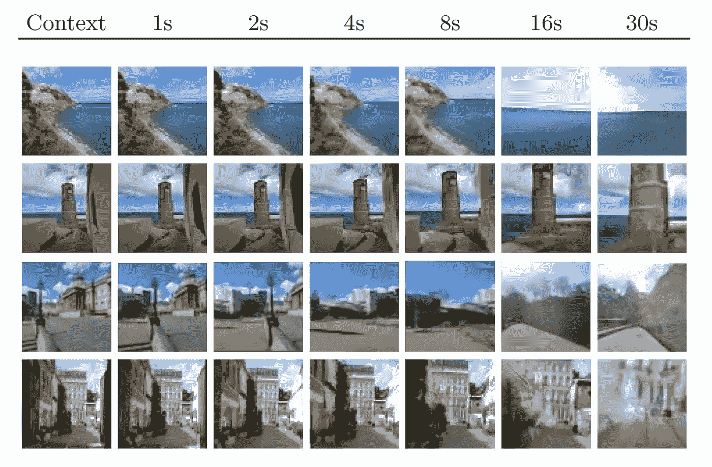

# Transframer 如何看世界

> 原文：<https://medium.com/mlearning-ai/how-transframer-sees-the-world-8e8ea52ae90d?source=collection_archive---------6----------------------->

## [机器学习艺术](https://mlearning.substack.com)

[https://mlearning.substack.com](https://mlearning.substack.com)

**Transframer，**被训练来预测以一个或多个带注释的上下文帧为条件的任意帧的概率。

[**项目页面**](#8cb1) (向下滚动)

基于概率帧预测的图像建模和视觉任务的通用框架。该方法涉及各种任务，从图像分割到新颖的…