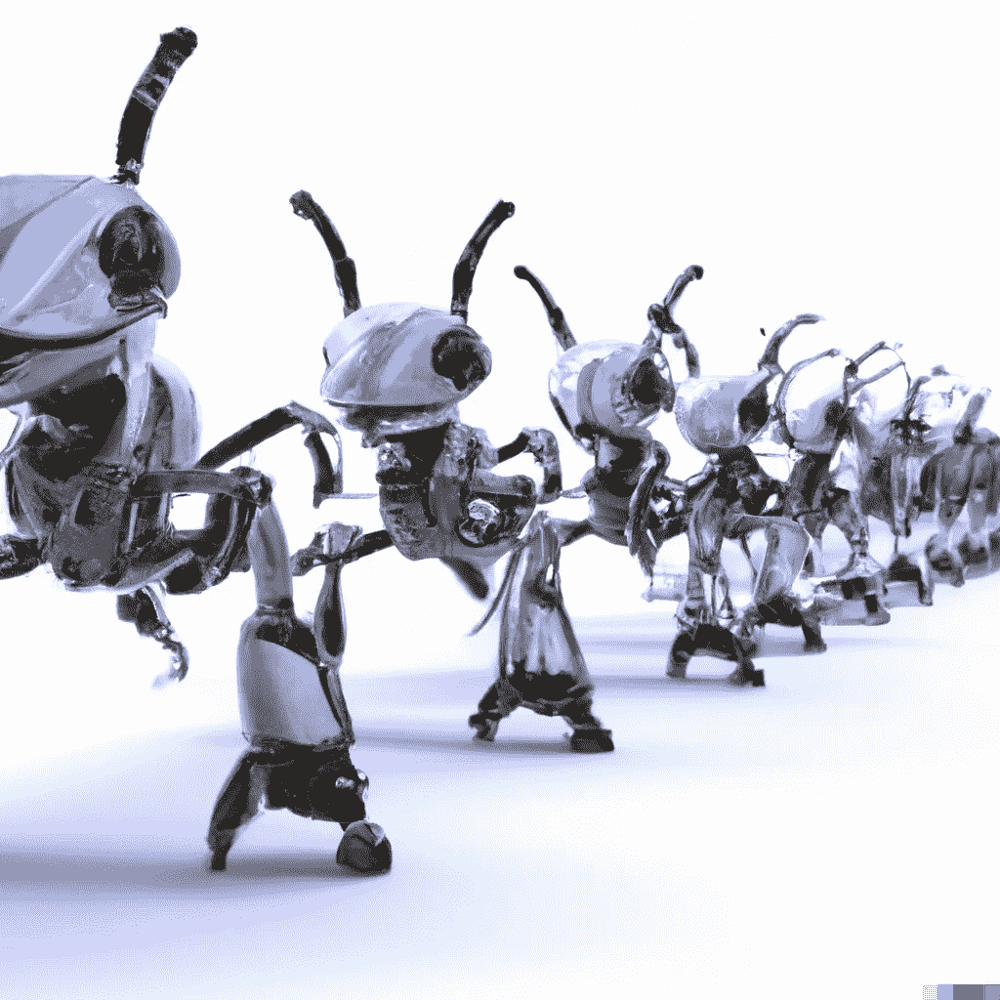

# 了解蚂蚁如何提升你的机器学习营销游戏

> 原文：<https://medium.com/mlearning-ai/how-understanding-ants-can-up-your-machine-learning-marketing-game-35f656ee9c9d?source=collection_archive---------5----------------------->

今天的简短课程是关于机器学习是如何工作的…等等！不要走！

我知道，我知道。学习机器学习听起来就像看草生长一样令人兴奋。

但是相信我，你会因为两个原因想要坚持下去…

第一，机器学习(ML)就是我们现在生活的这个有营销的世界。持续的成功至少需要对机器如何操纵事物有一个基本的了解(或者，更好的是，你如何操纵机器！)

**第二，你不需要一个博士学位(甚至 GED)来理解 ML 是如何工作的。你只需要了解蚂蚁。**

是的，蚂蚁。除非它们在你的房子里或者带着你的午餐跑了，否则你不会太注意这些爬行的小家伙。

以下是 ants 如何帮助你比大多数人更好地理解 ML:

事实证明，蚂蚁是一种迷人的生物。其中一种方式是通过他们使用信息素。

蚂蚁旅行时会留下信息素痕迹。这是它们告诉它们的蚂蚁朋友如何找到食物来源的路径。

所有的蚂蚁都知道，如果它们沿着信息素的路线走，它们就会找到食物。

(他们对这一点非常执着，以至于他们会陷入“死亡圈”，在那里他们会绕圈行进，直到无法摆脱费洛蒙的踪迹而死去。这里有一个关于这一现象的[短片](https://www.youtube.com/watch?v=LEKwQxO4EZU)。)

对于那些好奇的人(魔鬼？)孩子们，你们知道这条信息素路线很容易被破坏。

要想弄乱蚂蚁，你需要做的就是用手指划过轨迹。这从不同的方向抹去了一些信息素。

这让可怜的家伙们很困惑。

因为，对蚂蚁来说，那条信息素线是它们需要去哪里的标志。这是它们与食物来源的联系，当这种联系中断时，蚂蚁不知道去哪里或做什么。

**机器学习的工作方式非常相似。**

简单地说，ML 使用输入的所有数据开辟了一条通向转换的道路。

根据这些数据(关键词、登陆页面、出价、受众、时间、位置等。)，它为一个活动建立了一个成功的模型。

基本上，它会计算出转换的位置，然后构建一条直线，高效且一致地到达那里。

但是，就像蚂蚁一样，如果你打破了这条线，你就可能与 ML 发生冲突。

**对 ML 活动进行更改相当于用手指划过蚂蚁信息素轨迹。**

对于蚂蚁来说，如果对它们踪迹的干扰相对较小，那也没什么大不了的。他们的直线可能会变宽一点。他们可能会四处游荡一会儿，以便重新找到踪迹。但是，最终，它们中的大多数还是能找到食物。

同样的，对 ML 战役做了一些小的调整…机器应该仍然能够找到转换的方法。

但是如果你做的改变太大，对蚂蚁和曼梯·里来说，事情就会分崩离析。

对于 ML 活动，这可能包括对您的登录页面进行重大更改，或者大幅增加您活动的每次行动目标成本或广告支出回报。

这相当于用一个巨大的手指拖着安德烈走过 ML 为转换而建立的轨迹。这种干扰如此之大，以至于机器变得混乱，它的模型崩溃了。

这可能会导致你的活动(甚至在某些情况下整个帐户)完全崩溃。

**亲爱的读者，这就是为什么你在改变大联盟的活动时要非常小心的原因！**

值得称赞的是，这方面的情况正在好转。与 6 个月前或一年前相比，现在对活动进行改变不太可能导致彻底的崩溃。

然而，许多其他大型科技公司使用的 ML 仍然在追赶。

例如，我最近在微软广告中的一个机器学习活动因为仅仅将预算从每天 57 美元提高到 63 美元而失败。(顺便说一句，这是 Ads 女士建议的涨幅——感谢微软的惊人建议——grrrrr！)

无论如何，这里有两个建议留给你:

**1。一般来说，你越能远离机器学习运动，就越好。**

如果你真的想对广告活动做出重大改变(至少在谷歌)，我们建议使用实验。

将你想要测试的每一个改变分成两个星期的实验(或者类似的事情)。

这将防止算法在运作的活动中崩溃…同时让你看到如果你将这种改变应用到整个活动中会发生什么。

2.如果你做出了改变，而你曾经高高在上的竞选变成了一堆垃圾，这里有一个建议…

“重置”该活动的最佳方法是从其中移除机器学习。

是的，走老路，尽可能不受任何曼梯·里的影响来管理竞选。

让它回到你得到好的数据、结果、可接受的 CPA 等的点上。然后，一旦你把船摆正，让它朝着好的方向前进，你就可以重新打开 ML，开辟一条新的转化之路。

看，学习 ML 并没有那么糟糕！

事实上，这一课的一个额外好处是，如果你在后院烧烤，你想给你的朋友和家人留下深刻印象，就告诉他们蚂蚁和机器学习！

你可能只是想附近有一些突袭，以防任何蚂蚁试图击败水果沙拉的信息素踪迹。

 [## Mlearning.ai 提交建议

### 如何成为 Mlearning.ai 上的作家

medium.com](/mlearning-ai/mlearning-ai-submission-suggestions-b51e2b130bfb)