# 如何使用单因素方差分析进行预测

> 原文：<https://medium.com/mlearning-ai/how-use-one-way-anova-for-forecasting-in-r-908bb1b5b4d3?source=collection_archive---------2----------------------->

也可以预测的统计检验


The English book section at my local bookstore. Image by author.

想象一下，当我得知在假设检验中被广泛使用的方差分析(ANOVA)可以用来预测销售额时，我有多惊讶。嗯，这真的不应该是一个惊喜，因为方差分析和回归密切相关。

方差分析有助于回答这个问题:*我们的群体真的不同吗？*我们使用 ANOVA 来分析平均值的方差，然后我们可以对这些平均值做出推断。

我将使用单向方差分析预测产品销售。单向的，因为我们只用一个独立变量来预测。如果我们想通过**分析两个**独立变量，这将是一个双向方差分析。这个数据集来自 Wayne L. Winston 的《营销分析:使用 Microsoft Excel 的数据驱动技术》的第 40 章。它包含位于商店不同货架位置的计算机书籍 6 周的销售数据。

该数据集有 3 列(前面、后面和中间货架位置),每行有总销售额。

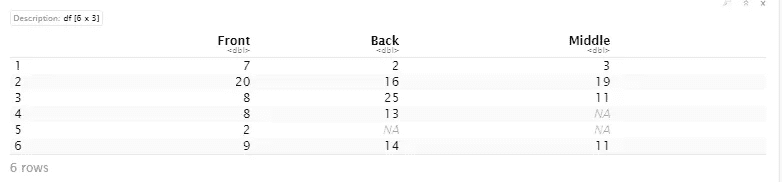

方差分析将有助于回答这个问题:*书架位置影响图书销售吗？我们可以期待总销售额是多少？*

# 浏览数据集

首先，我们需要重塑数据，以便能够运行任何统计分析。现在，我们的数据集很宽，我们希望它很长，这样每一行只是每个时间点每个位置的一个观察值。我们将首先添加一个星期数作为行号，然后使用 tidyr 的 pivot_longer()函数。

```
books <- bookstore %>% 
mutate(week_num = row_number())  %>%
  pivot_longer(!week_num, names_to = "location",
               values_to = "sales")books
```

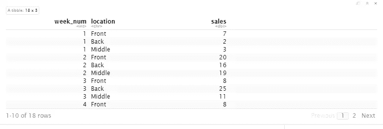

Transformed data from wide-to-long. Image by author.

重要的是要知道，在我们的分析中，我们会忽略一些缺失值，而不是删除或输入(替换)缺失值。

接下来，我们来做一些探索性的数据可视化。我们将使用箱线图按货架位置绘制销售图，以检查分布情况。

```
#set Wall Street Journal theme for all plots
theme_set(theme_wsj())ggplot(data = books, aes(x=location, y=sales)) + geom_boxplot(na.rm=TRUE) + ggtitle("Book sales by shelf location")
```

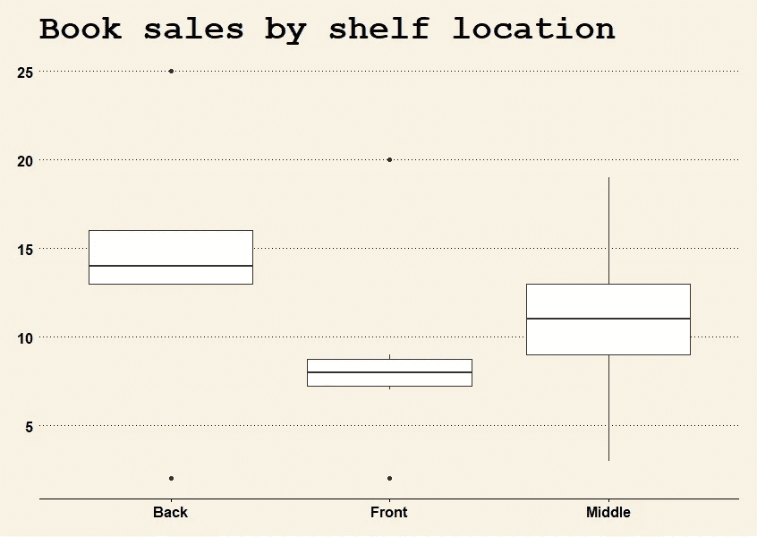

Book sales ggplot boxplot using wsj theme from ggthemes package. Image by author.

位于后面时，平均销售额会更高。我们也有一些异常值，用方框外的黑点表示。

# 方差分析

像所有的统计测试一样，需要做一些假设来确保我们可以使用我们的统计测试。对于方差分析，假设是:

1.数据来自随机样本
2。观察是独立的
3。正态分布的底层数据
4。方差的同质性

让我们定义我们的无效假设和替代假设:

*H₀* —组间均值相等
*哈* —组间均值不同

# 方差分析假设

为了使用方差分析，我们必须确保我们的基础数据满足上述四(4)个方差分析假设。我们最关心的假设是方差的正态性和同质性。我们将用夏皮罗-维尔克方法检验正态性，用巴勒特检验检验方差齐性。

```
# Test normality across groups (Shapiro)
tapply(books$sales, books$location, FUN = shapiro.test)
```

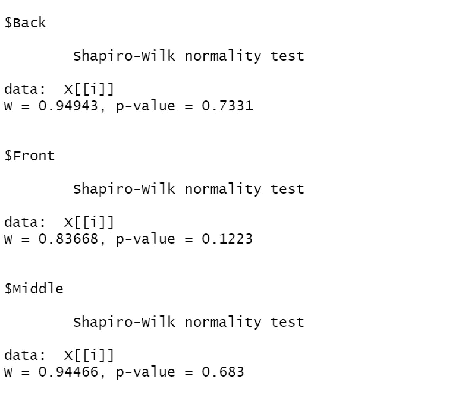

Shapiro-Wilk normality test output. Image by author.

所有货架位置的所有 p 值都非常大(> 0.05)，因此我们可以假设基础数据的正态性。

让我们检查方差的同质性。

```
# Check the homogeneity of variance (Bartlett)
bartlett.test(sales ~ location, data = books)
```


Output of Bartlett test. Image by author.

Bartlett 检验的 p 值非常大(> 0.05)，我们可以假设方差齐性。我们现在可以安全地继续进行单向方差分析。

# 进行单向方差分析

```
# Perform one-way ANOVA 
(anova_results <- oneway.test(sales ~ location, data = books, var.equal = TRUE))#Extract p-value
anova_results$p.value < 0.05 #If true, means are different. If false, mean sales are identical in all shelf positions.
```

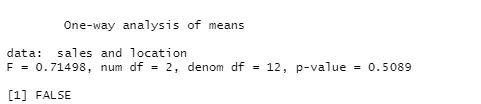

One-way ANOVA output p-value is very large so we fail to reject the null hypothesis. Image by author.

单因素方差分析结果解读:
检验的 p 值大于显著性水平α= 0.05。我们不能根据货架高度得出销售有显著差异的结论。(p 值高于 5%，因此我们无法拒绝组间均值相等的零假设)。换句话说，我们接受零假设，并得出结论，销售没有显着不同的货架位置。

# 预报

每组的预测平均值是总体平均值。预测将是每周销售，不考虑货架位置。

```
#Forecast:  mean of sales and remove n/a's
mean(books$sales, na.rm = TRUE)
```

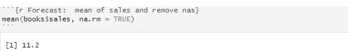

Forecast for weekly sales. Image by author.

我们预计每周能卖出 1120 本书。

# 场景 2:如果各组有明显不同的方法呢？

让我们用不同的场景再试一次。让我们来看一下**新的数据集**为我们的计算机书籍提供的 6 周的销售数据。就像我们的第一个数据集一样，该数据最初很宽，我们将其转换为长格式。

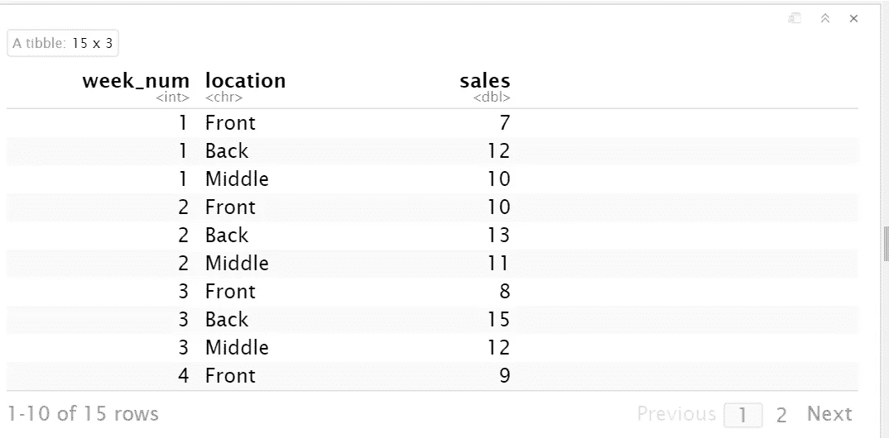

Transformed data from wide-to-long. Image by author.

让我们在箱线图上绘制这个数据集。

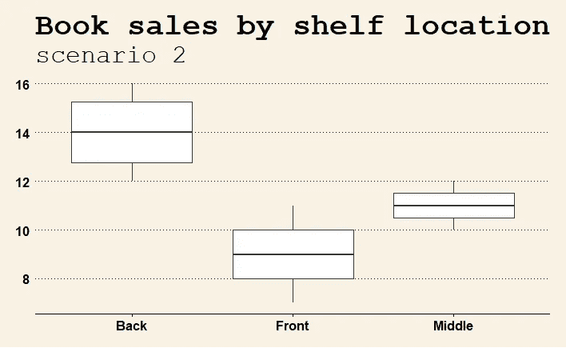

Book sales for scenario 2 with ggplot boxplot using wsj theme from ggthemes package. Image by author.

在这个数据集中，我们看到，与前面和中间位置相比，位于后面的书籍销量明显更多。

# 方差分析假设(情景 2)

```
# Test normality across groups
tapply(books2$sales, books2$location, FUN = shapiro.test)
```

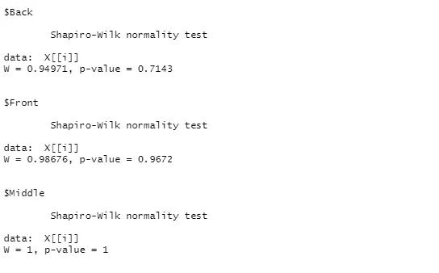

Shapiro-Wilk test output. Image by author.

```
# Check the homogeneity of variance
bartlett.test(sales ~ location, data = books2)
```

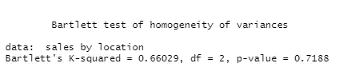

Bartlett test output. Image by author.

Bartlett 检验 p 值也很大。

# 再次进行单向方差分析

```
# Perform one-way ANOVA 
(anova_results2 <- oneway.test(sales ~ location, data = books2, var.equal = TRUE))anova_results2$p.value < 0.05 #If true, means are different. reject null hypothesis and alternative hypothesis is true. if false, mean sales are identical in all shelf positions.
```

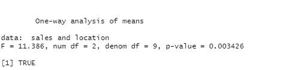

ANOVA output for scenario 2\. Image by author.

单因素方差分析结果的解释:
p 值非常小，为 0.003426，因此我们拒绝零假设，并得出结论:货架位置之间的销售额存在显著差异。

# 预测(当我们有明显不同的手段时)

每组的预测平均值等于组平均值。

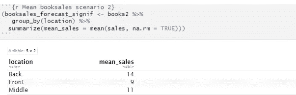

Forecast of weekly sales based on result of ANOVA. Image by author.

我们可以预计，当位于书区的前面时，每周销售 900 本书，当位于中间时，每周销售 1100 本书，当位于书区的后面时，每周销售 1400 本书。

# 关键要点

使用单因素方差分析进行预测时:

> 如果销售平均值**不显著**跨组预测:
> 每个组的预测平均值等于**总体平均值**。
> 
> F 预测如果销售平均值**跨组** **显著**:
> 每个组的预测平均值等于**组平均值**。

代码可以在 [Github](https://github.com/bonheurgirl/Forecasting-in-R/blob/main/Forecasting%20with%20One-way%20ANOVA%20in%20R.Rmd) 和 [Rpubs](https://rpubs.com/anitaowens/forecasting-anova) 上找到。

# 参考资料:

温斯顿 W. L. (2014 年)。营销分析:微软 Excel 的数据驱动技术。威利。

[](/mlearning-ai/mlearning-ai-submission-suggestions-b51e2b130bfb) [## Mlearning.ai 提交建议

### 如何成为 Mlearning.ai 上的作家

medium.com](/mlearning-ai/mlearning-ai-submission-suggestions-b51e2b130bfb)