# 2023 年，德国开发者对技术和工具的使用将会如何发展？

> 原文：<https://medium.com/mlearning-ai/how-will-the-usage-of-technologies-and-tools-by-developers-in-germany-evolve-in-2023-70e438125288?source=collection_archive---------6----------------------->

在我们最近的文章中，我们通过查看他们在 [2021 StackOverflow 调查](https://insights.stackoverflow.com/survey)数据集中回答的两个问题，分享了我们对德国开发人员在 2022 年使用的技术和工具的发现。在本文中，我们探索并处理了 [2022 年 StackOverflow 调查](https://insights.stackoverflow.com/survey)，以确定德国开发者在 2023 年最有可能使用的技术和工具。该数据集有 5395 名受访者。

在此分析中，我们使用了他们在给定调查中回答的两个问题。这些问题如下:

> **1)开发人员被要求从给定数量的技术或工具中进行选择，这些技术或工具是他们在过去几年中已经做了大量工作的。**
> 
> 然后，他们被要求选择他们希望在即将到来的 2023 年使用的技术或工具。

我们的目标是探索并分享我们对 2023 年技术和工具使用趋势的发现。决策者可能会发现我们的结果是有用的，他们可能会考虑将它们纳入他们的决策承诺。

与我们的上一篇文章类似，我们的分析目标领域也分为以下几类:

**1。云平台**

**2。数据库**

**3。误触工具**

**4。新的协作工具**

**5。编程、脚本和标记语言**

**6。工具技术**

7。Web 框架和库

## **分析方法学**

我们使用一种简单的方法来确定开发者对技术和工具使用偏好的可能趋势，首先查看他们提供的关于他们在 2022 年使用的技术和工具的信息。然后，我们检索他们提供的关于他们**希望在来年(2023 年)与**合作的技术和工具的信息。对于当前(2022 年)和未来一年(2023 年)，我们计算 7 个类别中每个类别的开发人员总数，并输出给定年份内他们在每个组中的百分比。

为了澄清上面的解释，请看下表。

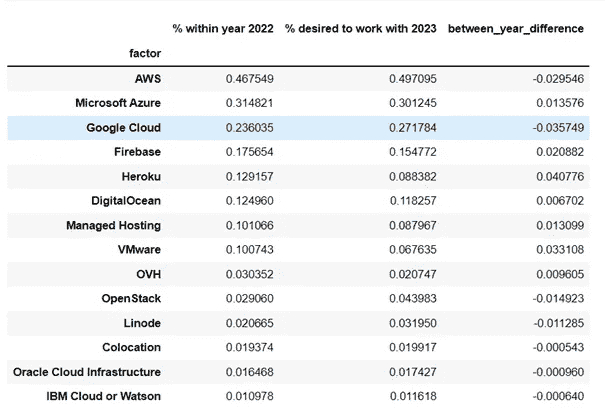

**Table 1\. Cloud Platform Environment**

这里有类别**云平台**的因素。这一类别中有 14 种不同的云平台。**% 2022 年内**是指 2022 年开发者使用相应平台的百分比。希望在 2023 年使用的 **%表示希望在 2023 年使用给定平台的开发人员的百分比。最后一栏**_ year _ difference**是 2022 年使用该平台的开发人员和 2023 年希望使用相应平台的开发人员之间的百分比差异。**

我们利用每个因素的年间差异来确定差异的**方向**。如果在 **2022 年使用给定云平台的开发人员的百分比差异大于 2023 年使用该平台的开发人员的百分比差异**，那么我们将此理解为**2023 年相应因素的使用趋势将下降**。我们对这种解释的推理是，开发人员被明确要求表明他们是否希望在未来一年(2023 年)继续使用他们目前使用的技术和工具。因此，来年使用量的减少可能表明他们目前对给定的技术或工具不满意。

另一方面，如果 2023 年他们的**预期使用量的差异大于 2022 年**的差异，那么我们将其解释为相应技术或工具的**可能增加的使用量**。

想想云平台 AWS。2022 年，47%的开发人员在使用它。开发商希望在 2023 年使用 AWS 的比例在 50%左右。这大约增加了 3%。我们将这种增长解释为 AWS 用户的**可能上升的受欢迎程度**。

另一方面，想想云平台英雄库。在 2022 年，大约 13%的开发人员在使用它。开发商在 2023 年使用它的愿望约为 09%。因此，我们与 2022 年相比有 4%的差距。我们认为云平台 Heroku **在 2023 年很可能会面临**使用量的减少。

> O **以上分析方法基于百分比差异(正或负)方向的直觉。我们没有通过必要的分析方法(如假设检验)提供统计显著性证明。**

作为总结，我们使用了 2022 年堆栈溢出开发者调查。该数据集由 5395 名受访者组成。在我们开始之前，让我们看看受访者来自的行业规模。

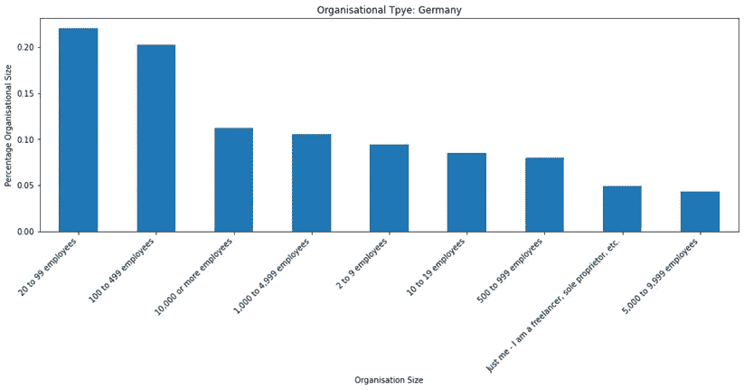

**Figure 1\. Organisational Types**

当我们看这个图表时，我们可以根据开发人员的数量将公司大致分为 4 组。大多数开发者来自拥有 20 到 99 名员工的公司(**小型企业**)和 100 到 449 名员工(**中小型企业**)。此外，第二高的受访者来自拥有 **10000 名及以上员工**以及 **1000 至 4999 名(大企业)**的公司。而第三组开发人员来自拥有 2 到 9 名员工(微型企业)、10 到 19 名员工(小型企业)和 500 到 999 名员工的公司。最后一组是**自由职业者、个体经营者、**和拥有 **5000 到 9999 名员工的公司(大企业)**。

现在我们已经对开发人员来自的公司有了一个大致的了解，让我们来探究一下数据集中出现的开发人员的类型。

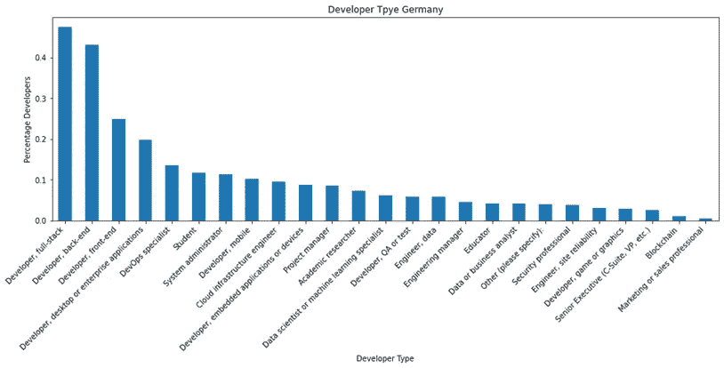

**Figure 2\. Developer Type**

大约有 25 种开发人员类型，其中最大的群体是全栈开发人员和后端开发人员。其次是开发人员、前端、开发人员、桌面或企业应用、DevOps 专员、学生、系统管理员、开发人员、移动、云基础设施工程师、数据库管理员和开发人员、嵌入式应用设备。除了已经提到的开发人员，其他开发人员类型的分布似乎是均匀的，市场营销或销售代表是最低的。

让我们从云平台的使用开始。

1.  **云平台**

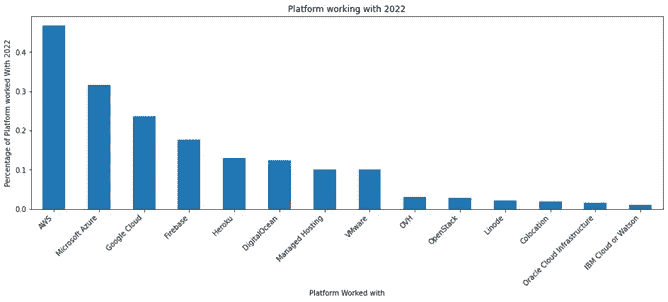

**Figure 3\. Cloud Platform 2022**

从上图中，我们观察到大多数开发人员都在使用 **AWS** 。紧随其后的是**微软 Azure、谷歌云、Firebase、Heroku、DigitalOcean、托管和 VMware** 。其余分别是 **OVH** 、 **OpenStack** 、 **Linode** 、**主机托管**、**甲骨文云基础设施、**和 **IBM 云**或**沃森。**

接下来，看看 2023 年开发者**愿望**的分发云平台。

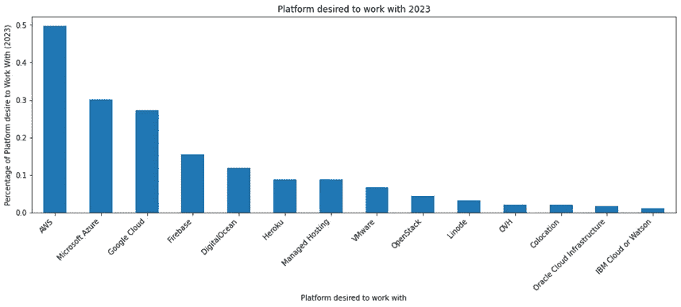

**Figure 4\. Desired Cloud Platform 2023**

在这里，我们看到胎面仍然与 2022 年相同。唯一的区别是数字海洋和 Heroku 以及利诺德和 OVH 改变了位置。

接下来，我们将两个图表放在一起(**2022 年的使用分布**(黄色)和 d**2023 年的期望使用分布**(紫色))

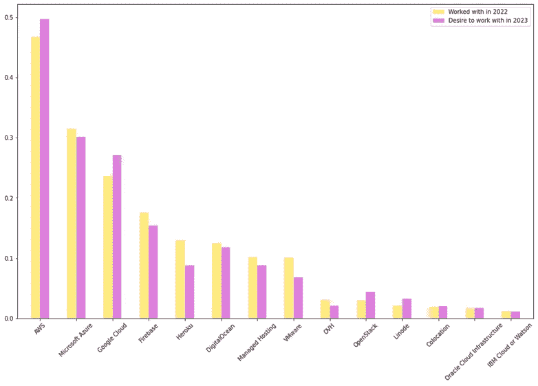

**Figure 5\. Cloud Platform usage and desired**

我们看到，就百分比而言，2023 年更多的开发者更喜欢使用 **AWS** 。对于**的谷歌云、【OpenStack】、**和**的 Linode** 来说，这种观察也是显著的。此外，我们观察到 2023 年对 **Heroku** 、 **VMWare** 和 **OVH** 的需求也有所下降。

现在让我们来看看百分比差异。

**百分比差异**

**Table 2\. Percentage differences of usage in 2022 and desired in 2023**

观察各列及其对应的行值。仔细查看数值和百分比差异(年间差异)

下图是开发者使用云平台的百分比差异图，代表了他们对 2023 年的偏好。

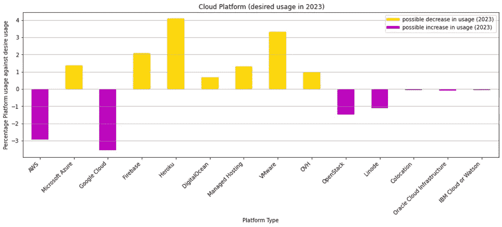

**Figure 6\. Cloud platform: Likely usage in 2023**

一般来说，我们观察到一些云平台的使用趋势可能会在 2023 年显著增加，如 **AWS** 、**谷歌云**、 **OpenStack、**和 **Linode** 。**主机托管**、**甲骨文云基础设施**和 **IBM 云**或**沃森**的使用可能会略有增加。但是这些增加的使用是最小的。最值得注意的是增加了对**谷歌云平台**和 **AWS** 的偏好。

另一方面，**微软 Azure** 、 **Firebase** 、 **Heroku** 、**数字海洋**、**托管**、 **VMW** 和 **OVH** 的使用率可能会下降，其中 **Heroku** 和 **OVH** 的使用率可能下降幅度最大。

接下来，我们将介绍数据库环境的信息。

**2。数据库环境**

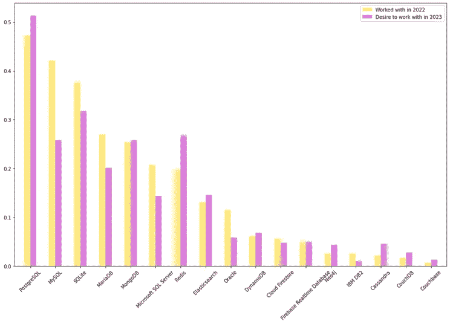

**Figure 7\. Database Environment: usage and desired usage**

现在考虑下图中的百分比差异。

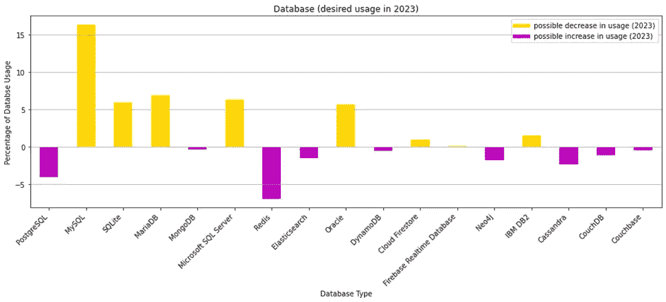

**Figure 8\. Database: Likely usage in 2023**

可以观察到 **Redis** 和 **PostgreSQL** 的使用显著增加。我们可能还会看到 **MongoDB** 、 **Elasticsearch** 、 **Neo4j** 、 **Cassandra** 、 **CouchDB 和 Couchbase** 的使用量略有增加。对于 **MySQL** 、 **SQLite** 、 **MariaDB** 、**微软 SQL Server** 、 **Oracle** 和 **IBM DB** 来说，使用量可能会减少。下降最明显的可能是 MySQL**和**。

接下来，我们介绍 Misch_Tech 工具的百分比差异。

**3。混合技术工具**

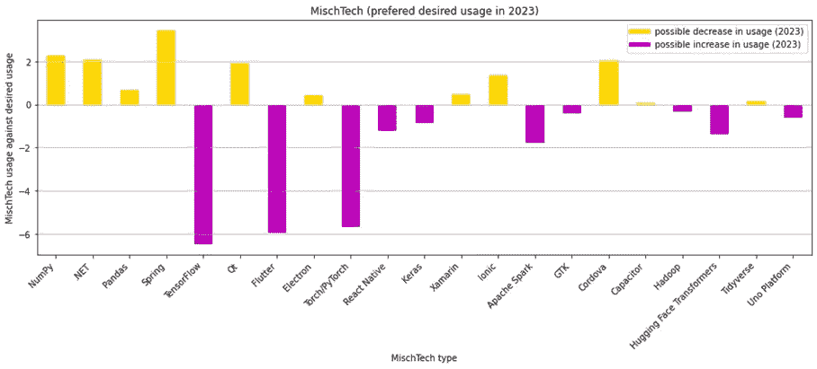

**Figure 9\. Misch Tech: Likely usage in 2023**

使用量大幅增加的可能是 **TensorFlow、Flutter、**和 **Torch/PyTorch。**对 **Keras** 、 **React Native** 、 **Apache Spark** 、 **Hadoop、抱脸变形金刚**、 **Uno 平台**的需求也可能会增加。另一方面， **NumPy** 、 **NET** 、**熊猫**、**弹簧**、 **Ot** 、**电子**、 **Xamarin** 、 **Ionic、**和 **Cordova** 的使用量可能会减少

下一张图描绘了新协作工具的百分比差异。

**4。新的协作工具**

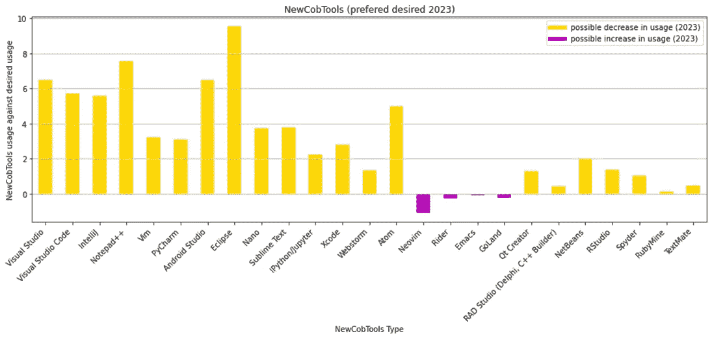

**Figure 10\. New Collaboration Tools: Likely usage in 2023**

除了 **Neovim** 、 **Rider** 、**和 GoLand** 之外，大多数工具的使用都有可能减少。最明显的减少可能是针对 **Visual Studio** 、 **Visual Studio Cod** e、 **IntelliJ** 、 **Notepad+** 、 **Vim** 、 **PyCharm** 、 **Android Studio** 、 **Eclipse** 、 **Nano** 、 **Sublime Text** 和**公理**

**接下来，我们考虑编程、脚本和标记语言这几个类别。**

****5。编程、脚本和标记语言****

**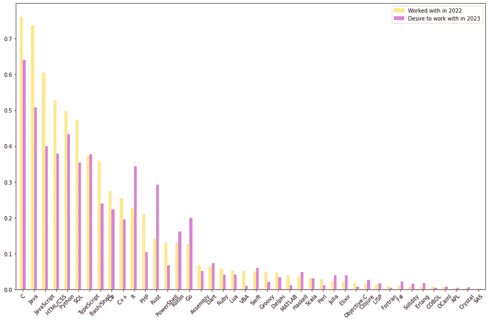**

****Figure 11\. Programming, Scripting, and Markup Languages: usage and desired usage****

**上图描绘了 2023 年和 2023 年开发人员在使用方面的百分比差异。**

**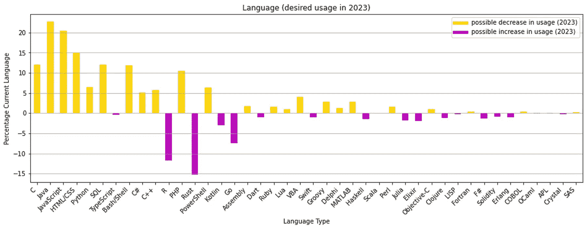**

****Figure 12\. Likely usage in 2023****

**在这一类别中，2023 年对 **R、Rust、Go** 和 **Kotlin** 的使用需求很可能会增加。 **TypeScript** 、 **Dart、Swift** 、 **Scala** 、 **Haskell** 、**elixin**、 **Clojure** 和 **Julia** 也可能会出现小幅增长。 **C** ， **Java** ，Python， **JavaScript** ， **HTML/CSS** ， **PHP** ， **SQL** ， **Bush/Shell** ， **C#** ， **C++** 的用法可能会落到**，**与 **Java****

****6。工具技术****

**现在我们考虑工具技术。**

**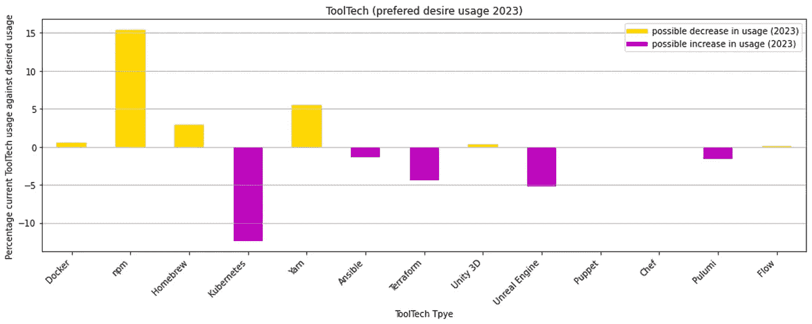**

****Figure 13\. Tools Technology: Likely usage in 2023****

**人们可以预期在 2023 年 **Kubernetes** 、 **Terraform** 和**虚幻引擎**的使用会显著增加。也有可能对 **Ansible 和 Pulumi** 的需求增加。另一方面，对 **Docker** 、 **npm、Homebrew** 、 **Yam** 和 **Unity 3D** 的需求可能会减少，其中 npm 的需求会显著减少。**木偶**，**厨师**，，**流**可能有稳定的需求。**

****7。Web 框架****

**最后，让我们看看 web 框架。**

**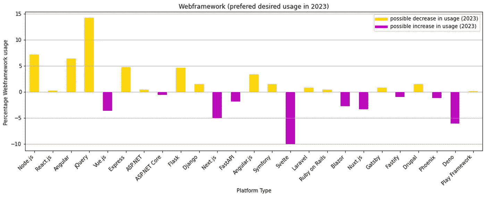**

****Figure 14\. Web Framework: Likely usage in 2023****

**可能对 **Vue.js** 、 **Next.js** 、 **FastAPI** 、 **Svelte** 、 **Blazor** 、 **Nuxt.js** 、 **Fastify、**和 **Deno** 、with **Svelte** 、 **Deno** 和**另一方面， **Node.js** ， **jQuery** ， **Angular** ， **Express** ， **Angular.js** ， **Flask** ， **Symfony** ， **Gatsby** ， **Ruby on Ralls** ， **Laravel** 和**的用法显著的使用减少可能是针对 **jQuery** 的。******

## **总之**

在本文中，我们揭示了德国开发者在 2023 年对技术和工具的可能使用趋势。我们使用来自 [2022 StackOverflow 调查](https://insights.stackoverflow.com/survey)数据集的 5395 个数据集，开发人员来自不同的工业机构。我们利用开发人员在调查中回答的两个问题来确定他们在 2023 年对技术和工具的可能使用趋势。

这些类别是:

1.  ***云平台*** *，2。* ***数据库*** *，3。* ***MischTech 工具*** *，4。* ***新的协作工具*** *，5。* ***编程、脚本和标记语言*** *，6。* ***工具技术*** *和 7。* ***Web 框架和库***

# **2023 年可能的趋势**

**1。云平台**

**使用量增加** : *AWS、Google Cloud、OpenStack 和 Linode、主机托管、Oracle 云基础设施以及 IBM Cloud 或 Watson*

**递减使用:** *微软 Azure、Firebase、Heroku、DigitalOcean、托管托管、VMW、OVH*

**2。数据库**

**使用量增加** : *Redis、PostgreSQL MongoDB、Elasticsearch、Neo4j、Cassandra、CouchDB、Couchbase*

**使用量递减:** *MySQL、SQLite、MariaDB、微软 SQL Server、Oracle、IBM DB*

**3。误击工具**

**使用量增加:** *TensorFlow、Flutter and Torch/PyTorch、Keras、React Native、Apache Spark、Hadoop、拥抱脸变形金刚、Uno 平台*

**递减用法:** *NumPy，NET，Pandas，Spring，Ot，electronic，Xamarin，Ionic，Cordova*

## **4。新的协作工具**

**增加用法:** *尼奥维姆、莱德、戈兰德*

**递减用法:** *Visual Studio、Visual Studio Code、IntelliJ、Notepad+、Vim、PyCharm、Android Studio、Eclipse、Nano、Sublime Text、Axiom*

## **5。编程、脚本和标记语言**

**增加用法:** *R、Rust、Go、Kotlin、TypeScript、Dart、Swift、Scala、Haskell、Elixir、Clojure、Julia*

**递减用法:** *C、Java、Python、JavaScript、HTML/CSS、PHP、SQL、Bush/Shell、C#、C++*

## **6。工具技术**

**增加用法:** *Kubernetes、Terraform、虚幻引擎、Ansible、Pulumi*

**递减用法:** *Docker、npm、Homebrew、Yam、Unity 3D*

**常量用法** *:木偶、厨师、流*

## **7。网络框架**

**增加用法:** *Vue.js、Next.js、FastAPI、Svelte、Blazor、Nuxt.js、Phoenix、Deno*

**常量用法:** *Node.js、jQuery、Angular、Express、Angular.js、Flask、Symfony、Gatsby、Ruby on Ralls、Laravel、Drupal*

最后，我们观察到类别 ***中的趋势新协作工具*** 确实显得非常不稳定。开发人员似乎对使用其他协作工具感兴趣。在其他类别中，趋势似乎遵循一种混合的动态形式。

非常感谢您的阅读。如果你觉得这篇文章有用或没用，请留下你的意见和建议。

 [## Mlearning.ai 提交建议

### 如何成为 Mlearning.ai 上的作家

medium.com](/mlearning-ai/mlearning-ai-submission-suggestions-b51e2b130bfb)