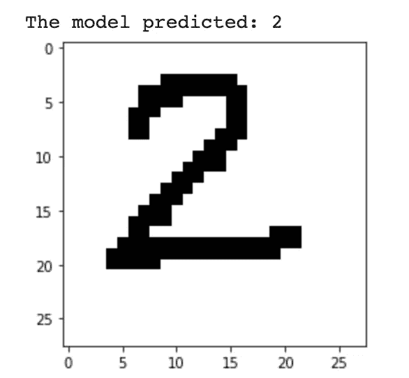
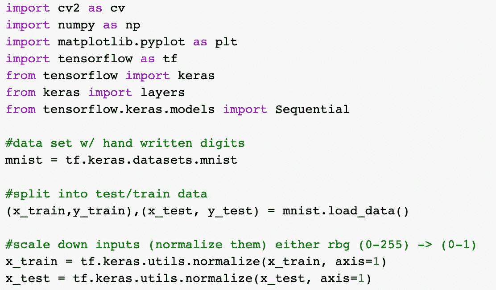
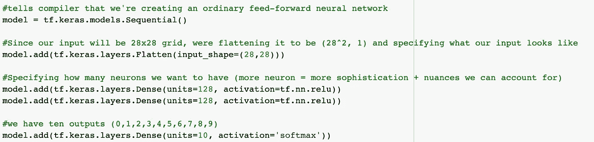
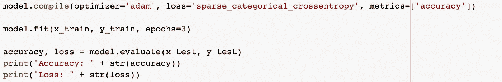
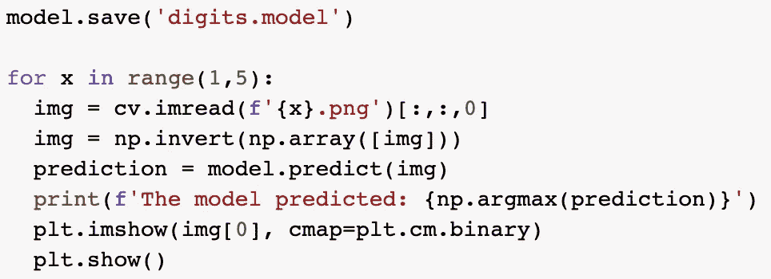

# 你的电脑到底是怎么看的！

> 原文：<https://medium.com/mlearning-ai/how-your-computer-literally-sees-16f9066fb361?source=collection_archive---------8----------------------->

在我们进入正题之前，请允许我自我介绍一下。我是 Rohan，一个专注于人工智能的软件开发人员，正在接受培训，以成为未来影响数十亿人的首席执行官！嗯…至少我希望如此。无论如何，这篇文章有点超出了我通常讨论机器学习概念的趋势，因为我将介绍一个您可以自己实现的实际应用程序。希望你能从这篇文章中有所收获！

# 前言

原来是真的！我们的计算机不能像我们一样“看”，但我们已经找到了一种方法，使它们能够处理图像。事实上，通过一点点机器学习，我们甚至可以让我们的计算机区分某些对象，如数字。是啊，是啊，是啊，这是一个老生常谈的例子，但我打赌你不知道它是如何工作的。这就是我进来的地方！😉

如果您有另一个选项卡上的代码来来回回地引用，那么这篇文章最适合。然而，如果你对我将在这个视频中讨论的概念有经验，你可能只是对代码感兴趣。嗯[这里](https://github.com/rohan-jagtap04/Machine-Learning/blob/main/digit_recognition.py)你去吧！在对这个模型进行编程时，我将 Tensorflow 和 Keras 库用于我所有的机器学习应用程序，OpenCV 库用于处理我们的图像，Matplotlib/NumPy 用于处理我们的数据。尽管你可能已经很熟悉了，我还是恳请你通读一下这篇文章。不管怎样，我相信你会刷新你的记忆或者学到一些新的东西。

# 收集必要的工具

正如介绍中提到的，我们需要在项目中导入相当多的工具来构建我们的模型。虽然我导入了很多库(Tensorflow，OpenCV，NumPy 等。)，除了初始化 **mnist** 变量之外，我想让你最注意的是我导入**图层**和**序列**的那几行。

**层**很重要，因为我们将使用它向我们的神经网络添加隐藏层和输出层(更多信息请参见**创建我们的模型**)。导入**序列**允许我们稍后实例化一个普通的前馈神经网络。最后， **mnist** 变量允许我们访问已经存储的成千上万的图像，用于训练我们的模型。

在包括必要的工具之后，我们将 **mnist** 数据分成训练和测试数据。**训练数据**是模型用来实际“学习”的数据，而**测试数据**用来查看模型被训练的有多好。

在分割我们的数据之后，我们然后归一化所有的 **x 数据**变量。由于我们将输入一个 28x28 的网格作为我们模型的输入，我们将采用(0-255)范围的 RGB 颜色，并使它们适合 0-1 之间的值，也就是所谓的**标准化我们的数据**。

在这一点上，我们完成了设置所有我们需要的信息，我们准备开始使用我们所做的一切来制作一个功能模型。

# 创建我们的模型

为了实际创建我们的模型，我们将首先创建一个**前馈神经网络**的新实例，并将它存储在**模型**变量中。然后，我们将通过将输入从 28x28 矩阵更改为 28 x1 或 784x1 矢量来展平任何未来图层。

然后，我们将添加两个密集层，这两个层都使用**整流线性单元(relu)** 激活功能，每个层包含 128 个单元。我们添加了**密集**层，以确保当前节点连接到下一层的节点。在未来的视频中，我将讨论我们为什么要使用 **relu** 激活功能。对于每一层，我们都指定了 128 个单元，这意味着每一层都有 128 个节点。您拥有的节点越多，您的模型就越复杂，它可以拾取的细微差别就越多，从而使您的模型更加精确。

最后，我们将最后一层添加到模型中，称为输出层。我们仍然使这一层成为致密层，但是，我们的单位值变为 10，我们使用 **softmax** 激活函数。我们的值更改为 10，因为我们只有 10 个可能的数字供模型输出，范围从 0 到 9。此外，我们使用 **softmax** 激活函数，因为它用于分类的情况，在我们的情况下，它将是多类分类，其中每个类代表一个数字。

# 培训/评估我们的模型

在我们建立了模型的结构之后，我们将首先编译它。我们使用 **adam** 优化函数编译我们的模型，指定**交叉熵**作为我们的损失函数，精确度作为我们对此模型感兴趣的度量。

然后，我们使用之前创建的训练数据来拟合(训练)我们的模型，方法是拆分我们的数据来训练我们的模型。我们还将**纪元**指定为 3，这意味着当我们的模型被训练时，它将看到它被训练三次的数据。

最后，我们用之前创建的测试变量评估我们的模型，并存储准确性和损失值。准确性本质上显示了正确预测的数据百分比，而损失则显示了每次优化迭代后我们的模型表现有多差。

# 测试您自己的映像—可选

在代码的最后，你会注意到我已经包括了如何加载你自己的图像的部分，来尝试看看这个模型的效果如何。本质上，我将图像命名为从 1 到 x，并使用索引指定图像，使其成为 for 循环的范围。然后，我加载图像并输入图像数据作为模型的参数，然后预测数字。然后，我打印出模型的答案，并通过将它绘制到网格上来显示模型预测的图像。这可以让你知道哪个图像被载入，以及图像实际上应该是什么编号。

关于我的更多信息——我的名字叫 Rohan，我是一名 16 岁的高中生，正在学习颠覆性技术，我选择从人工智能开始。要联系我，请通过我的[电子邮件](http://rohjag18@gmail.com/)或我的 [LinkedIn](https://www.linkedin.com/in/rohan-jagtap-1a07151b0/) 联系我。我非常乐意提供任何见解或了解你可能有的见解。另外，如果你能加入我的[月刊](https://rohanjagtap.substack.com/p/coming-soon?r=baakt&utm_campaign=post&utm_medium=web&utm_source=copy)，我将不胜感激。感谢阅读，直到下一篇！