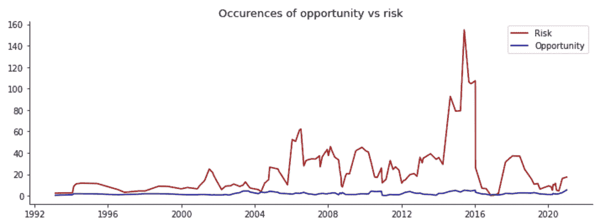
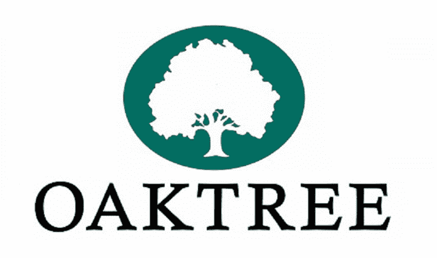
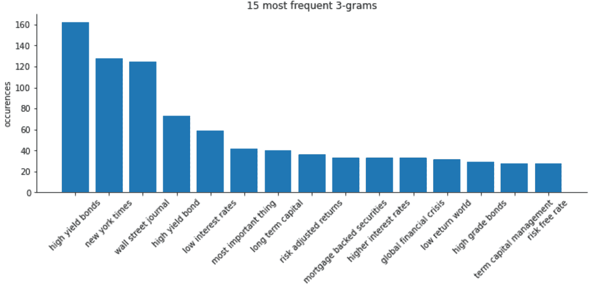
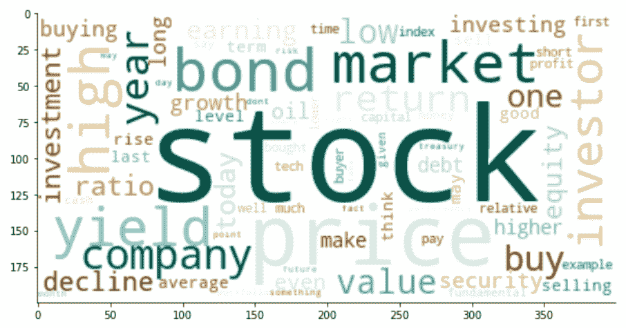
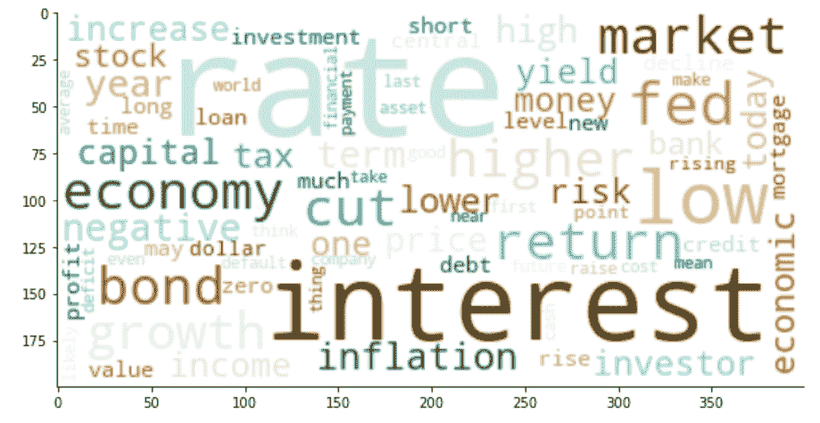

# 霍华德马克备忘录 NLP 分析

> 原文：<https://medium.com/mlearning-ai/howard-marks-memo-nlp-analysis-3dac619c20b0?source=collection_archive---------6----------------------->

**霍华德·马克斯投资哲学的文本分析揭示了什么**

霍华德·马克斯在过去 30 年里出版了 130 多份备忘录，总计 1400 页(不包括他在此期间写的两本书)，可以说是一位相当多产的作家。

在书中，他描述了自己的投资哲学，并详细讨论了使他成为成功投资者的核心理念:投资的风险、对市场周期的认识以及投资者的心理。

我想使用 NLP 技术并分析他的备忘录，看看定量分析方法是否能给我们带来对他文章的不同看法。从对霍华德·马克斯备忘录的定量分析中，我们可以得到一些启示。

*   预处理

Python 不能像你我一样直接读取一个 PDF 文件。它反复无常，只有当文本以一种非常标准化和简洁的格式呈现时，它才会考虑阅读。因此，在每个 NLP 项目中，我们需要对文档进行预处理，以便它可以被机器解释。

具体来说，对备忘录的预处理包括删除文本编辑中使用的 HTML 和 XML 格式(例如，“\n”表示换行，但不是我们希望在分析中保留的单词)。我们还需要删除无用的信息，如“法律披露”，“保留所有权利”等，这些都不是真实内容的一部分。

当只剩下文本时，我们可以进行常规的文本清理步骤:小写单词(“new york”变成“New York”)，删除标点符号、特殊字符、数字、停用词(如“the”、“an”、“is”)。这样可以去除句子中的噪音，只保留有用的信息。然后，我们通过应用一个引理化函数来标准化每个单词，也就是说，我们将每个单词转换成它的引理。这样，所有单词都被转换为它们的词根形式，并且将被解释为完全相同:

有了足够的信噪比，我们就可以开始分析了！

*   情感分析

TextBlob 是一个 python 库，它计算单词或句子的情感极性。给定一个文本，它返回一个范围从 1(非常积极的语气)到-1(非常消极)的分数。它还可以衡量消息的主观性，从 1(非常客观)到-1 是(非常主观)。

奇怪的是，霍华德的备忘录总体上相当积极，平均得分为 0.44，其中只有一份得分低于 0。这让我很惊讶，因为霍华德是一个非常谨慎的经理，他花更多的时间考虑潜在投资的风险，而不是回报。

负责-0.2 极性得分的备忘录名为“*神秘*”(2019)，谈到了负利率。这种大幅下降是有道理的，因为霍华德在这篇文章中用了 76 次“否定”这个词。

在这个具体案例中，负利率在金融界确实被广泛认为是负的，但该计划可能误解了投资界特有的表述。例如，“减债”可能会产生负面情绪，尽管对企业有利。

主观性得分为正值，在整个期间相当稳定(平均值为 0.33)。霍华德确实很冷静，在信中尽量保持客观。他还以一种非常细致入微的方式写作，即使他的作品超过一千页，也很难在他的分析中找到弱点。

最主观的备忘录是“*第一季度业绩*”(1991)，在那里他制定了自己的投资哲学和原则。显然是一个很主观的话题。

*   情绪

text2emotion 是一个 Python 库，它可以从内容中提取情感，专注于人类的五种核心情感:快乐、愤怒、悲伤、惊讶和恐惧。

分数范围从 0(没有情绪)到 1。

霍华德·马克斯(Howard Marks)形容自己“痴迷于风险”，并认为自己属于“防御性投资者”类别。恐惧情绪在他的作品中占据主导地位很有意义，因为他担心可能会出什么问题，无论是投资组合还是经济。“风险”和“机会”出现的次数清楚地证实了这种直觉:

2016 年底的“惊喜”峰值(紫线)是由于美国特朗普/希拉里总统大选。相应的备忘录，“*选举*的含义”(2016)，就写在选举日期之前。在信中，霍华德描述了他对事件后果的期望。

霍华德信中表现出恐惧程度最高(绿线)的时间是 2019 年 4 月的，有“沙子里的线条”。他特别关注的是认购额度(银行贷款给基金，使他们能够借更多的钱)的使用。高杠杆和过度负债是备忘录中反复出现的主题，也是他经常担心的问题。他写了一句有趣的话来总结他对这个话题的思考:“下次有危机的时候，环顾四周；你可能会找到贷款人”(“*天才是不够的*，1998)。

最悲伤的文字(蓝线)，“*这一次会有所不同吗*”(1996)是对过去市场过度行为的批评，以及投资者无法谨慎行事。他对个人和机构投资者在这方面提升自己的能力相当悲观。当然，不会是即将到来的 2000 年科技泡沫改变了他对这个问题的看法。这再一次证明了投资中最危险的四个字的确是“这次不一样”。

最后，当霍华德发表“*我们对抗他们*”(2004)时，他似乎处于最快乐的(黄线)，在这封信中，他讨论了自己的投资哲学(谨慎、防御)。他将自己的方法与我们称之为“成长型投资者”的方法进行了对比，后者往往更激进、更乐观、更关注回报。

*   WordCloud

单词云是文本语料库中最常见单词的图形表示。以下是所有备忘录中的前 300 个单词。

如果你想知道这个有趣的绿色圆点代表什么，那是一棵橡树，是橡树资本管理公司的象征，霍华德在该公司工作。使用徽标作为遮罩，云的形状和颜色会相应地进行调整。

毫不奇怪，与投资世界相关的词汇出现频率最高，其中“投资者”、“市场”或“风险”出现频率过高。

霍华德·马克斯的写作风格更具体地体现了“一”和“事物”这两个词的重要性。如果你了解他，你会认出他提到的“*最重要的事情*”清单(他写了一整本书，同名)。事实上，对霍华德来说，许多事情是最重要的，认真的投资者应该考虑所有的事情。我最喜欢的是:价格和价值之间的关系(以好价格购买资产的重要性)，避免坏年景(听说过沃伦·巴菲特的投资第一法则吗？—不要赔钱！)和留意周期。

*   N-grams

我们可以计算一组单词(称为 n-grams)的出现次数，而不是查看单个单词，这使我们能够在消息中捕捉更多的上下文。

最常见的 3 个字母显然都与金融话题有关。与上面展示的 WorldCould 相比，我们可以看到，理解内容的真正本质更有意义。当考虑表达而不是单个单词时，确定主题变得容易得多。

看看前 3 个字母，我们甚至可以把话题从“金融”缩小到“公司债券”。事实上，霍华德·马克斯擅长高收益债券投资，这需要评估被认为风险很高的公司破产的可能性。

*   k 均值聚类

我们可以根据文本中的单词对文本进行分类，并根据相似性进行分组。为此，我们使用 Tf-Idf 算法将每个句子转换成一个向量(一列数字)。这仅仅意味着我们对在给定文档中常见但在文档语料库中罕见的单词给予更大的权重。这将筛选出在所有文档中经常出现的单词，因为它们共享相同的主题(与此处投资相关的单词)，或者停用词(“an”、“the”、“or”)。

我们将备忘录分为 10 类，看看出现的一些类别，以及最能描述它的关键词:

。风险规避、容忍度、溢价、波动性、控制、调整

。股票——市场、价值、买入、利润、收益率、增长、公司、科技、上涨、下跌

。利率-债券、降息、低利率、更低利率、负利率、联邦利率、银行利率、贷款利率、信贷利率、收入利率

*   结论

在这篇文章中，我们看到了如何使用一些自然语言处理技术来分析文本语料库:情感极性，情感得分，世界云，术语频率和文本聚类。

这些工具有助于对实际文本内容的广泛理解。与物理阅读相比，它不能提供相同水平的洞察力，但文本分析在捕捉核心思想方面做得很好。

总的来说，霍华德·马克斯奠定了一种投资哲学，这种哲学可以概括为对风险的痴迷和意识到风险的必要性。尽管恐惧是描述其作品的最佳情绪，但霍华德成功地在一个不确定的世界中采取行动，这要归功于他对市场力量(尤其是信贷周期)的深刻理解，以及对当前市场参与者心理(贪婪与恐惧)的认识。

如果要用一句话来总结他在高债券市场 30 年的经验，最合适的肯定是沃伦·巴菲特的名言，即霍华德引用了比普通人更多的话:“别人处理自己的事情越不谨慎，我们就应该越谨慎地处理自己的事情”。

注:项目代码可在 Github 上获得:[https://Github . com/Julien-guerin/NLP/tree/main/Howard % 20 marks](https://github.com/julien-guerin/NLP/tree/main/Howard%20Marks)