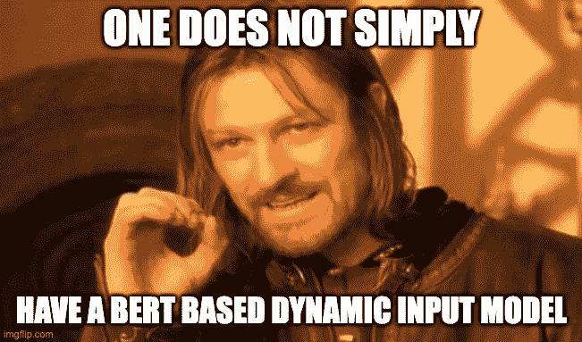
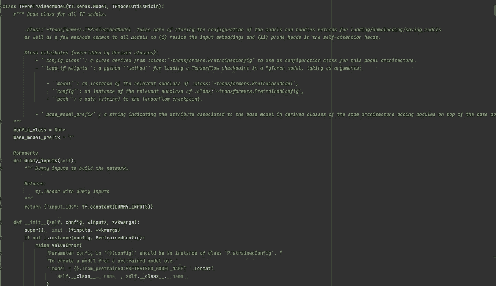

# 拥抱脸+角膜:一种现代的方法

> 原文：<https://medium.com/mlearning-ai/hugging-face-keras-a-modern-approach-980aa3e5b38e?source=collection_archive---------6----------------------->

受众— Keras (DL Pyton framework)用户，他们有兴趣改善拥抱脸集成，提高计算时间、准确性并简化代码结构。

如果您曾经使用 HF + Keras 构建过文本分类器，这是为您准备的。

Yes this is the original quote from the movie.

# 介绍

为什么我会想到这个？因为我已经创建了一个 Distilbert 的扩展，作为一个序列模型，但是有固定的输入。这样做实际上迫使我有固定的输入，完全填充到 512。这浪费了大量的计算周期。

这让我很困扰，HF 是如何在没有固定输入的情况下实现 Keras 模型的？我必须弄清楚。

此外，我可能是地球上最后一个使用 Keras 进行深度学习的人，因为每个人都在 PyTorch 火车上跳跃。但作为忠实于一夫一妻制框架的我(弗朗索瓦·乔莱是罪魁祸首)，我不得不想办法适应时代。

这个博客是对这段有趣旅程的回忆。

# **你会学到什么**

1.  创建 Keras HF 模型
    的所有不同方法——最有效——通过子类化
2.  子类化带来的问题的解决方案
3.  对 HF Bert 模型实施的深入理解

# 词汇

**首选车型**——[蒸馏酒脱壳](https://huggingface.co/distilbert-base-uncased)除了受欢迎没有具体原因。仅这个月就有 750 万次下载

**输入维度** — Distilbert 接受多达 510 个单词片段，向它们添加一个开始标记和一个结束标记，我们得到已知的 512 个数字。为了简化，我们可以把单词想象成单词片段，作为一种有用的类比。这意味着 Distilbert 可以计算多达 510 个单词的句子。

HF — Fugging Face，加载 SOTA 预训练模型的框架。基本模型可用于微调您的数据。

**计算时间**——所有以“ms”表示的计算时间都是在我的 CPU 上完成的，我将它们视为数量级的记录，而不是精确的数字。

**灵感** —这篇 [HF 文章](https://huggingface.co/blog/tensorflow-philosophy)提出了这条途径，但缺乏全面的实施和警告概述

**Keras 背景**—Keras 的神给了我们 3 种实现 Keras 模型的方法。顺序、功能和子类化。子类化在大多数用例中很少见，这就是我要利用的。你可以阅读[这篇](https://pyimagesearch.com/2019/10/28/3-ways-to-create-a-keras-model-with-tensorflow-2-0-sequential-functional-and-model-subclassing/)来获得关于差异的可靠解释。

# TF/Keras + HF 的常见实现

1.  标准—端对端使用高频，Keras 是培训师。 [HF 教程](https://huggingface.co/docs/transformers/main/en/training)
2.  中级—使用 Keras API 在 HF 分类器之上构建

Example of intermediate way — GlobalMaxPool you are my favorite layer

## 为什么不用**标准的**方式？

1.  这实现了动态输入的目标，但是**将你绑定到**我认为是**的参数化分类器**。
2.  **除了标准的 softmax 分类器，您还需要什么吗？**即使添加基于多标签的 sigmoid NN 也不是 HF 的直截了当。
3.  **你想提高精度** — HF 通过使用最后一个隐藏状态的第一个向量——CLS 向量(768 维)来实现分类器。阅读[这个关于如何改进的](https://www.kaggle.com/code/rhtsingh/utilizing-transformer-representations-efficiently)建议(例如，我更喜欢最大池)

## 为什么不用中间的方式呢？

1.  计算时间长—常用的方法是定义固定输入。这将需要对所有后面的样本进行填充，而不管它们的长度如何。假设您设置了维度输入 512，那么每个样本平均需要 400-500 毫秒。**即使是只有一个字的句子:“嘿”，为了避免因形状不匹配而导致的网络错误，你也必须完全填充它。**
2.  由于截断而降低精度-为了避免计算时间过长，您可以将输入维度设置为 128，然后进行约 100 毫秒的推断。长句怎么办？你将不得不截断它们，到 128，这有可能降低精确度。想象一下，你可以阅读这篇文章，但只能阅读它的前 128 个单词。这可能会妨碍你的理解。同样，短句不必要地增加到了 128 个。

# 子类化 Keras 模型类

对 Keras 模型进行子类化是一种创建神经网络架构的方法，而无需显式声明。这是一种更高级、更简单的方法，但也为您提供了最大的灵活性。**这就是让 HF 拥有非固定输入维度的果汁！**

这里有一个来自 HF 代码库的例子

Here is my proof — tf.keras.Model. TFPreTrainedModel is inheriting a Keras Model

我为自己的例子添加了一个要点——解释如下

Keras model that accepts many types of HF models

## 逐行

这是与我在上面添加的`get_model`相同的神经架构(在通用实现下),所以我不会再赘述。

第 5 行:`class HFKerasModel(tf.keras.Model)`我们继承了 tf.keras.Model，它为我们的类提供了预定义的方法，比如默认的`build`、`fit`等等。

第 11 行:`self.base_model = TFAutoModel.from_pretrained(base_model_path)`我们可以接受各种 HF 模型，例如基于蒸馏的外壳、基于蒸馏的非外壳等等。

第 17–21 行:为了构建架构，您必须`call`建模。

第 23–25 行:装载重量(如果提供)

第 27 行:我们定义了向前传球，`training`是一个参数，因为一些层的行为不同，取决于我们是否在训练中。

那么为什么我们不需要固定输入呢？因为我们隐式地定义了我们的前向传递，神经网络变量将被延迟地创建。这意味着性能的巨大提升！没必要把一切都推给麦克斯。

## 警告

1.  需要给类添加一个`call`方法
2.  需要在预测或加载权重之前调用模型
3.  需要`fit`总结之前的模式
4.  通过`model = HFKerasModel(targets=1); model.save_weights(save_path)`保存模型

# 摘要

我从一个观察开始，HF 使用动态输入来提高性能。理解 HF 如何实现这一壮举使我进入了这个有趣的兔子洞，它实际上允许更多令人兴奋的机会，比如在我的模型中有更多的定制逻辑。例如，我可以使用 3-4 种不同的 HF 模型，并连接它们的输出。我为什么要这么做？也许我想有几种形式，如语音、文本和视觉。

除此之外，即使对于文本分类器的原始用例，我认为采用最佳标准并通过 Keras 子类化充分利用 HF 也是很重要的。

希望你觉得这很有用！

不要脸的插头——如果你对改善公司的客户服务感兴趣，请访问 [www.loris.ai](http://www.loris.ai) 了解更多信息。

 [## Mlearning.ai 提交建议

### 如何成为 Mlearning.ai 上的作家

medium.com](/mlearning-ai/mlearning-ai-submission-suggestions-b51e2b130bfb)