# 拥抱面转换器流水线运行不同语句长度的输入语句批

> 原文：<https://medium.com/mlearning-ai/hugging-face-transformer-pipeline-running-batch-of-input-sentence-with-different-sentence-length-197a4aff17cf?source=collection_archive---------1----------------------->

这是一个关于使用拥抱面对变压器管道和我所面临的问题的快速总结。

流水线是一个非常好想法，可以简化 NLP 过程中需要使用 transformer 库处理的一些操作，至少包括但不限于:

1.  将输入字符串标记化
2.  将令牌映射到 id(整数)
3.  将映射的 id 作为张量传递给模型

管道之前的老办法:

```
# Load pretrained model/tokenizer
from transformers import DistilBertModel, DistilBertTokenizer
model_class, tokenizer_class, pretrained_weights = (DistilBertModel, DistilBertTokenizer, 'distilbert-base-uncased')
tokenizer = tokenizer_class.from_pretrained(pretrained_weights)
model = model_class.from_pretrained(pretrained_weights)input_ids = torch.tensor([tokenizer.encode("this is a test")])
with torch.no_grad():
  last_hidden_states = model(input_ids)[0]  # Models outputs can include multiple outputs like attention mask
```

管道道:

```
feature_extractor = pipeline("feature-extraction", model="distilbert-base-uncased", tokenizer="bert-base-uncased")
feature_extractor("this is a test")
```

所以当我们使用管道时，看起来简单多了

# 第一个问题—错误的标记器

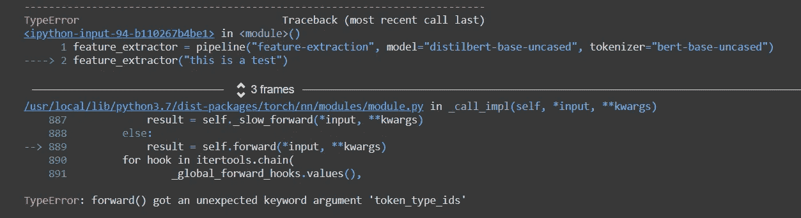

在线快速搜索，这个 huggingface github [issue](https://github.com/huggingface/transformers/issues/2702) 指出，bert 基础令牌化器给出 token_type_ids 作为输出，但是 DistilBertModel 并不期望它，因此建议在传递给 Model 之前删除它。

我丑陋的实现:

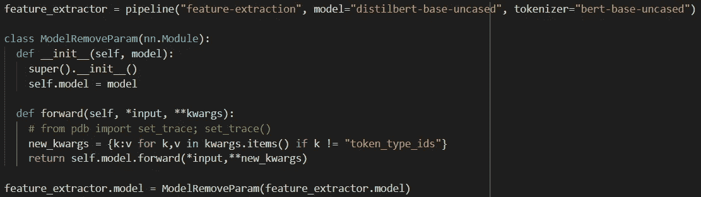

这是为了在传递给实际模型之前创建一个包装器来丢弃 token_type_ids。

正确的方法是使用正确的记号赋予器(“distilbert-base-uncased”，而不是“bert-base-uncased”):

```
feature_extractor = pipeline("feature-extraction", model="distilbert-base-uncased", tokenizer="distilbert-base-uncased")feature_extractor("this is a test")
```

# 第二项—控制我是否需要特殊令牌

人们会发现输出的长度是 6，而不是 4(字)，这是因为对于 Transformer 模型，它将在前面包括[CLS]标记，在结尾包括[SEP]标记。

我们如何提供这个参数来告诉标记器添加或不添加这些特殊的标记呢？令牌化器允许使用“添加特殊令牌”开关:

```
tokenizer.encode("this is a test", add_special_tokens=False)
```

管道怎么样？看完源代码，方式很相似:

```
feature_extractor("this is a test",add_special_tokens=False)
```


[https://huggingface.co/transformers/_modules/transformers/pipelines/base.html#Pipeline](https://huggingface.co/transformers/_modules/transformers/pipelines/base.html#Pipeline) => the __call__ function take in kwargs and pass to _parse_and_tokenize function

# 第三项—批量输入

对于这一点，我只关注管道(管道前的旧代码有点长)

管道 API 支持将字符串列表作为输入，并将它们作为批处理，但是请记住，张量大小是固定的，因此对于可变长度的输入字符串，应该对它们进行填充:

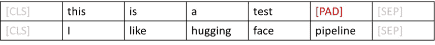

我想要做的是得到一个“有意义的”记号的平均值(这对于解释为句子的嵌入来说不是 100%正确，但是我只是想要一个方便的嵌入)

所以，我做的是:

```
result_tensor = torch.tensor(feature_extractor(["this is a test", "I like hugging face pipeline"],add_special_tokens=False))result_avg = torch.mean(result_tensor[0,:4,:],dim=0)
```

result_tensor[0，:4，:= >第一个索引是关于引用第一个输入“这是一个测试”的#item，第二个:4“是我只想要第二维中的前 4 个令牌

这个解决方案肯定非常难看，因为它使用了一个硬编码数(4)，人们可能希望通过计算令牌来动态地计算它。但是这并不是 100%无关紧要的，因为记号赋予器使用了 Wordpiece，并且它不仅仅是按空格分解:

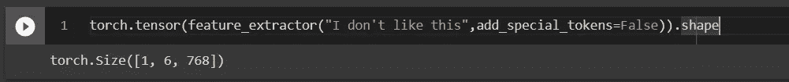

记号赋予器像这样拆分它(像这样拆分“’”和“t”)

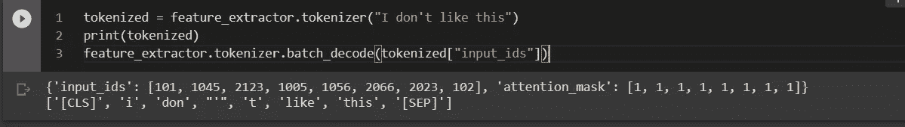

########[开始]跟进 2021 年 8 月 9 日# # # # # # # #

为了迎合“有意义的”(非 pad 令牌)的平均问题，我在实现中得到了更新，这是使用注意掩码。


用最简单的形式来解释，huggingface pipline __call__ 函数进行标记化，将标记转换为 id，并传递给模型进行处理，标记化器将输出 ID 和注意掩码。

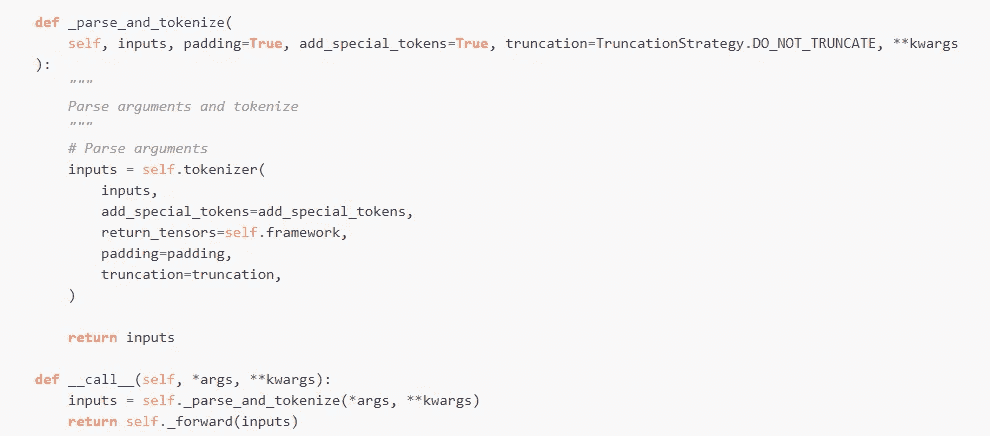

Huggingface transformer library documentation on Pipeline class: [https://huggingface.co/transformers/_modules/transformers/pipelines/base.html#Pipeline](https://huggingface.co/transformers/_modules/transformers/pipelines/base.html#Pipeline)

下面的代码将更加动态地管理 pad(每批都不同)，而不是在固定的令牌范围内执行简单的 torch.mean(…)

代码示例:


######## [End]跟进 2021 年 8 月 9 日########

# 结论/临时结果

最后，我尝试了 4 种不同的变化，结果如下，我会说…没有裁决。

这 4 种变化是:

1.  (左上)**拥有**特殊代币，拥有超过**所有**代币的平均值(包括填充)
2.  (右上)**没有**特殊令牌，并且有一个平均值超过**所有**令牌(包括填充符)
3.  (左下角)**具有**特殊令牌，具有超过**非填充**令牌(无填充)的平均值
4.  (右下)**无**特殊令牌，且平均超过**无填充**令牌(无填充)

下面是 UMAP 的一些结果。请注意，这是一个降维，根据经验，有时这是非常混乱的降维应用，所以最好做最近邻分析(我通常通过 faiss)

另外，另一个想法是变压器[CLS]令牌通常被训练来表示一个句子级嵌入，这篇文章将被更新，一旦分析正在运行。

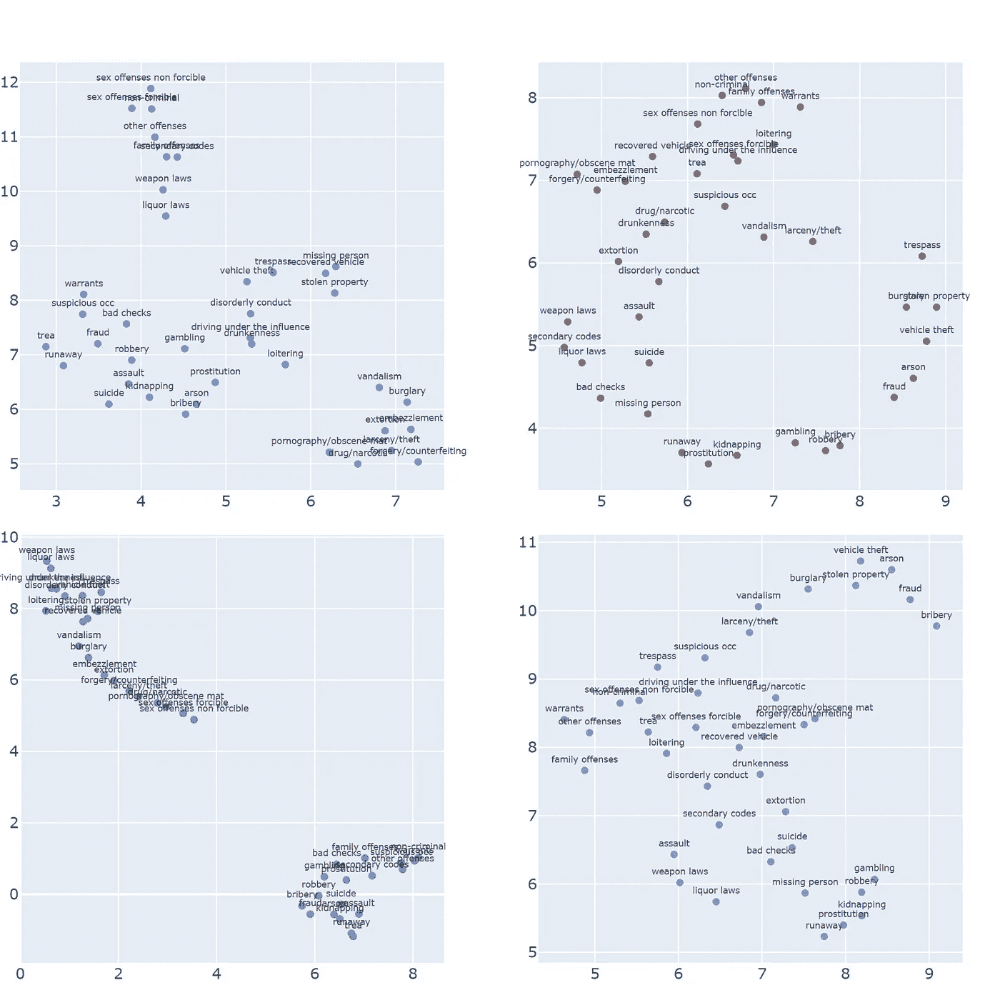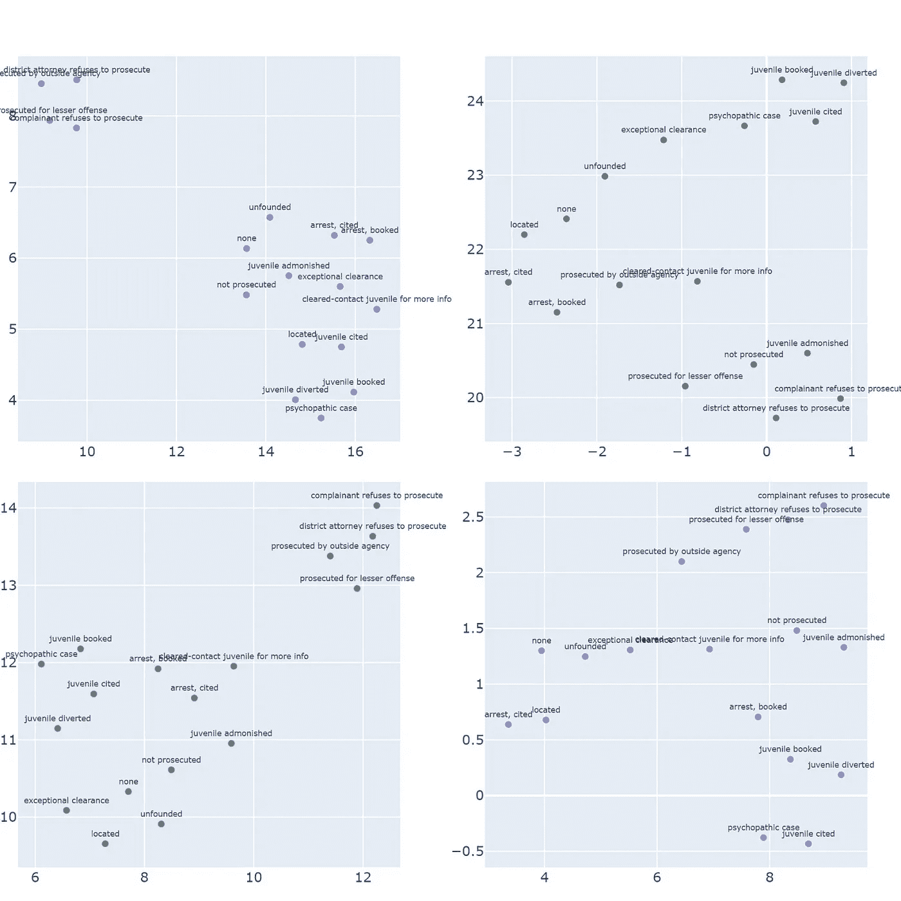

# 跟进(2021 年 3 月 29 日)

在接下来的文章中，我添加了 CLS 向量，并使用 Faiss 在原始维度空间中寻找最近邻(余弦相似度)。

请注意，生成的 UMAP 结果(降维)与上面预期的不同。

还通过 Faiss 索引收录了 768 个原始维度 top 5 近邻(使用余弦相似度作为度量)。结果是…巨大的，我只是把它们倒在底部。

有一些观察(基于我的人类判断):

1.  [CLS]的方法并不像我预期的那样能抓住一般的序列(句子)思想(事实上很多时候人们会把它用于像 QA 这样的下游任务)，而且总的来说，我更喜欢无特殊标记对。
2.  (显然)归一化是高度优选的，因为我们试图使用余弦相似性，Faiss 只做内点积，而不为我们归一化(他们的文档指示用户在传递到索引之前进行归一化)，并且该值更容易在不同方法之间进行比较
3.  仍有一些“语义意义”被 CLS 捕捉得更好，像失踪的人和自杀更接近(比其他人)，正如我能想象的那样它与“失去人”有关
4.  奇怪的是，对于具有特殊标记和平均值(包括填充)的方法，最接近的有时并不相同(即，在索引中的搜索查询=“XYZ”并不作为顶部结果返回，得分也不是 1.0)

下面是结果，有兴趣的考察一下。

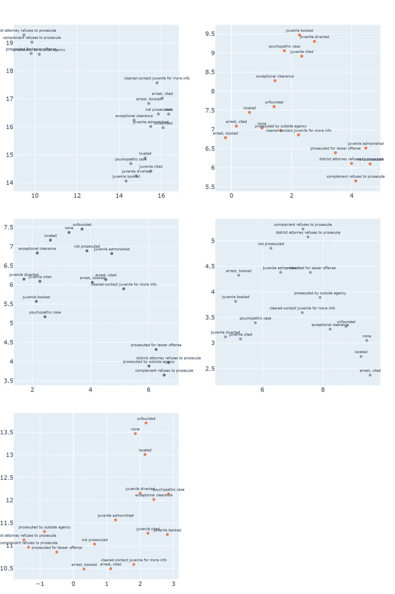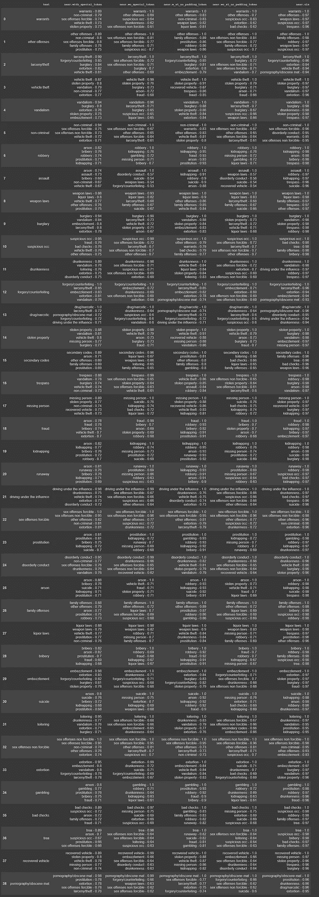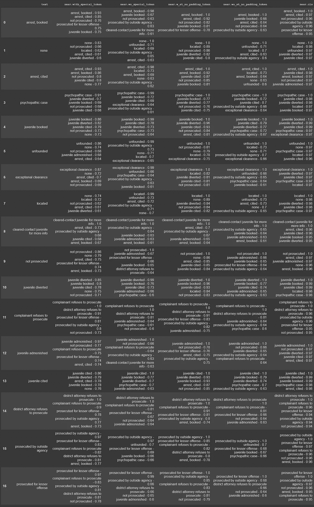