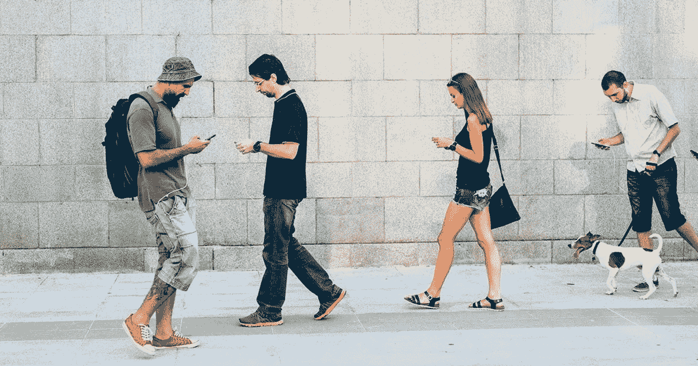

# 使用手机传感器数据预测人类活动

> 原文：<https://medium.com/mlearning-ai/human-activity-recognition-predicting-activity-using-phone-sensor-data-1690b8d74e9?source=collection_archive---------0----------------------->

**简介**

这个项目旨在建立一个模型，从智能手机的传感器数据中预测人类的活动，如走路、上楼、下楼、坐着、站着和躺着。这是一个六级分类问题，因为我们有六个活动要分析和检测。

**数据集**