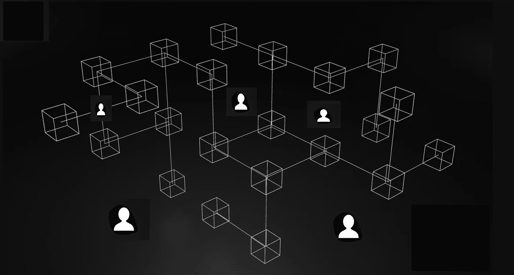

# 以人为中心的数据科学:它是什么，为什么它是前进的方向？

> 原文：<https://medium.com/mlearning-ai/human-centered-data-science-what-is-it-and-why-is-it-the-way-forward-e44e749fe4c9?source=collection_archive---------5----------------------->

Image by [Shubham Dhage](https://unsplash.com/@theshubhamdhage) from [Unsplash](https://unsplash.com/), modified by Author

数据科学被[定义为](https://www.liebertpub.com/doi/pdfplus/10.1089/big.2013.1508)“一套支持和指导从数据中有原则地提取信息和知识的基本原则。”它是一种结合几个领域的实践，如统计学、数学、计算机科学、信息科学，来检查数据集(通常是大型数据集)以进行知识生产。我们环顾四周，数据科学正在默默运转——在我们的手机上，在我们的教室和工作场所，以及其他任何地方。

数据科学关注数据集的聚合和解释。举例来说，考虑一下你的全部推文历史，或者脸书帖子。可以很容易地设计一种算法来收集(即收集)这些推文和所有相关的元数据，如时间戳、位置、点赞和转发的数量等。现在想象这些信息是为你认识的每一个人和他们认识的每一个人收集的。关于他们所有推文的数百万个数据点，被收集并浓缩到一个大型数据库中。

但是那些推文中的内容呢？当然，该算法将收集他们的字符/字数，如果应用一些更复杂的指标，甚至可能测量像情感(即情绪表达的性质)或语言能力等其他东西。但是这些算法对你在这些推文中倾诉的个人，真正的*你有什么了解呢？他们*真的*能理解你关于泰勒·斯威夫特最新专辑的 16 集推特吗？他们会知道《超自然》结尾时你哭得有多伤心吗？他们会理解你对失去的独特诠释吗？他们会理解你为什么在 2012 年 5 月 13 日敲键盘吗？他们会吗？他们能吗？*

以人为中心的数据科学试图通过定性和定量指标的结合来表彰“大规模聚合数据海洋中令人信服和鼓舞人心的个人故事”跨学科领域试图将经常不可见但非常真实的人结合起来，创造数据点，因为它试图给每个数据一个声音来讲述自己的故事。

这个过程的一部分是承认一些不确定感，以及对意义和上下文的主观解释。但是以人为中心的数据科学对此没有意见。正如玛西娅·贝茨[写道](https://www.sciencedirect.com/science/article/pii/0306457390901039)“如果我们在信息系统的人机界面设计中利用而不是忽视人类的特殊特征，我们可能会发现我们的能力以不可预测和创造性的方式得到增强。”以人为中心的数据科学就是要拥抱这种不可预测性，真正让数据带领研究人员踏上旅程。

以人为中心的数据科学流程还考虑了道德、潜在的偏见和危害，这些都是在聚集和操作大量人类生成的数据的过程中可能发生的。这样的考虑对研究过程来说是重要和必要的，现在比以往任何时候都更重要。

因此，我认为数据科学的发展方向是以人为本，充分尊重大型电子表格中每个单元格下的人。我邀请你去看看该领域创始人[即将出版的关于以人为中心的数据科学](https://mitpress.mit.edu/books/human-centered-data-science)的书，并希望你考虑将这些方法融入到你的实践中。

 [## Mlearning.ai 提交建议

### 如何成为 Mlearning.ai 上的作家

medium.com](/mlearning-ai/mlearning-ai-submission-suggestions-b51e2b130bfb)