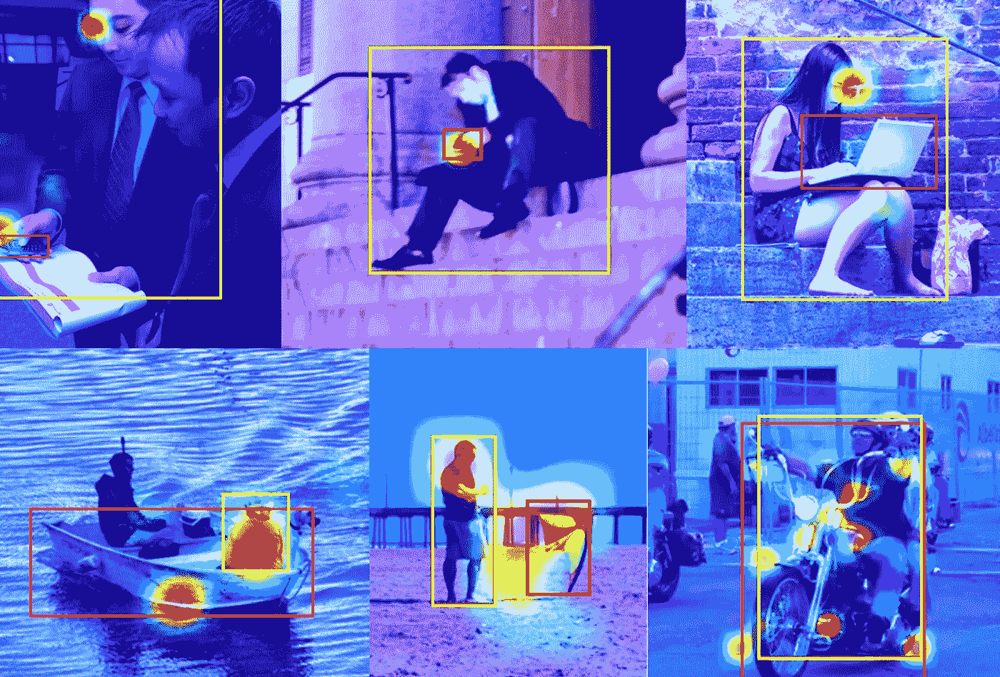

# 人体-物体相互作用检测

> 原文：<https://medium.com/mlearning-ai/human-object-interaction-detection-90887e50089e?source=collection_archive---------1----------------------->

## [机器学习艺术](https://mlearning.substack.com)

[https://mlearning.substack.com](https://mlearning.substack.com)

**与物体互动的人类**经常创造错综复杂的探测场景。例如，这两个实体可以是一个人和一个物体或者一个人和她的环境。因此，为了更好地理解模型必须考虑的场景，确定它们是否协调工作或者是否发生了某种交互是至关重要的。